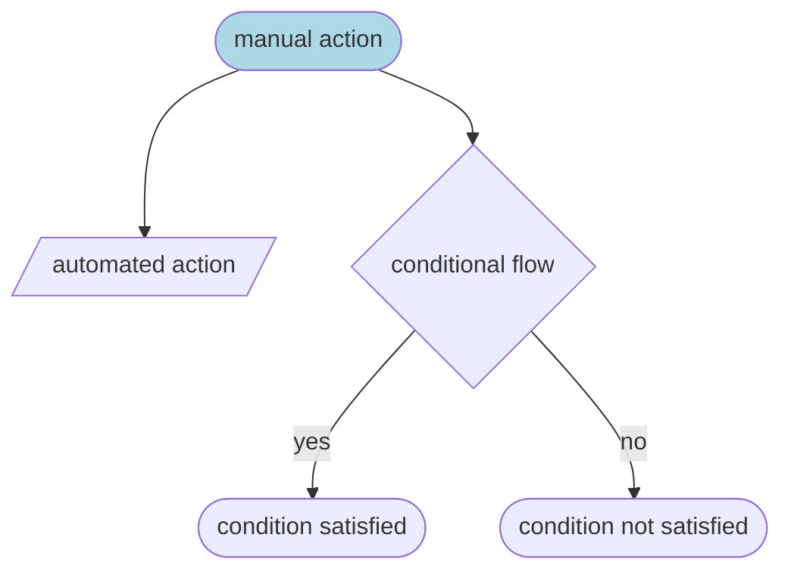
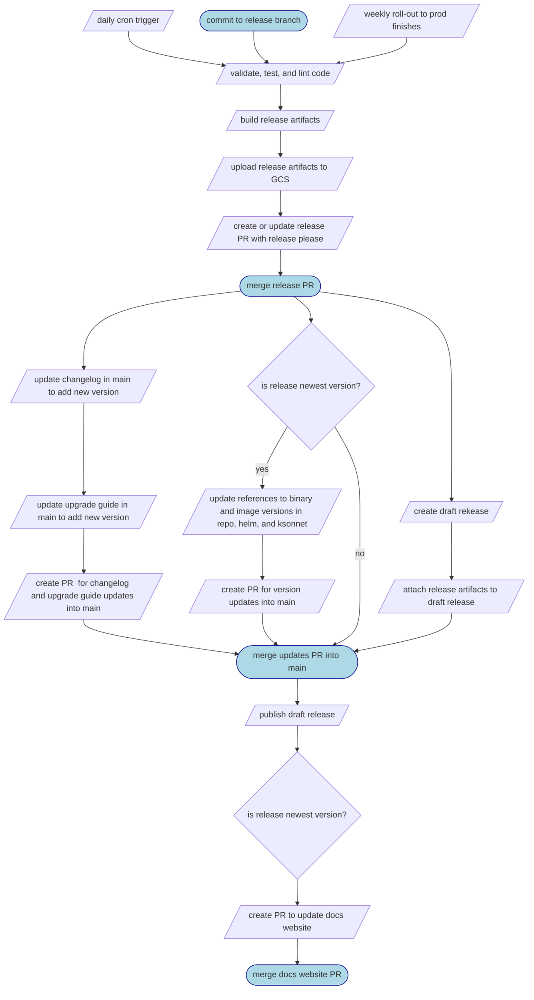

# loki-release

[](./badges/coverage.svg)

This repository was built to replace our
[existing workflow](./docs/loki-legacy-workflow.md), which was mostly a manual
process. This new workflow (diagramed below), runs on a daily cron trigger,
whenever a commit to a release branch is made, or at the end of our automated
weekly release process.

In the following diagram, light blue stadium-shaped nodes indicate manual
actions, parallelagrams indicate automated actions, and a rhombus indicates a
conditional flow.



The new workflow is depicted below. Note that there are only 4 manual steps (1
of which is optional, the other 3 of which are merging a PR, with 1 of those
only needing to happen when releasing the newest version):



## Contributing

1. Install jsonnet dependencies `jsonnet` and `jsonnetfmt`
1. Install node dependencies

   ```bash
   npm install
   ```

## Backlog

For now, I'm just keeping a backlog here

_TODO_: release PR needs to: - update references to binary versions - update
references to image versions - update helm/ksonnet versions - update the upgrade
guide if (this is likely going to require the upgrade guide to be made of
individual files): - there are config changes - there are metric changes

_TODO_: how to force upgrade guide changes? - maybe fail a release PR if metric
or config changes are detected unless it has both: - an upgrade guide for that
version - a tag on the PR indicating it's been checked

_TODO_: can the release-please PR be against `main` with the correct backport?

- otherwise, how do we handle updating the docs/releases/changelog in main?

_TODO_: define validate

- check generated files
- check gomod
- check shellcheck
- check doc drift
- validate example configs
- check example config docs
- check helm values doc

- define which images are going to be built

  - loki
    - amd64
    - arm64
    - arm
    - multi-arch
  - loki-canary
    - amd64
    - arm64
    - arm
    - multi-arch
  - logcli
    - amd64
    - arm64
    - arm
    - multi-arch
  - promtail
    - amd64
    - arm64
    - arm
    - multi-arch
  - lokioperator
    - amd64
    - arm64
    - arm
  - fluent-bit
    - amd64
  - fluentd
    - amd64
  - logstash
    - amd64
  - querytee
    - amd64

- there is no longer a need to announce, since we have a long running PR

- the cron job needs to use the GitHub api to call the prepare release pipeline
  with the correct branches

- cool feature

# Instructions

First release of a new branch (ie. releasing 1.5.0 from release-1.5.x) needs a
special commit:

```
git commit --allow-empty -m "chore: release 1.5.0" -m "Release-As: 1.5.0"
```

cool new feature

cool feature again

coolest feature yet

need to test something
