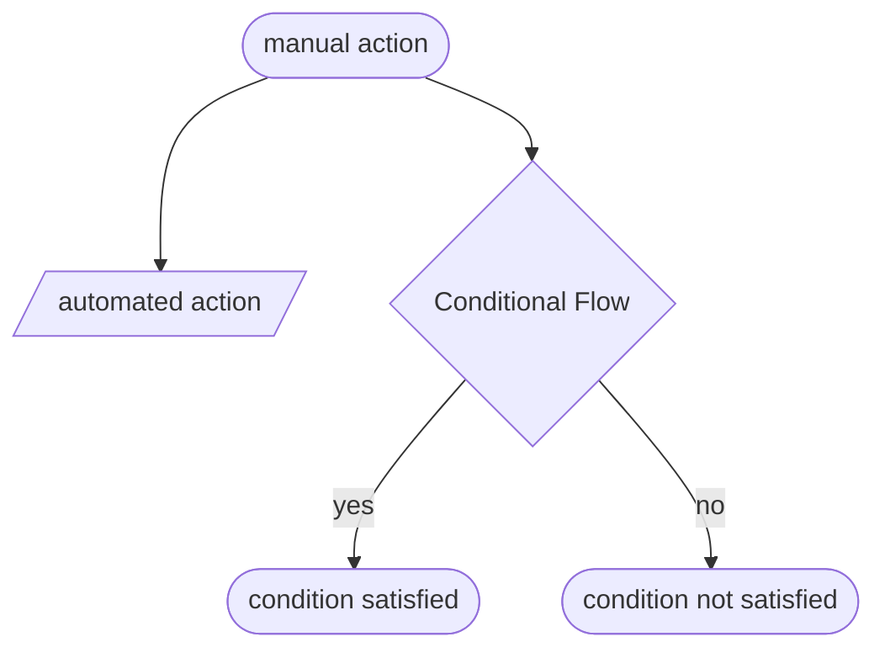
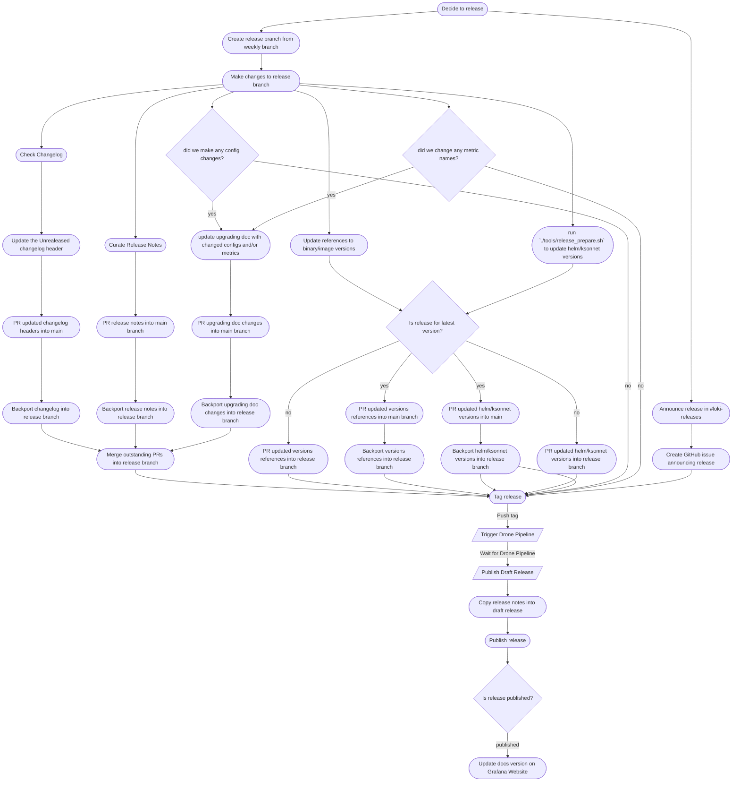

# Legacy Workflow

This doc contains diagrams illustrating the old workflow the Loki team followed to release new versions.

In the following diagrams, stadium-shaped nodes indicate manual actions, parallelagrams indicate automated actions, and a rhombus indicates a conditional flow.

## Workflow Overview

Here is a general overflow of the workflow required to release a new version of Loki. I have collapsed the drone pipeline into a single node, see below for a detailed version of the drone pipeline.

## Detailed Drone Pipeline

```mermaid
graph TD;
    E[/Trigger Drone Pipeline/] --> F[/build loki build image/];
    E --> G[/build helm test image/];

    E --> H[/check drone drift/];
    H --> I[/check generated files/];
    I --> J[/run tests/];
    J --> K[/run linters/];
    K --> L[/check gomod/];
    L --> M[/run shellcheck/];
    M --> N[/build loki binary/];
    N --> O[/check doc drift/];
    O --> P[/validate example configs/];
    P --> Q[/check example config docs/];
    Q --> R[/build docs website/];

    E --> S[/lint mixin jsonnet/];

    E --> T[/check helm values doc/];

    E --> U[/publish loki amd64 image to dockerhub/];
    U --> V[/publish loki-canary amd64 image to dockerhub/];
    V --> W[/publish logcli amd64 image to dockerhub/];

    E --> X[/publish loki arm64 image to dockerhub/];
    X --> Y[/publish loki-canary arm64 image to dockerhub/];
    Y --> Z[/publish logcli arm64 image to dockerhub/];

    E --> a[/publish loki arm image to dockerhub/];
    a --> b[/publish loki-canary arm image to dockerhub/];
    b --> c[/publish logcli arm image to dockerhub/];

    E --> d[/publish promtail amd64 image to dockerhub/];
    E --> f[/publish promtail arm64 image to dockerhub/];
    E --> g[/publish promtail arm image to dockerhub/];

    E --> h[/publish lokioperator amd64 image to dockerhub/];
    E --> i[/publish lokioperator arm64 image to dockerhub/];
    E --> j[/publish lokioperator arm image to dockerhub/];

    E --> k[/publish fluent-bit amd64 image to dockerhub/];

    E --> l[/publish fluentd amd64 image to dockerhub/];

    E --> m[/publish logstash amd64 image to dockerhub/];

    E --> n[/publish querytee amd64 image to dockerhub/];

    E --> o[/publish multi-arch promtail image to dockerhub/];
    o --> p[/publish multi-arch loki image to dockerhub/];
    p --> q[/publish multi-arch loki-canary image to dockerhub/];
    q --> r[/publish multi-arch loki-operator image to dockerhub/];

    E --> s[/prepare updater config/];
    E --> t[/trigger updater/];

    E --> u[/check if helm chart needs update/];
    u --> v[/prepre helm chart update/];
    v --> w[/trigger helm chart update/];

    E --> x[/test promtail-windows/];

    E --> y[/publish logql analyzer image to dockerhub/];

    E --> z[/setup linux packaging/];
    z --> aa[/test linux packaging/];
    aa --> ab[/test debian packaging/];
    ab --> ac[/test rpm packaging/];
    ac --> ad[/create github draft release/];

    E --> ae[/build and publish docker driver to dockerhub/];

    E --> af[/build and publish lambda-promtail amd64 image to dockerhub/];

    E --> ag[/build and publish lambda-promtail arm64 image to dockerhub/];
```

## Versioning Docs Website

Loki docs are versioned. Follow the below steps to version Loki docs for this release.

> NOTE: Here $LOCAL_LOKI_PATH is your local path where Loki is checked out with correct $VERSION

1. Clone Grafana website [repo](https://github.com/grafana/website)
1. Create new branch `git checkout -b $VERSION` (replace `$VERSION` with current release version. e.g: `v2.5.0`)
1. Run `mv content/docs/loki/next content/docs/loki/next.main`
1. Run `mkdir content/docs/loki/next`
1. Run `cp -R $LOCAL_LOKI_PATH/docs/sources/* content/docs/loki/next`
1. Run `scripts/docs-release.sh loki latest next`
1. Run `scripts/docs-release.sh loki $VERSION latest`
1. Run `mv content/docs/loki/next.main content/docs/loki/next`
1. Update `version_latest` to `$VERSION` in `content/docs/loki/_index.md`
1. Docs will be generated for this release.
1. Create PR and Merge it after approval.
