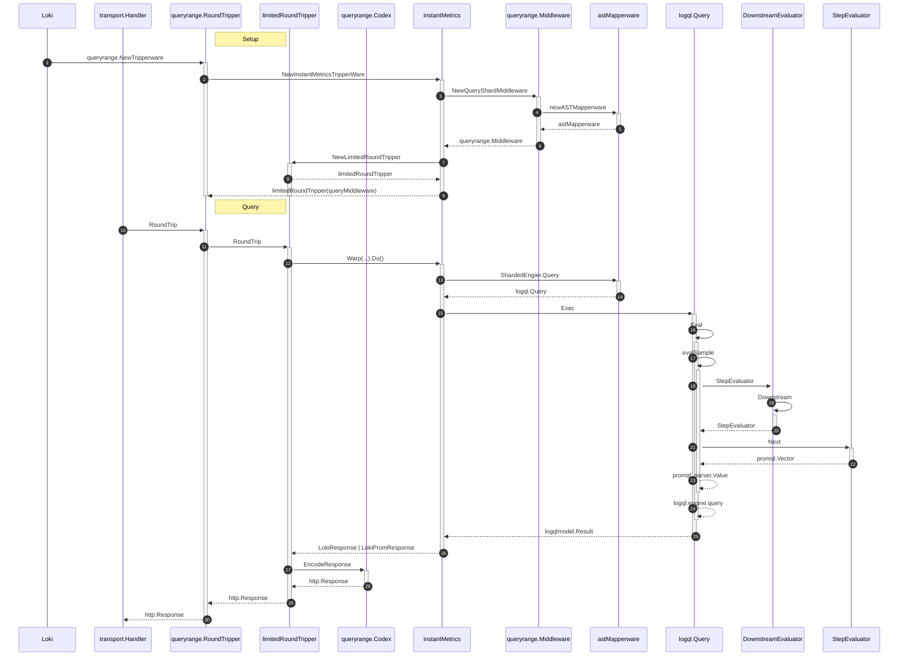

# Contribute

Loki uses GitHub to manage reviews of pull requests:

- If you have a trivial fix or improvement, go ahead and create a pull request.
- If you plan to do something more involved, discuss your ideas on the relevant GitHub issue.

## Steps to contribute

For now, you need to add your fork as a remote on the original **\$GOPATH**/src/github.com/grafana/loki clone, so:

```bash

$ go get github.com/grafana/loki
$ cd $GOPATH/src/github.com/grafana/loki # GOPATH is $HOME/go by default.

$ git remote add <FORK_NAME> <FORK_URL>
```

Notice: `go get` return `package github.com/grafana/loki: no Go files in /go/src/github.com/grafana/loki` is normal.

## Contribute to helm

Please follow the [Loki Helm Chart](./production/helm/README.md).

### Dependency management

We use [Go modules](https://golang.org/cmd/go/#hdr-Modules__module_versions__and_more) to manage dependencies on external packages.
This requires a working Go environment with version 1.15 or greater and git installed.

To add or update a new dependency, use the `go get` command:

```bash
# Pick the latest tagged release.
go get example.com/some/module/pkg

# Pick a specific version.
go get example.com/some/module/pkg@vX.Y.Z
```

Tidy up the `go.mod` and `go.sum` files:

```bash
go mod tidy
go mod vendor
git add go.mod go.sum vendor
git commit
```

You have to commit the changes to `go.mod` and `go.sum` before submitting the pull request.

## Coding Standards

### go imports
imports should follow `std libs`, `externals libs` and `local packages` format

Example
```
import (
	"fmt"
	"math"

	"github.com/prometheus/common/model"
	"github.com/prometheus/prometheus/pkg/labels"

	"github.com/grafana/loki/pkg/logproto"
	"github.com/grafana/loki/pkg/logql"
)
```


