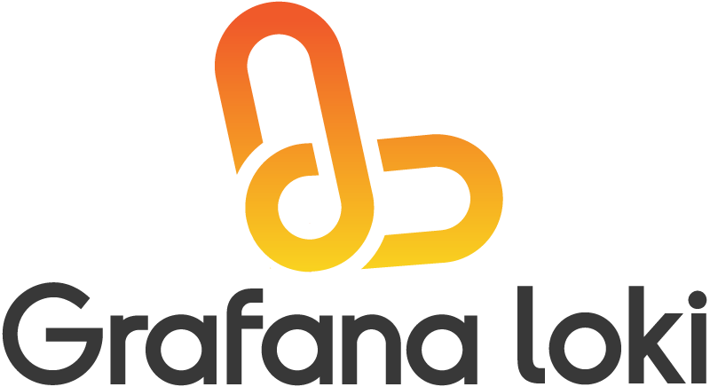

# Loki: like Prometheus, but for logs.

Loki is a horizontally-scalable, highly-available, multi-tenant log aggregation system inspired by [Prometheus](https://prometheus.io/).
It is designed to be very cost effective and easy to operate.
It does not index the contents of the logs, but rather a set of labels for each log stream.

Compared to other log aggregation systems, Loki:

- does not do full text indexing on logs. By storing compressed, unstructured logs and only indexing metadata, Loki is simpler to operate and cheaper to run.
- indexes and groups log streams using the same labels you’re already using with Prometheus, enabling you to seamlessly switch between metrics and logs using the same labels that you’re already using with Prometheus.
- is an especially good fit for storing [Kubernetes](https://kubernetes.io/) Pod logs. Metadata such as Pod labels is automatically scraped and indexed.
- has native support in Grafana (needs Grafana v6.0).

A Loki-based logging stack consists of 3 components:

- `promtail` is the agent, responsible for gathering logs and sending them to Loki.
- `loki` is the main server, responsible for storing logs and processing queries.
- [Grafana](https://github.com/grafana/grafana) for querying and displaying the logs.

Loki is like Prometheus, but for logs: we prefer a multidimensional label-based approach to indexing, and want a single-binary, easy to operate system with no dependencies.
Loki differs from Prometheus by focussing on logs instead of metrics, and delivering logs via push, instead of pull.

## Getting started

The [getting started docs](./production/README.md) have instructions on how to install Loki via Docker images, Helm charts, Jsonnet, or from source.

Once you have promtail, Loki, and Grafana running, continue with [our usage docs](./docs/usage.md) on how to query your logs.

### Documentation

- [API documentation](./docs/api.md) for alternative ways of getting logs into Loki.
- [Operations](./docs/operations.md) for important aspects of running Loki.
- [Promtail](./docs/promtail.md) is an agent which can tail your log files and push them to Loki.
- [Processing Log Lines](./docs/logentry/processing-log-lines.md) for detailed log processing pipeline documentation
- [Docker Logging Driver](./cmd/docker-driver/README.md) is a docker plugin to send logs directly to Loki from Docker containers.
- [Logcli](./docs/logcli.md) on how to query your logs without Grafana.
- [Loki Canary](./docs/canary/README.md) for monitoring your Loki installation for missing logs.
- [Troubleshooting](./docs/troubleshooting.md) for help around frequent error messages.
- [Usage](./docs/usage.md) for how to set up a Loki datasource in Grafana and query your logs.

## Getting Help

If you have any questions or feedback regarding Loki:

- Ask a question on the Loki Slack channel. To invite yourself to the Grafana Slack, visit [http://slack.raintank.io/](http://slack.raintank.io/) and join the #loki channel.
- [File an issue](https://github.com/grafana/loki/issues/new) for bugs, issues and feature suggestions.
- Send an email to [lokiproject@googlegroups.com](mailto:lokiproject@googlegroups.com), or use the [web interface](https://groups.google.com/forum/#!forum/lokiproject).
- UI issues should be filed directly in [Grafana](https://github.com/grafana/grafana/issues/new).

Your feedback is always welcome.

## Further Reading

- The original [design doc](https://docs.google.com/document/d/11tjK_lvp1-SVsFZjgOTr1vV3-q6vBAsZYIQ5ZeYBkyM/view) for Loki is a good source for discussion of the motivation and design decisions.
- Callum Styan's March 2019 DevOpsDays Vancouver talk "[Grafana Loki: Log Aggregation for Incident Investigations][devopsdays19-talk]".
- Grafana Labs blog post "[How We Designed Loki to Work Easily Both as Microservices and as Monoliths][architecture-blog]".
- Julien Garcia Gonzalez' March 2019 blog post "[Grafana Logging using Loki][giant-swarm-blog]".
- Tom Wilkie's early-2019 CNCF Paris/FOSDEM talk "[Grafana Loki: like Prometheus, but for logs][fosdem19-talk]" ([slides][fosdem19-slides], [video][fosdem19-video]).
- David Kaltschmidt's KubeCon 2018 talk "[On the OSS Path to Full Observability with Grafana][kccna18-event]" ([slides][kccna18-slides], [video][kccna18-video]) on how Loki fits into a cloud-native environment.
- Goutham Veeramachaneni's blog post "[Loki: Prometheus-inspired, open source logging for cloud natives](https://grafana.com/blog/2018/12/12/loki-prometheus-inspired-open-source-logging-for-cloud-natives/)" on details of the Loki architectire.
- David Kaltschmidt's blog post "[Closer look at Grafana's user interface for Loki](https://grafana.com/blog/2019/01/02/closer-look-at-grafanas-user-interface-for-loki/)" on the ideas that went into the logging user interface.

[devopsdays19-talk]: https://grafana.com/blog/2019/05/06/how-loki-correlates-metrics-and-logs-and-saves-you-money/
[architecture-blog]: https://grafana.com/blog/2019/04/15/how-we-designed-loki-to-work-easily-both-as-microservices-and-as-monoliths/
[giant-swarm-blog]: https://blog.giantswarm.io/grafana-logging-using-loki
[fosdem19-talk]: https://fosdem.org/2019/schedule/event/loki_prometheus_for_logs/
[fosdem19-slides]: https://speakerdeck.com/grafana/grafana-loki-like-prometheus-but-for-logs
[fosdem19-video]: https://mirror.as35701.net/video.fosdem.org/2019/UB2.252A/loki_prometheus_for_logs.mp4
[kccna18-event]: https://kccna18.sched.com/event/GrXC/on-the-oss-path-to-full-observability-with-grafana-david-kaltschmidt-grafana-labs
[kccna18-slides]: https://speakerdeck.com/davkal/on-the-path-to-full-observability-with-oss-and-launch-of-loki
[kccna18-video]: https://www.youtube.com/watch?v=U7C5SpRtK74&list=PLj6h78yzYM2PZf9eA7bhWnIh_mK1vyOfU&index=346

## Contributing

Refer to [CONTRIBUTING.md](CONTRIBUTING.md)

## License

Apache License 2.0, see [LICENSE](LICENSE).
