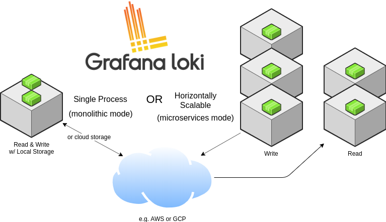

# Loki's Architecture

This document will expand on the information detailed in the [Loki
Overview](overview/README.md).

## Multi Tenancy

All data - both in memory and in long-term storage - is partitioned by a
tenant ID, pulled from the `X-Scope-OrgID` HTTP header in the request when Loki
is running in multi-tenant mode. When Loki is **not** in multi-tenant mode, the
header is ignored and the tenant ID is set to "fake", which will appear in the
index and in stored chunks.

## Modes of Operation



Loki has a set of components (defined below in [Components](#components)) which
are internally referred to as modules. Each component spawns a gRPC server for
internal traffic and an HTTP/1 server for external API requests. All components
come with an HTTP/1 server, but most only expose readiness, health, and metrics
endpoints.

Which component Loki runs is determined by either the `-target` flag at the
command line or the `target: <string>` section in Loki's config file. When the
value of `target` is `all`, Loki will run all of its components in a single
process. This is referred to as "single process", "single binary", or monolithic
mode. Monolithic mode is the default deployment of Loki when Loki is installed
using Helm.

When `target` is _not_ set to `all` (i.e., it is set to `querier`, `ingester`,
or `distributor`), then Loki is said to be running in "horizontally scalable",
or microservices, mode.

Each component of Loki, such as the ingesters and distributors, communicate with
one another over gRPC using the gRPC listen port defined in the Loki config.
When running components in monolithic mode, this is still true: each component,
although running in the same process, will connect to each other over the local
network for inter-component communication.

Single process mode is ideally suited for local development, small workloads,
and for evaluation purposes. Monolithic mode can be scaled with multiple
processes with the following limitations:

1. Local index and local storage cannot currently be used when running
   monolithic mode with more than one replica, as each replica must be able to
   access the same storage backend, and local storage is not safe for concurrent
   access.
2. Individual components cannot be scaled independently, so it is not possible
   to have more read components than write components.

## Components

### Distributor

The **distributor** service is responsible for handling incoming streams by
clients. It's the first stop in the write path for log data. Once the
distributor receives a set of streams, each stream is validated for correctness
and to ensure that it is within the configured tenant (or global) limits. Valid
chunks are then split into batches and sent to multiple [ingesters](#ingester)
in parallel.

#### Hashing

Distributors use consistent hashing in conjunction with a configurable
replication factor to determine which instances of the ingester service should
receive a given stream.

A stream is a set of logs associated to a tenant and a unique labelset. The
stream is hashed using both the tenant ID and the labelset and then the hash is
used to find the ingesters to send the stream to.

A hash ring stored in [Consul](https://www.consul.io) is used to achieve
consistent hashing; all [ingesters](#ingester) register themselves into the hash
ring with a set of tokens they own. Each token is a random unsigned 32-bit
number. Along with a set of tokens, ingesters register their state into the
hash ring. The state JOINING, and ACTIVE may all receive write requests, while
ACTIVE and LEAVING ingesters may receive read requests. When doing a hash
lookup, distributors only use tokens for ingesters who are in the appropriate
state for the request.

To do the hash lookup, distributors find the smallest appropriate token whose
value is larger than the hash of the stream. When the replication factor is
larger than 1, the next subsequent tokens (clockwise in the ring) that belong to
different ingesters will also be included in the result.

The effect of this hash set up is that each token that an ingester owns is
responsible for a range of hashes. If there are three tokens with values 0, 25,
and 50, then a hash of 3 would be given to the ingester that owns the token 25;
the ingester owning token 25 is responsible for the hash range of 1-25.

#### Quorum consistency

Since all distributors share access to the same hash ring, write requests can be
sent to any distributor.

To ensure consistent query results, Loki uses
[Dynamo-style](https://www.allthingsdistributed.com/files/amazon-dynamo-sosp2007.pdf)
quorum consistency on reads and writes. This means that the distributor will wait
for a positive response of at least one half plus one of the ingesters to send
the sample to before responding to the client that initiated the send.

### Ingester

The **ingester** service is responsible for writing log data to long-term
storage backends (DynamoDB, S3, Cassandra, etc.) on the write path and returning
log data for in-memory queries on the read path.

Ingesters contain a _lifecycler_ which manages the lifecycle of an ingester in
the hash ring. Each ingester has a state of either `PENDING`, `JOINING`,
`ACTIVE`, `LEAVING`, or `UNHEALTHY`:

1. `PENDING` is an Ingester's state when it is waiting for a handoff from
   another ingester that is `LEAVING`.

2. `JOINING` is an Ingester's state when it is currently inserting its tokens
   into the ring and initializing itself. It may receive write requests for
   tokens it owns.

3. `ACTIVE` is an Ingester's state when it is fully initialized. It may receive
   both write and read requests for tokens it owns.

4. `LEAVING` is an Ingester's state when it is shutting down. It may receive
   read requests for data it still has in memory.

5. `UNHEALTHY` is an Ingester's state when it has failed to heartbeat to
   Consul. `UNHEALHTY` is set by the distributor when it periodically checks the ring.

Each log stream that an ingester receives is built up into a set of many
"chunks" in memory and flushed to the backing storage backend at a configurable
interval.

Chunks are compressed and marked as read-only when:

1. The current chunk has reached capacity (a configurable value).
2. Too much time has passed without the current chunk being updated
3. A flush occurs.

Whenever a chunk is compressed and marked as read-only, a writable chunk takes
its place.

If an ingester process crashes or exits abruptly, all the data that has not yet
been flushed will be lost. Loki is usually configured to replicate multiple
replicas (usually 3) of each log to mitigate this risk.

When a flush occurs to a persistent storage provider, the chunk is hashed based
on its tenant, labels, and contents. This means that multiple ingesters with the
same copy of data will not write the same data to the backing store twice, but
if any write failed to one of the replicas, multiple differing chunk objects
will be created in the backing store. See [Querier](#querier) for how data is
deduplicated.

#### Handoff

By default, when an ingester is shutting down and tries to leave the hash ring,
it will wait to see if a new ingester tries to enter before flushing and will
try to initiate a handoff. The handoff will transfer all of the tokens and
in-memory chunks owned by the leaving ingester to the new ingester.

Before joining the hash ring, ingesters will wait in `PENDING` state for a
handoff to occur. After a configurable timeout, ingesters in the `PENDING` state
that have not received a transfer will join the ring normally, inserting a new
set of tokens.

This process is used to avoid flushing all chunks when shutting down, which is a
slow process.

### Querier

The **querier** service handles queries using the [LogQL](./logql.md) query
language, fetching logs both from the ingesters and long-term storage.

Queriers query all ingesters for in-memory data before falling back to
running the same query against the backend store. Because of the replication
factor, it is possible that the querier may receive duplicate data. To resolve
this, the querier internally **deduplicates** data that has the same nanosecond
timestamp, label set, and log message.

## Chunk Format

```
  -------------------------------------------------------------------
  |                               |                                 |
  |        MagicNumber(4b)        |           version(1b)           |
  |                               |                                 |
  -------------------------------------------------------------------
  |         block-1 bytes         |          checksum (4b)          |
  -------------------------------------------------------------------
  |         block-2 bytes         |          checksum (4b)          |
  -------------------------------------------------------------------
  |         block-n bytes         |          checksum (4b)          |
  -------------------------------------------------------------------
  |                        #blocks (uvarint)                        |
  -------------------------------------------------------------------
  | #entries(uvarint) | mint, maxt (varint) | offset, len (uvarint) |
  -------------------------------------------------------------------
  | #entries(uvarint) | mint, maxt (varint) | offset, len (uvarint) |
  -------------------------------------------------------------------
  | #entries(uvarint) | mint, maxt (varint) | offset, len (uvarint) |
  -------------------------------------------------------------------
  | #entries(uvarint) | mint, maxt (varint) | offset, len (uvarint) |
  -------------------------------------------------------------------
  |                      checksum(from #blocks)                     |
  -------------------------------------------------------------------
  |                    #blocks section byte offset                  |
  -------------------------------------------------------------------
```

`mint` and `maxt` describe the minimum and maximum Unix nanosecond timestamp,
respectively.

### Block Format

A block is comprised of a series of entries, each of which is an individual log
line.

Note that the bytes of a block are stored compressed using Gzip. The following
is their form when uncompressed:

```
  -------------------------------------------------------------------
  |    ts (varint)    |     len (uvarint)    |     log-1 bytes      |
  -------------------------------------------------------------------
  |    ts (varint)    |     len (uvarint)    |     log-2 bytes      |
  -------------------------------------------------------------------
  |    ts (varint)    |     len (uvarint)    |     log-3 bytes      |
  -------------------------------------------------------------------
  |    ts (varint)    |     len (uvarint)    |     log-n bytes      |
  -------------------------------------------------------------------
```

`ts` is the Unix nanosecond timestamp of the logs, while len is the length in
bytes of the log entry.

## Chunk Store

The **chunk store** is Loki's long-term data store, designed to support
interactive querying and sustained writing without the need for background
maintenance tasks. It consists of:

* An index for the chunks. This index can be backed by:
    * [Amazon DynamoDB](https://aws.amazon.com/dynamodb)
    * [Google Bigtable](https://cloud.google.com/bigtable)
    * [Apache Cassandra](https://cassandra.apache.org)
* A key-value (KV) store for the chunk data itself, which can be:
    * [Amazon DynamoDB](https://aws.amazon.com/dynamodb)
    * [Google Bigtable](https://cloud.google.com/bigtable)
    * [Apache Cassandra](https://cassandra.apache.org)
    * [Amazon S3](https://aws.amazon.com/s3)
    * [Google Cloud Storage](https://cloud.google.com/storage/)

> Unlike the other core components of Loki, the chunk store is not a separate
> service, job, or process, but rather a library embedded in the two services
> that need to access Loki data: the [ingester](#ingester) and [querier](#querier).

The chunk store relies on a unified interface to the
"[NoSQL](https://en.wikipedia.org/wiki/NoSQL)" stores (DynamoDB, Bigtable, and
Cassandra) that can be used to back the chunk store index. This interface
assumes that the index is a collection of entries keyed by:

* A **hash key**. This is required for *all* reads and writes.
* A **range key**. This is required for writes and can be omitted for reads,
which can be queried by prefix or range.

The interface works somewhat differently across the supported databases:

* DynamoDB supports range and hash keys natively. Index entries are thus
  modelled directly as DynamoDB entries, with the hash key as the distribution
  key and the range as the DynamoDB range key.
* For Bigtable and Cassandra, index entries are modelled as individual column
  values. The hash key becomes the row key and the range key becomes the column
  key.

A set of schemas are used to map the matchers and label sets used on reads and
writes to the chunk store into appropriate operations on the index. Schemas have
been added as Loki has evolved, mainly in an attempt to better load balance
writes and improve query performance.

> The current schema recommendation is the **v10 schema**.

## Read Path

To summarize, the read path works as follows:

1. The querier receives an HTTP/1 request for data.
2. The querier passes the query to all ingesters for in-memory data.
3. The ingesters receive the read request and return data matching the query, if
   any.
4. The querier lazily loads data from the backing store and runs the query
   against it if no ingesters returned data.
5. The querier iterates over all received data and deduplicates, returning a
   final set of data over the HTTP/1 connection.

## Write Path


To summarize, the write path works as follows:

1. The distributor receives an HTTP/1 request to store data for streams.
2. Each stream is hashed using the hash ring.
3. The distributor sends each stream to the appropriate ingesters and their
   replicas (based on the configured replication factor).
4. Each ingester will create a chunk or append to an existing chunk for the
   stream's data. A chunk is unique per tenant and per labelset.
5. The distributor responds with a success code over the HTTP/1 connection.
