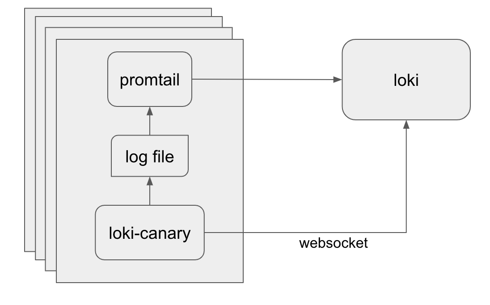

# loki-canary

A standalone app to audit the log capturing performance of Loki.

## how it works



loki-canary writes a log to a file and stores the timestamp in an internal array, the contents look something like this:

```nohighlight
1557935669096040040 ppppppppppppppppppppppppppppppppppppppppppppppppppppppppppp
```

The relevant part is the timestamp, the `p`'s are just filler bytes to make the size of the log configurable.

Promtail (or another agent) then reads the log file and ships it to Loki.

Meanwhile loki-canary opens a websocket connection to loki and listens for logs it creates

When a log is received on the websocket, the timestamp in the log message is compared to the internal array.

If the received log is:

  * The next in the array to be received, it is removed from the array and the (current time - log timestamp) is recorded in the `response_latency` histogram, this is the expected behavior for well behaving logs
  * Not the next in the array received, is is removed from the array, the response time is recorded in the `response_latency` histogram, and the `out_of_order_entries` counter is incremented
  * Not in the array at all, it is checked against a separate list of received logs to either increment the `duplicate_entries` counter or the `unexpected_entries` counter.

In the background, loki-canary also runs a timer which iterates through all the entries in the internal array, if any are older than the duration specified by the `-wait` flag (default 60s), they are removed from the array and the `websocket_missing_entries` counter is incremented.  Then an additional query is made directly to loki for these missing entries to determine if they were actually missing or just didn't make it down the websocket.  If they are not found in the followup query the `missing_entries` counter is incremented.

## building and running

`make` will run tests and build a docker image

`make build` will create a binary `loki-canary` alongside the makefile

To run the image, you can do something simple like:

`kubectl run loki-canary --generator=run-pod/v1 --image=grafana/loki-canary:latest --restart=Never --image-pull-policy=Never --labels=name=loki-canary -- -addr=loki:3100`

Or you can do something more complex like deploy it as a daemonset, there is a ksonnet setup for this in the `production` folder, you can import it using jsonnet-bundler:

```shell
jb install github.com/grafana/loki-canary/production/ksonnet/loki-canary
```

Then in your ksonnet environments `main.jsonnet` you'll want something like this:

```nohighlight
local loki_canary = import 'loki-canary/loki-canary.libsonnet';

loki_canary {
  loki_canary_args+:: {
    addr: "loki:3100",
    port: 80,
    labelname: "instance",
    interval: "100ms",
    size: 1024,
    wait: "3m",
  },
  _config+:: {
    namespace: "default",
  }
}

```

## config

It is required to pass in the Loki address with the `-addr` flag, if your server uses TLS, also pass `-tls=true` (this will create a wss:// instead of ws:// connection)

You should also pass the `-labelname` and `-labelvalue` flags, these are used by loki-canary to filter the log stream to only process logs for this instance of loki-canary, so they must be unique per each of your loki-canary instances.  The ksonnet config in this project accomplishes this by passing in the pod name as the labelvalue

If you get a high number of `unexpected_entries` you may not be waiting long enough and should increase `-wait` from 60s to something larger.

__Be cognizant__ of the relationship between `pruneinterval` and the `interval`.  For example, with an interval of 10ms (100 logs per second) and a prune interval of 60s, you will write 6000 logs per minute, if those logs were not received over the websocket, the canary will attempt to query loki directly to see if they are completely lost.  __However__ the query return is limited to 1000 results so you will not be able to return all the logs even if they did make it to Loki.

__Likewise__, if you lower the `pruneinterval` you risk causing a denial of service attack as all your canaries attempt to query for missing logs at whatever your `pruneinterval` is defined at.

All options:

```nohighlight
  -addr string
        The Loki server URL:Port, e.g. loki:3100
  -buckets int
        Number of buckets in the response_latency histogram (default 10)
  -interval duration
        Duration between log entries (default 1s)
  -labelname string
        The label name for this instance of loki-canary to use in the log selector (default "name")
  -labelvalue string
        The unique label value for this instance of loki-canary to use in the log selector (default "loki-canary")
  -pass string
        Loki password
  -port int
        Port which loki-canary should expose metrics (default 3500)
  -pruneinterval duration
        Frequency to check sent vs received logs, also the frequency which queries for missing logs will be dispatched to loki (default 1m0s)
  -size int
        Size in bytes of each log line (default 100)
  -tls
        Does the loki connection use TLS?
  -user string
        Loki username
  -wait duration
        Duration to wait for log entries before reporting them lost (default 1m0s)
```
