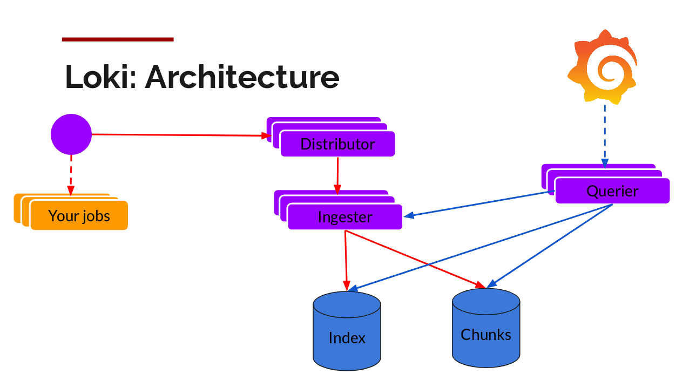

# Overview
This page lists the 2 common Loki deployments, to help user to better understand Loki architecture.

Loki consists several components as below (Quote from slides [here](https://grafana.com/blog/2018/12/12/loki-prometheus-inspired-open-source-logging-for-cloud-natives/)):


|  Component | Intro |
| --- | --- |
| Distributor | use consistent hashing to assign a logstream to an ingester |
| Ingester | gzip logs and append them. Index and data chunks go to different store |
| Querier | look at the index to figure out which chunks match, and distributed grep through them. Talks to chunks and Ingester(get the recent data that has not been flushed) both |
| Table-Manager | manage the chunk and index lifecycle |


# Loki Deployment on Single Process
To those who want to just have a try at Loki, deploying Loki on `Single Process` is the easiest way.
It combines all above component in a single process.

[Run Locally Using Docker](https://github.com/grafana/loki/tree/master/production#run-locally-using-docker) and [Run from Source](https://github.com/grafana/loki/tree/master/production#build-and-run-from-source) have already gave the examples.

They are using Loki config like below
```yaml
auth_enabled: false

server:
  http_listen_port: 3100

ingester:
  lifecycler:
    address: 127.0.0.1
    ring:
      kvstore:
        store: inmemory
      replication_factor: 1
  chunk_idle_period: 15m

schema_config:
  configs:
  - from: 2018-04-15
    store: boltdb
    object_store: filesystem
    schema: v9
    index:
      prefix: index_
      period: 168h

storage_config:
  boltdb:
    directory: /tmp/loki/index

  filesystem:
    directory: /tmp/loki/chunks

limits_config:
  enforce_metric_name: false
  reject_old_samples: true
  reject_old_samples_max_age: 168h

chunk_store_config:
  max_look_back_period: 0

table_manager:
  chunk_tables_provisioning:
    inactive_read_throughput: 0
    inactive_write_throughput: 0
    provisioned_read_throughput: 0
    provisioned_write_throughput: 0
  index_tables_provisioning:
    inactive_read_throughput: 0
    inactive_write_throughput: 0
    provisioned_read_throughput: 0
    provisioned_write_throughput: 0
  retention_deletes_enabled: false
  retention_period: 0
```

# Loki Deployment on Separate Mode
To those who want to use Loki in production and persuit higher performance, deploying Loki on `Separate Mode` is a must.

There're 4 things need to consider compared to Single Process Mode.
1. The Ring Store:
    
    You need to start a Consul server as the Ring store. It will store a consistent hash ring which consists of a list of tokens and ingesters. And Components like Distributors/Queriers rely on it to know which ingester is alive.
    For more details, you can read doc [here](https://github.com/cortexproject/cortex/blob/master/docs/architecture.md#the-hash-ring).
    
    Here's an example using docker to start a Consul server:
    `docker run -e 'CHECKPOINT_DISABLE=1' -p 8300:8300 -p 8400:8400 -p 8500:8500 consul:0.7.1 agent -ui -server -client=0.0.0.0 -bootstrap`
2. The Storage:
    
    You need to think about using some index store and chunk store which can access from all above components.
    For example, if you start above components in Kubernetes Pods, you may choose Amazon DynamoDB+S3, or choose boltdb+filesystem in a NFS storage like CephFS.
3. The http_listen_port and grpc_listen_port:
    
    If you start above components separately in different Kubernetes Pod or in different VM/BM, you don't need to worry about it.
    If you start above components separately in your dev machine or one VM/BM, you need assign different port to them. Otherwise you will see errors like "address already in use".
4. The startup command args
    
    You need to specify the target for different component. 
    For example, to start up Ingester only, using command like `./loki -config.file=/etc/loki/local-config.yaml -target=ingester`
    Other components are similar.
    
Below is the sample Loki Config for Separate Mode, please pay attention to the `ingester.lifecycler.ring.kvstore` part.
```yaml
uth_enabled: false

server:
  http_listen_port: 3100

ingester:
  lifecycler:
    ring:
      kvstore:
        store: consul
        consul:
          host: consulhost:8500
          prefix: ''
          httpclienttimeout: 20s
          consistentreads: true
      replication_factor: 1
  chunk_idle_period: 15m

schema_config:
  configs:
  - from: 2018-04-15
    store: boltdb
    object_store: filesystem
    schema: v9
    index:
      prefix: index_
      period: 168h

storage_config:
  boltdb:
    directory: /import/ceph/loki/index

  filesystem:
    directory: /import/ceph/loki/chunks

limits_config:
  enforce_metric_name: false
  reject_old_samples: true
  reject_old_samples_max_age: 168h

chunk_store_config:
  max_look_back_period: 0

table_manager:
  chunk_tables_provisioning:
    inactive_read_throughput: 0
    inactive_write_throughput: 0
    provisioned_read_throughput: 0
    provisioned_write_throughput: 0
  index_tables_provisioning:
    inactive_read_throughput: 0
    inactive_write_throughput: 0
    provisioned_read_throughput: 0
    provisioned_write_throughput: 0
  retention_deletes_enabled: false
  retention_period: 0
``` 