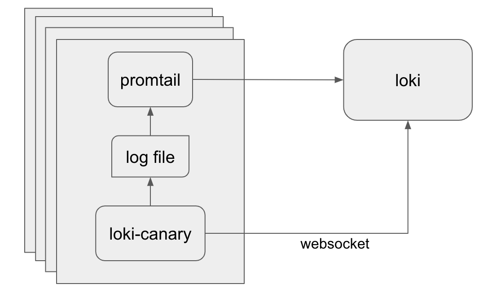

# Loki Canary

Loki Canary is a standalone app that audits the log capturing performance of
Loki.

## How it works



Loki Canary writes a log to a file and stores the timestamp in an internal
array. The contents look something like this:

```nohighlight
1557935669096040040 ppppppppppppppppppppppppppppppppppppppppppppppppppppppppppp
```

The relevant part of the log entry is the timestamp; the `p`s are just filler
bytes to make the size of the log configurable.

An agent (like Promtail) should be configured to read the log file and ship it
to Loki.

Meanwhile, Loki Canary will open a WebSocket connection to Loki and will tail
the logs it creates. When a log is received on the WebSocket, the timestamp
in the log message is compared to the internal array.

If the received log is:

* The next in the array to be received, it is removed from the array and the
  (current time - log timestamp) is recorded in the `response_latency`
  histogram. This is the expected behavior for well behaving logs.
* Not the next in the array to be received, it is removed from the array, the
  response time is recorded in the `response_latency` histogram, and the
  `out_of_order_entries` counter is incremented.
* Not in the array at all, it is checked against a separate list of received
  logs to either increment the `duplicate_entries` counter or the
  `unexpected_entries` counter.

In the background, Loki Canary also runs a timer which iterates through all of
the entries in the internal array. If any of the entries are older than the
duration specified by the `-wait` flag (defaulting to 60s), they are removed
from the array and the `websocket_missing_entries` counter is incremented. An
additional query is then made directly to Loki for any missing entries to
determine if they are truly missing or only missing from the WebSocket. If
missing entries are not found in the direct query, the `missing_entries` counter
is incremented.

## Installation

### Binary

Loki Canary is provided as a pre-compiled binary as part of the
[Loki Releases](https://github.com/grafana/loki/releases) on GitHub.

### Docker

Loki Canary is also provided as a Docker container image:

```bash
# change tag to the most recent release
$ docker pull grafana/loki-canary:v1.0.0
```

### Kubernetes

To run on Kubernetes, you can do something simple like:

`kubectl run loki-canary --generator=run-pod/v1
--image=grafana/loki-canary:latest --restart=Never --image-pull-policy=IfNotPresent
--labels=name=loki-canary -- -addr=loki:3100`

Or you can do something more complex like deploy it as a DaemonSet, there is a
Tanka setup for this in the `production` folder, you can import it using
`jsonnet-bundler`:

```shell
jb install github.com/grafana/loki-canary/production/ksonnet/loki-canary
```

Then in your Tanka environment's `main.jsonnet` you'll want something like
this:

```jsonnet
local loki_canary = import 'loki-canary/loki-canary.libsonnet';

loki_canary {
  loki_canary_args+:: {
    addr: "loki:3100",
    port: 80,
    labelname: "instance",
    interval: "100ms",
    size: 1024,
    wait: "3m",
  },
  _config+:: {
    namespace: "default",
  }
}
```
#### Examples

Standalone Pod Implementation of loki-canary

```
---
apiVersion: v1
kind: Pod
metadata:
  labels:
    app: loki-canary
    name: loki-canary
  name: loki-canary
spec:
  containers:
  - args:
    - -addr=loki:3100
    image: grafana/loki-canary:latest
    imagePullPolicy: IfNotPresent
    name: loki-canary
    resources: {}
---
apiVersion: v1
kind: Service
metadata:
  name: loki-canary
  labels:
    app: loki-canary
spec:
  type: ClusterIP
  selector:
    app: loki-canary
  ports:
  - name: metrics
    protocol: TCP
    port: 3500
    targetPort: 3500
```

DeamonSet Implementation of loki-canary

```
---
kind: DaemonSet
apiVersion: extensions/v1beta1
metadata:
  labels:
    app: loki-canary
    name: loki-canary
  name: loki-canary
spec:
  template:
    metadata:
      name: loki-canary
      labels:
        app: loki-canary
  spec:
    containers:
    - args:
      - -addr=loki:3100
      image: grafana/loki-canary:latest
      imagePullPolicy: IfNotPresent
      name: loki-canary
      resources: {}
---
apiVersion: v1
kind: Service
metadata:
  name: loki-canary
  labels:
    app: loki-canary
spec:
  type: ClusterIP
  selector:
    app: loki-canary
  ports:
  - name: metrics
    protocol: TCP
    port: 3500
    targetPort: 3500
```


### From Source

If the other options are not sufficient for your use case, you can compile
`loki-canary` yourself:

```bash
# clone the source tree
$ git clone https://github.com/grafana/loki

# build the binary
$ make loki-canary

# (optionally build the container image)
$ make loki-canary-image
```

## Configuration

The address of Loki must be passed in with the `-addr` flag, and if your Loki
server uses TLS, `-tls=true` must also be provided. Note that using TLS will
cause the WebSocket connection to use `wss://` instead of `ws://`.

The `-labelname` and `-labelvalue` flags should also be provided, as these are
used by Loki Canary to filter the log stream to only process logs for the
current instance of the canary. Ensure that the values provided to the flags are
unique to each instance of Loki Canary. Grafana Labs' Tanka config
accomplishes this by passing in the pod name as the label value.

If Loki Canary reports a high number of `unexpected_entries`, Loki Canary may
not be waiting long enough and the value for the `-wait` flag should be
increased to a larger value than 60s.

__Be aware__ of the relationship between `pruneinterval` and the `interval`.
For example, with an interval of 10ms (100 logs per second) and a prune interval
of 60s, you will write 6000 logs per minute. If those logs were not received
over the WebSocket, the canary will attempt to query Loki directly to see if
they are completely lost. __However__ the query return is limited to 1000
results so you will not be able to return all the logs even if they did make it
to Loki.

__Likewise__, if you lower the `pruneinterval` you risk causing a denial of
service attack as all your canaries attempt to query for missing logs at
whatever your `pruneinterval` is defined at.

All options:

```nohighlight
  -addr string
        The Loki server URL:Port, e.g. loki:3100
  -buckets int
        Number of buckets in the response_latency histogram (default 10)
  -interval duration
        Duration between log entries (default 1s)
  -labelname string
        The label name for this instance of loki-canary to use in the log selector (default "name")
  -labelvalue string
        The unique label value for this instance of loki-canary to use in the log selector (default "loki-canary")
  -pass string
        Loki password
  -port int
        Port which loki-canary should expose metrics (default 3500)
  -pruneinterval duration
        Frequency to check sent vs received logs, also the frequency which queries for missing logs will be dispatched to loki (default 1m0s)
  -size int
        Size in bytes of each log line (default 100)
  -tls
        Does the loki connection use TLS?
  -user string
        Loki username
  -wait duration
        Duration to wait for log entries before reporting them lost (default 1m0s)
```
