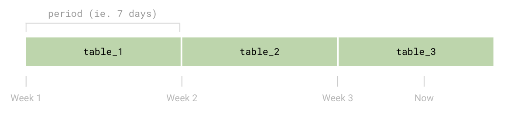
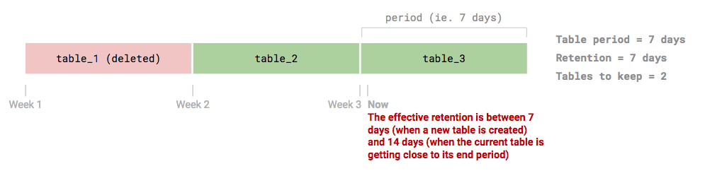
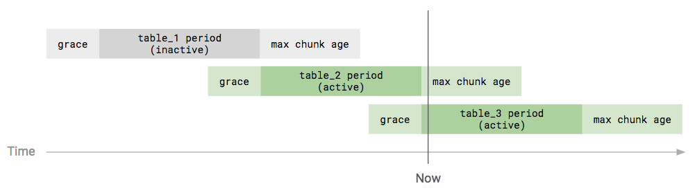

# Table Manager

Loki supports storing indexes and chunks in table-based data storages. When
such a storage type is used, multiple tables are created over the time: each
table - also called periodic table - contains the data for a specific time
range.

This design brings two main benefits:
1. **Schema config changes**: each table is bounded to a schema config and
   version, so that changes can be introduced over the time and multiple schema
   configs can coexist
1. **Retention**: the retention is implemented deleting an entire table, which
   allows to have fast delete operations

The **Table Manager** is a Loki component which takes care of creating a
periodic table before its time period begins, and deleting it once its data
time range exceeds the retention period.

The Table Manager supports the following backends:

- **Index store**
  - [Amazon DynamoDB](https://aws.amazon.com/dynamodb)
  - [Google Bigtable](https://cloud.google.com/bigtable)
  - [Apache Cassandra](https://cassandra.apache.org)
  - [BoltDB](https://github.com/boltdb/bolt) (primarily used for local environments)
- **Chunk store**
  - [Amazon DynamoDB](https://aws.amazon.com/dynamodb)
  - [Google Bigtable](https://cloud.google.com/bigtable)
  - [Apache Cassandra](https://cassandra.apache.org)
  - Filesystem (primarily used for local environments)

The object storages - like Amazon S3 and Google Cloud Storage - supported by Loki
to store chunks, are not managed by the Table Manager, and a custom bucket policy
should be set to delete old data.

For detailed information on configuring the Table Manager, refer to the
[`table_manager`](../../configuration/README.md#table_manager_config)
section in the Loki configuration document.


## Tables and schema config

A periodic table stores the index or chunk data relative to a specific period
of time. The duration of the time range of the data stored in a single table and
its storage type is configured in the
[`schema_config`](../../configuration/README.md#schema_config) configuration
block.

The [`schema_config`](../../configuration/README.md#schema_config) can contain
one or more `configs`. Each config, defines the storage used between the day
set in `from` (in the format `yyyy-mm-dd`) and the next config, or "now"
in the case of the last schema config entry.

This allows to have multiple non-overlapping schema configs over the time, in
order to perform schema version upgrades or change storage settings (including
changing the storage type).



The write path hits the table where the log entry timestamp falls into (usually
the last table, except short periods close to the end of a table and the
beginning of the next one), while the read path hits the tables containing data
for the query time range.


### Schema config example

For example, the following `schema_config` defines two configurations: the first
one using the schema `v8` and the current one using the `v9`.

The first config stores data between `2019-01-01` and `2019-04-14` (included),
then a new config has been added - to upgrade the schema version to `v9` -
storing data using the `v9` schema from `2019-04-15` on.

For each config, multiple tables are created, each one storing data for
`period` time (168 hours = 7 days).

```yaml
schema_config:
  configs:
    - from:   2019-01-01
      store:  dynamo
      schema: v8
      index:
        prefix: loki_
        period: 168h
    - from:   2019-04-15
      store:  dynamo
      schema: v9
      index:
        prefix: loki_
        period: 168h
```


### Table creation

The Table Manager creates new tables slightly ahead of their start period, in
order to make sure that the new table is ready once the current table end
period is reached.

The `creation_grace_period` property - in the
[`table_manager`](../../configuration/README.md#table_manager_config)
configuration block - defines how long before a table should be created.


## Retention

The retention - managed by the Table Manager - is disabled by default, due to
its destructive nature. You can enable the data retention explicitly enabling
it in the configuration and setting a `retention_period` greater than zero:

```yaml
table_manager:
  retention_deletes_enabled: true
  retention_period: 336h
```

The Table Manager implements the retention deleting the entire tables whose
data exceeded the `retention_period`. This design allows to have fast delete
operations, at the cost of having a retention granularity controlled by the
table's `period`.

Given each table contains data for `period` of time and that the entire table
is deleted, the Table Manager keeps the last tables alive using this formula:

```
number_of_tables_to_keep = floor(retention_period / table_period) + 1
```



It's important to note that - due to the internal implementation - the table
`period` and `retention_period` **must** be multiples of `24h` in order to get
the expected behavior.

For detailed information on configuring the retention, refer to the
[Loki Storage Retention](./retention.md)
documentation.


## Active / inactive tables

A table can be active or inactive.

A table is considered **active** if the current time is within the range:
- Table start period - [`creation_grace_period`](../../configuration/README.md#table_manager_config)
- Table end period + max chunk age (hardcoded to `12h`)



Currently, the difference between an active and inactive table **only applies
to the DynamoDB storage** settings: capacity mode (on-demand or provisioned),
read/write capacity units and autoscaling.

| DynamoDB            | Active table                            | Inactive table                       |
| ------------------- | --------------------------------------- | ------------------------------------ |
| Capacity mode       | `provisioned_throughput_on_demand_mode` | `inactive_throughput_on_demand_mode` |
| Read capacity unit  | `provisioned_read_throughput`           | `inactive_read_throughput`           |
| Write capacity unit | `provisioned_write_throughput`          | `inactive_write_throughput`          |
| Autoscaling         | Enabled (if configured)                 | Always disabled                      |


## DynamoDB Provisioning

When configuring DynamoDB with the Table Manager, the default [on-demand
provisioning](https://docs.aws.amazon.com/amazondynamodb/latest/developerguide/HowItWorks.ReadWriteCapacityMode.html)
capacity units for reads are set to 300 and writes are set to 3000. The
defaults can be overwritten:

```yaml
table_manager:
  index_tables_provisioning:
    provisioned_write_throughput: 10
    provisioned_read_throughput: 10
  chunk_tables_provisioning:
    provisioned_write_throughput: 10
    provisioned_read_throughput: 10
```

If Table Manager is not automatically managing DynamoDB, old data cannot easily
be erased and the index will grow indefinitely. Manual configurations should
ensure that the primary index key is set to `h` (string) and the sort key is set
to `r` (binary). The "period" attribute in the configuration YAML should be set
to `0`.


## Table Manager deployment mode

The Table Manager can be executed in two ways:

1. Implicitly executed when Loki runs in monolithic mode (single process)
2. Explicitly executed when Loki runs in microservices mode


### Monolithic mode

When Loki runs in [monolithic mode](../../architecture.md#modes-of-operation),
the Table Manager is also started as component of the entire stack.


### Microservices mode

When Loki runs in [microservices mode](../../architecture.md#modes-of-operation),
the Table Manager should be started as separate service named `table-manager`.

You can check out a production grade deployment example at
[`table-manager.libsonnet`](../../../production/ksonnet/loki/table-manager.libsonnet).
