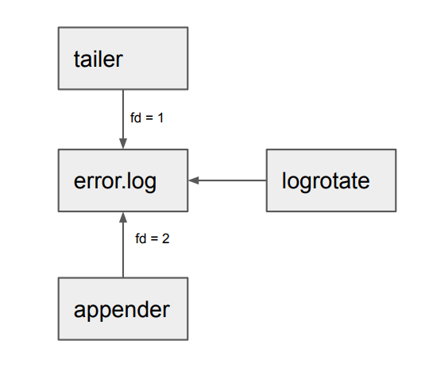

# Promtail and Log rotation

## Why log rotation matters?

At any point in time, there can be three processes working on a log file as shown in the image below.


1. Appender - A writer that keep appending to a log file. This can be your application or some system daemons like syslog, docker log driver or kubelet etc.
2. Tailer - A reader that read log lines as it is being appended e.g agents like Promtail.
3. Log Rotater - A process that rotates the log either based on time (say scheduled every day) or size (say a log file reached its max size)

NOTE: Here `fd` defines a file descriptor. Once a file is open for read or write, OS gives back unique file descriptor (an ingeter) per process and all the operations like read and write are done over that file descriptor. In other words, once file is opened successfully, file descriptor matters more than the file name.

One of the critical component here is log rotater. Let's understand how it impacts other components like appender and tailer.

In general, a log can be rotated in two ways.

Given a log file say `error.log`

1. Copy the log file with different name e.g `error.log.1` and truncate the original log file `error.log`.
2. Rename the log file with different name e.g: `error.log.1` and create new log file with original name `error.log`.

In both the cases, after log rotation, all the new log lines goes to original `error.log`

These types are shown in images below.

### Copy and Truncate


### Rename and Create


Both types of log rotation seems to give same end result. However there are some subtle differences.

(1) favours the appender in a sense, that file descriptor it is holding for original log file `error.log` doesn't change. So it can keep writing to same file descriptor, re-opening of the file is not needed.

However (1) has a serious problem if we bring `tailer` into the picture. There is a race between truncating the file and `tailer` finish reading that log file. Meaning, there is a high chance log rotate can truncate the file `error.log` before `tailer` read everything from it.

This is where (2) can help. Here when log file `error.log` is renamed to `error.log.1`, the `tailer` still holding file descriptor of `error.log.1` and it can continue reading the log file until it's completed. But that comes with the tradeoff, with (2) you have to signal the `appender` to reopen `error.log` (and `appender` should be able to reopen it), else it would be keep writing to `error.log.1` (because of same file descriptor). Almost all of the `appender` in real life (e.g: syslog, kubelet, docker log driver) supports reopening log file when it is renamed.

We recommend (2) as that is the one which works well with Promtail (or any agent) without any dataloss. Now let's understand how do we exactly configure log rotation in different platforms.

## Configure log rotation.

Your logs can be rotated by different components depending on where you are running your application or services. If you are running on Linux bare metal or VM, high chance you will be using [`logrotate`](https://man7.org/linux/man-pages/man8/logrotate.8.html) utility. However if you are running in kubernetes, it's not that obvious who rotates the logs and interestingly it may dependes on what container runtime your kubernetes cluster is using.

### Non kubernetes

Usually in Linux bare metal or VM log rotation is handled by [`logrotate`](https://man7.org/linux/man-pages/man8/logrotate.8.html) utility.

The two different types of log rotation as explained before are supported in `logrotate` as well.

#### Copy and Truncate
```
/var/log/apache2/*.log {
        weekly
        maxsize 1G
        copytruncate
}
```

Here `copytruncate` mode works exactly like (1) explained above.

#### Rename and Create
```
/var/log/apache2/*.log {
        weekly
        maxsize 1G
        create
}
```
Here `create` mode works like (2) explained above. `create` mode is optional because it's the default mode in `logroate`.

`logroate` configs are usually located in `/etc/logrotate/`

It has wide range [different options](https://man7.org/linux/man-pages/man8/logrotate.8.html) for compression, mailing, scripts to run pre and post rotation, etc.

**Recommended: Rename and Create**

### Kubernetes

We can [configure](https://kubernetes.io/docs/concepts/cluster-administration/logging/#log-rotation) `kubelet` running on each node to manage log rotation via two configs

1. `containerLogMaxSize` - It is a quantity defining the maximum size of the container log file before it is rotated. For example: "5Mi" or "256Ki". Default: "10Mi"
2. `containerLogMaxFiles` - It specifies the maximum number of container log files that can be present for a container. Default: 5

Both should be part of `kubelet` config. Check cloud provider docs for tweaking this configs in managed version of Kubernetes cluster. Examples [GKE](https://cloud.google.com/kubernetes-engine/docs/how-to/node-system-config#create), [AKS](https://learn.microsoft.com/en-us/azure/aks/custom-node-configuration#use-custom-node-configuration) and [EKS](https://eksctl.io/usage/customizing-the-kubelet/#customizing-kubelet-configuration)

NOTE: Log rotation managed by `kubelet` supports only rename + create (for a good reason) and doesn't support copy + truncate.

If `kubelet` is not configured to manage the log rotation, then it's upto CRI (Container Runtime Interface) the cluster is using or can be managed by `logrotate` utility in the kubernetes node itself.

Check your container runtime on your nodes via
```bash
$ kubectl get nodes -o wide
```

Two of the common used CRI are `containerd` and `docker`.

#### containerd CRI

`containerd` [doesn't support any way of log rotation](https://github.com/containerd/containerd/issues/4830#issuecomment-744744375), and it's often should be handled by `kubelet` itself. Managed clusters like GKE and AKS uses `containerd` as runtime and log rotation is handled by `kubelet`. [EKS after version 1.24](https://docs.aws.amazon.com/eks/latest/userguide/dockershim-deprecation.html) also uses `containerd` as default container runtime.

#### docker CRI

When using `docker` as runtime(EKS before 1.24 uses it by default), it's logrotate is managed by it's logging driver. Docker has [support for several logging drivers](https://docs.docker.com/config/containers/logging/configure/#supported-logging-drivers)

Out of all these logging drivers only `local` (default) and `json-file` supports log rotation. You configure following `log-opts` under `/etc/docker/daemon.json`

1. `max-size` - The maximum size of the log before it is rolled. A positive integer plus a modifier representing the unit of measure (k, m, or g). Defaults to 20m.
2. `max-file` - The maximum number of log files that can be present. If rolling the logs creates excess files, the oldest file is removed. A positive integer. Defaults to 5.

Example `/etc/docker/daemon.json`
```bash
{
  "log-driver": "local",
  "log-opts": {
    "max-size": "10m",
	"max-file": "10"
  }
}
```

If neither of `kubelet` or `CRI` is configured for log rotate, then we can still use `logrotate` utility on kubernetes nodes for the logration as explained previously.

**Recommended: Use kubelet for log rotation**

## Configure Promtail

Promtail uses `polling` to watch for file changes. And combined with `polling` and [copy and truncate](#copy-and-truncate) log rotation, there can be high chance, some logs may be lost before promtail reads all log lines(as file may got truncated).

In that case we strongly recommend to change the log rotation strategy to [rename and create](#rename-and-create) for long term solution. For the short term, you can tweak promtail client's `batchsize` [config](https://grafana.com/docs/loki/latest/clients/promtail/configuration/#clients) to higher values (like 5M or 8M) giving more room to read loglines without frequently waiting for push response from Loki server.
