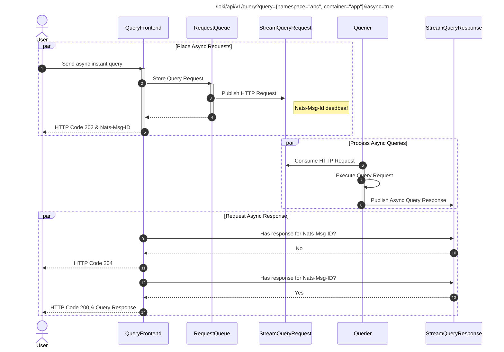

# DRAFT: Asynchronous Queries

**Author:** Periklis Tsirakidis

**Date:** 06/2023

**Sponsor(s):** @cyriltovena

**Type:** Feature

**Status:** Draft

**Related issues/PRs:** [9730](https://github.com/grafana/loki/pull/9730), [9055](https://github.com/grafana/loki/pull/9055)

**Thread from [mailing list](https://groups.google.com/forum/#!forum/lokiproject):**

---

## Background

Since inception Loki has only synchronous query capabilities which manifest in user-facing applications waiting for an instant/time-range query to return or a timeout to occur. A series of query scheduling and evaluation optimizations (e.g. [Query Fairness Scheduling](./0003-QueryFairnessInScheduler.md), [Per-Request Query Limits](https://github.com/grafana/loki/pull/8727), [PR - JSON Parser Improvements](https://github.com/grafana/loki/pull/7723)) have been added in the past to better utilize the availability of `queriers`. In addition new components like the `index-gateway` have been added to make `queriers` horizontally (auto-)scaling easier and more appealing (i.e. [Autoscaling Queriers](../../operations/autoscaling_queries.md)).

The present state leaves still client applications and related networking infrastructure (e.g. edge gateways like Nginx, L7 interconnect gateways like Skupper, Grafana datasource dataproxy) with the burden to maintain a long-waiting connection and appropriate timeouts for any query that has a long execution time (e.g. queries parsing GB/TB of logs, aggregating over multiple months of logs). This imposes users and in turn Loki administrators to understand Loki query timeouts and sharding as well as how to scale individual components for long-running queries. On the other hand users of such queries might consider it acceptable to request a query without an immediate response and get back later to check out the results. Such type of queries can be called asynchronous queries, where the user receives some sort of a unique ticket which can be used to check the query response in a future time.

## Problem Statement

Expensive/slow queries can be expressed in Loki terms in many different ways with various effects to the user experience, i.e.:

* A query that has a too-wide label selector might require to scan a tremendous amount of chunks (i.e. effectively TB of logs or more) (e.g. parsing logs across a fleet of clusters).
* A query that aggregates metrics over a very large time range (i.e. multiple months) and/or chunks (i.e. TB of logs or more) (e.g. count audit log events over months).
* A query using expensive/slow regex/pattern parsing over a considerable amount of chunks (i.e. TB of logs or more) (e.g. parsing the access log from a high traffic gateway).

Although the list is not exhaustive all examples granted can potentially result either in easily reaching limits (chunks, series, per-request, etc.) or take too long so that client applications and related networking infrastructure run in timeouts. Limits might be considered as tunable but timeouts might not be easy to mitigate or instantly addressable. These use cases can be considered problematic when the requesting user requires:

* The query result without the ability to tune execution time or Loki's resource constraints.
* The query result represents an expensive but important (aggregation) result set of logs and has a higher value as such irrespective how long it takes.

## Goals

The following proposals aim at providing the required infrastructure and query capabilities to execute queries in Loki asynchronously meaning the user will not fetch a result immediately but at later point in time using an identification for the requested query.

## Non-Goals (optional)

The following proposal do not aim at extending Loki to asynchronous capabilities beyond executing queries, e.g. offering asynchronous streams to read/write from/to Loki.

## Proposals

### Proposal 0: Do nothing

The current state represents the do-nothing scenario very well, as per trade-offs currently to consider:

* Users need to tune their queries manually (e.g. distinct label selectors, batching time frames).
* Users need to request per-tenant and/or per-request limits by their respecting Loki administrators to overcome limits for certain query demand over time.
* Client applications and networking infrastructure needs to be tuned for Loki response latency scenarios (e.g. Grafana datasource dataproxy, Server Write Timeouts on Gateways)

### Proposal 1: Built-in asynchronous streaming component for asynchronous queries

The main approach of a built-in asynchronous streaming component as devised in the [proof-of-concept PR](https://github.com/grafana/loki/pull/9730) is based on [nats.io's jetstream technology](https://nats.io/) and consists of:

- A new Loki component called the `nats-server` that is hosting the persistence layer for any NATS JetStreams.
- Multiple JetStream pub/sub streams for handling asynchronously Loki instant/range query requests and responses.

The main benefits of this approach can be summarized as:

- Provides a built-in stream handling component that can self-hosted with Loki as native Loki component (e.g. ring handling, discovery, scaling)
- Allows full-control on stream characteristics (i.e. retention, message replication, ack policy)
- Enables handling queries as simple pub/sub messages using built-in JetStream primitives (i.e. pub/sub provider as a native Loki subservice).

The tradeoffs using this approach are:

- A direct dependency to the NATS.io client and server code to be maintained.
- A whole new set of settings to control and maintain JetStream streams on the server-side.
- Object storage support for persisting streams currently experimental.

### Proposal 2: Client support for external asynchronous streaming systems

Another approach to enable asynchronous query execution is to expand Loki with client SDKs to support various streaming/queueing systems (e.g. Kafka).

The main benefits are:

- Simple client-based only handling of asynchronous queries, i.e. offloading stream handling to an external system.
- No need to maintain persistence intrisics for streams/queues in Loki and in turn keeping a uniform object-store-only architecture (Note: With Loki based on local filesystem)
- Offloading retention/availability/etc. requirements for asynchronous queries to a third-party system (i.e. as previously devised with Consul for ring operations)

The tradeoffs using this approach are:

- Requires developing some sort of generic asynchronous message handling across different technologies (e.g. Kafka, vs. AMQ vs. etc.)
- Needs to align support client SDKs with the our requirements on asynchronous message in respect to availability, retention, ack offerings.
- Requires to operate an additional system dependency close to Loki in order to offer simple asychronous queries.

## Other Notes

### Overview on using asynchronous streams for instant query requests

