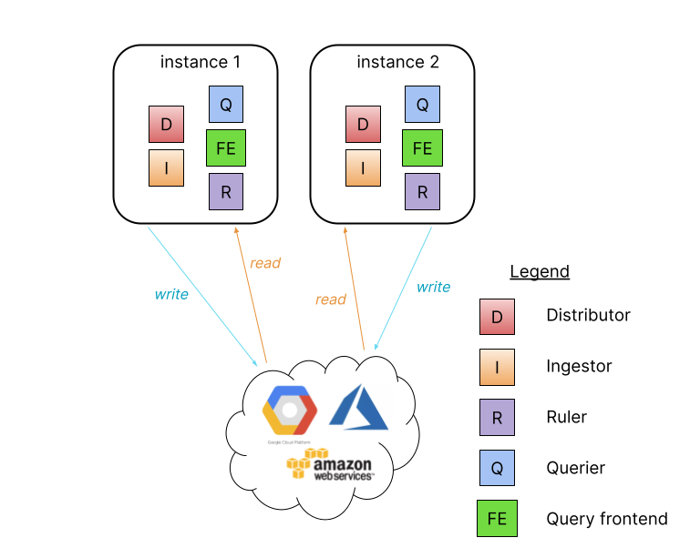
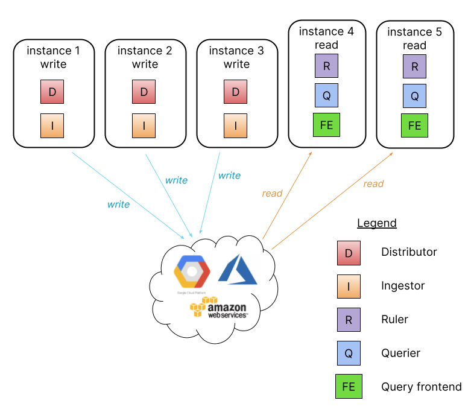
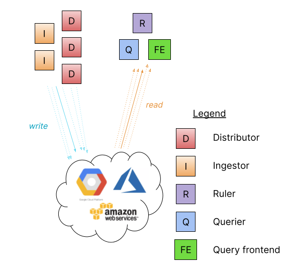

# Deployment modes

As an application, 
Loki is built out of many component microservices,
and is designed to run as a horizontally-scalable distributed system.
Loki's unique design compiles the code of the entire distributed system into
a single binary or Docker image.
The behavior of that single binary is controlled with
the `-target` command-line flag and defines one of three modes of operation.

Configuration for each deployed instance of the binary
further specifies which components it runs.

Loki is designed to easily redeploy a cluster under a different mode
as your needs change,
with no configuration changes or minimal configuration changes.

## Monolithic mode

The simplest mode of operation sets `-target=all`.
This is the default target,
and it does not need to be specified.
This is monolithic mode;
it runs all of Loki’s microservice components inside a single process
as a single binary or Docker image.

Monolithic mode is useful for getting started quickly to experiment with Loki,
as well as for small read/write volumes of up to approximately 100GB per day.

Horizontally scale up a monolithic mode deployment to more instances
by using a shared object store, and by configuring the
[`ring` section]()
to share state between all instances.

High availability can be configured by running two Loki instances
using `memberlist_config` configuration and a shared object store.

Route traffic to all the Loki instances in a round robin fashion.

Query parallelization is limited to the quantity of instances
and the query parallelism defined.

## Simple scalable deployment mode

If your volume of logs exceeds a few hundred GB a day,
or if you would like to separate read and write concerns,
Loki provides the simple scalable deployment mode.
This deployment mode can scale to several TBs of logs per day and more.
Consider the microservices mode approach for very large Loki installations.

In this mode the component microservices of Loki are bundled into two targets:
`-target=read` and `-target=write`.
The BoltDB [compactor]() 
service will run as part of the read target.

There are advantages to separating the read and write paths:

* higher availability of write path by providing dedicated nodes
* separately scalable read path to add/remove query performance on demand

The simple scalable deployment mode requires a load balancer in front of Loki,
which directs `/loki/api/v1/push` traffic to the write nodes.
All other requests go to the read nodes.
Traffic should be sent in a round robin fashion.

The simple scalable deployment of Loki can scale to
several TBs of logs per day and more.

## Microservices mode

The microservices deployment mode instantiates components of Loki
as distinct processes.
Each process is invoked specifying its `target`:

* ingester
* distributor
* query-frontend
* query-scheduler
* querier
* index-gateway
* ruler
* compactor

Running components as individual microservices allows scaling up
by increasing the quantity of microservices.
The customized cluster has better observability of the individual components.
Microservices mode deployments are the most efficient Loki installations.
However, they are also the most complex to set up and maintain.

Microservices mode is recommended for very large Loki clusters
or for clusters that require more control over scaling and cluster operations.

Microservices mode works best with Kubernetes deployments.
There are Jsonnet and distributed Helm chart installations.
