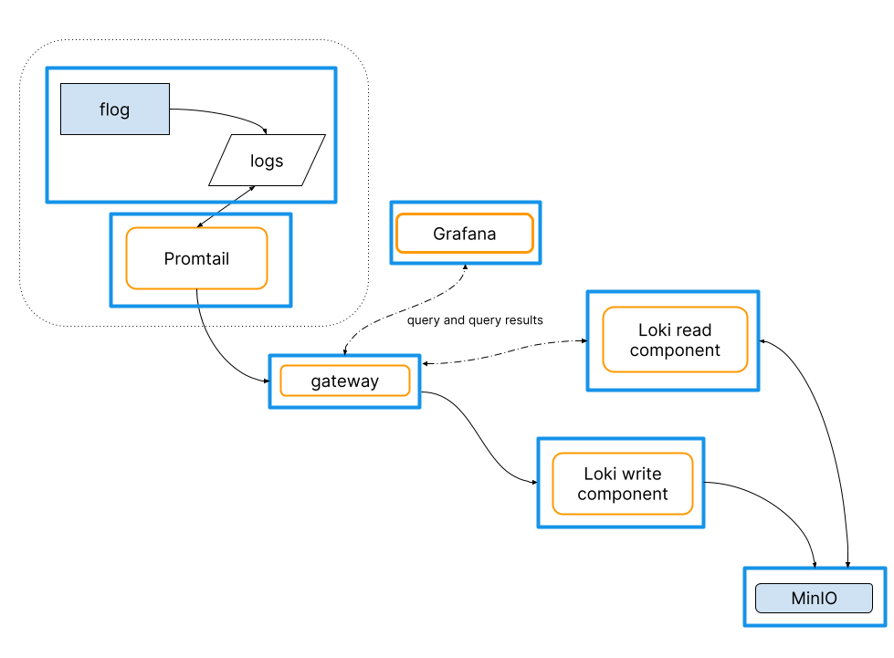

# Get started

This guide assists the reader to create and use a simple Loki cluster.
The cluster is intended for testing, development, and evaluation;
it will not meet most production requirements.

The test environment runs the [flog](https://github.com/mingrammer/flog) app to generate log lines.
Promtail is the test environment's agent (or client) that captures the log lines and pushes them to the Loki cluster through a gateway.
In a typical environment, the log-generating app and the agent run together, but in locations distinct from the Loki cluster. This guide runs each piece of the test environment locally, in Docker containers.

Grafana provides a way to pose queries against the logs stored in Loki and visualize query results.
 


The test environment uses Docker compose to instantiate these parts, each in its own container: 

- One [single scalable deployment]() mode **Loki** instance has:
    - One Loki read component
    - One Loki write component
    - **Minio** is Loki's storage back end in the test environment.
- The **gateway** receives requests and redirects them to the appropriate container based on the request's URL.
- **Flog** generates log lines.
- **Promtail** scrapes the log lines from flog, and pushes them to Loki through the gateway.
- **Grafana** provides visualization of the log lines captured within Loki.

## Prerequisites

- [Docker](https://docs.docker.com/install)
- [Docker Compose](https://docs.docker.com/compose/install)

## Obtain the test environment

1. Create a directory called `evaluate-loki` for the test environment. Make `evaluate-loki` your current working directory:
    ```bash
    mkdir evaluate-loki
    cd evaluate-loki
    ```
1. Download `loki-config.yaml`, `promtail-local-config.yaml`, and `docker-compose.yaml`:

    ```bash
    wget https://raw.githubusercontent.com/grafana/loki/main/examples/getting-started/loki-config.yaml -O loki-config.yaml
    wget https://raw.githubusercontent.com/grafana/loki/main/examples/getting-started/promtail-local-config.yaml -O promtail-local-config.yaml
    wget https://raw.githubusercontent.com/grafana/loki/main/examples/getting-started/docker-compose.yaml -O docker-compose.yaml
    ```

## Deploy the test environment

1. With `evaluate-loki` as the current working directory, deploy the test environment using `docker-compose`:
    ```bash
    docker-compose up -d
    ```
1. (Optional) Verify that the Loki cluster is up and running. The read component returns `ready` when you point a web browser at http://localhost:3101/ready. The message `Query Frontend not ready: not ready: number of schedulers this worker is connected to is 0` will show prior to the read component being ready.
The write component returns `ready` when you point a web browser at http://localhost:3102/ready. The message `Ingester not ready: waiting for 15s after being ready` will show prior to the write component being ready.

## Use Grafana and the test environment

Use [Grafana](/docs/grafana/latest/) to query and observe the log lines captured in the Loki cluster by navigating a browser to http://localhost:3000.
The Grafana instance has Loki configured as a [datasource](/docs/grafana/latest/datasources/loki/).

Click on the Grafana instance's [Explore](/docs/grafana/latest/explore/) icon to bring up the explore pane.

Use the Explore dropdown menu to choose the Loki datasource and bring up the Loki query browser.

Try some queries.
Enter your query into the **Log browser** box, and click on the blue **Run query** button.

To see all the log lines that flog has generated:
```
{container="evaluate-loki-flog-1"}
```

The flog app will generate log lines for invented HTTP requests.
To see all `GET` log lines, enter the query:

```
{container="evaluate-loki-flog-1"} |= "GET"
```
For `POST` methods:
```
{container="evaluate-loki-flog-1"} |= "POST"
```

To see every log line with a 401 status (unauthorized error): 
```
{container="evaluate-loki-flog-1"} | json | status="401"
```
To see every log line other than those that contain the value 401: 
```
{container="evaluate-loki-flog-1"} != "401"
```

Refer to [query examples]() for more examples.

## Stop and clean up the test environment

To break down the test environment:

- Close the Grafana browser window

- With `evaluate-loki` as the current working directory, stop and remove all the Docker containers:
    ```bash
    docker-compose down
    ```

## Modifying the flog app output

You can modify the flog app's log line generation by changing
its configuration.
Choose one of these two ways to apply a new configuration:

- To remove already-generated logs, restart the test environment with a new configuration.

    1. With `evaluate-loki` as the current working directory, stop and clean up an existing test environment:
        ```
        docker-compose down
        ```
    1. Edit the `docker-compose.yaml` file.  Within the YAML file, change the `flog.command` field's value to specify your flog output. Refer to the `flog` [command line arguments](https://hub.docker.com/r/mingrammer/flog).
    1. With `evaluate-loki` as the current working directory, instantiate the new test environment:
        ```
        docker-compose up -d
        ```

- To keep already-generated logs in the running test environment, restart flog with a new configuration.

    1. Edit the `docker-compose.yaml` file.  Within the YAML file, change the `flog.command` field's value to specify your flog output.
    1. With `evaluate-loki` as the current working directory, restart only the flog app within the currently-running test environment:
        ```
        docker-compose up -d --force-recreate flog
        ```

