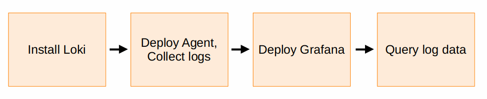

# Get started with Grafana Loki



Loki is a horizontally scalable, highly available, multi-tenant log aggregation system inspired by Prometheus. It is designed to be very cost effective and easy to operate. It does not index the contents of the logs, but rather a set of labels for each log stream.

Because all Loki implementations are unique, the installation process is
different for every customer. But there are some steps in the process that
should be common to every installation.

To collect logs and view your log data generally involves the following steps:



1. Install Loki on Kubernetes in simple scalable mode, using the recommended [Helm chart](https://grafana.com/docs/loki/<LOKI_VERSION>/setup/install/helm/install-scalable/). Supply the Helm chart with your object storage authentication details.
   - [Storage options](https://grafana.com/docs/loki/<LOKI_VERSION>/operations/storage/)
   - [Configuration reference](https://grafana.com/docs/loki/<LOKI_VERSION>/configure/)
   - There are [examples](https://grafana.com/docs/loki/<LOKI_VERSION>/configure/examples/) for specific Object Storage providers that you can modify.
1. Deploy [Grafana Alloy](https://grafana.com/docs/alloy/latest/) to collect logs from your applications.
    1. On Kubernetes, deploy the Grafana Flow using the Helm chart. Configure Grafana Alloy to scrape logs from your Kubernetes cluster, and add your Loki endpoint details. See the following section for an example Grafana Alloy configuration file.
    1. Add [labels](https://grafana.com/docs/loki/<LOKI_VERSION>/get-started/labels/) to your logs following our [best practices](https://grafana.com/docs/loki/<LOKI_VERSION>/get-started/labels/bp-labels/). Most Loki users start by adding labels which describe where the logs are coming from (region, cluster, environment, etc.).
1. Deploy [Grafana](https://grafana.com/docs/grafana/latest/setup-grafana/) or [Grafana Cloud](https://grafana.com/docs/grafana-cloud/quickstart/) and configure a [Loki data source](https://grafana.com/docs/grafana/latest/datasources/loki/configure-loki-data-source/).
1. Select the [Explore feature](https://grafana.com/docs/grafana/latest/explore/) in the Grafana main menu. To [view logs in Explore](https://grafana.com/docs/grafana/latest/explore/logs-integration/):
    1. Pick a time range.
    1. Choose the Loki data source.
    1. Use [LogQL](https://grafana.com/docs/loki/<LOKI_VERSION>/query/) in the [query editor](https://grafana.com/docs/grafana/latest/datasources/loki/query-editor/), use the Builder view to explore your labels, or select from sample pre-configured queries using the **Kick start your query** button.

**Next steps:** Learn more about the Loki query language, [LogQL](https://grafana.com/docs/loki/<LOKI_VERSION>/query/).

## Example Grafana Alloy and Agent configuration files to ship Kubernetes Pod logs to Loki

To deploy Grafana Alloy or Agent to collect Pod logs from your Kubernetes cluster and ship them to Loki, you an use a Helm chart, and a `values.yaml` file.

This sample `values.yaml` file is configured to:

- Install Grafana Agent to discover Pod logs.
- Add `container` and `pod` labels to the logs.
- Push the logs to your Loki cluster using the tenant ID `cloud`.

1. Install Loki with the [Helm chart](https://grafana.com/docs/loki/<LOKI_VERSION>/setup/install/helm/install-scalable/).

1. Deploy either Grafana Alloy or the Grafana Agent, using the Helm chart:
    - [Grafana Alloy Helm chart](https://grafana.com/docs/alloy/latest/get-started/install/kubernetes/)
    - [Grafana Agent Helm chart](https://grafana.com/docs/agent/latest/flow/setup/install/kubernetes/)

1. Create a `values.yaml` file, based on the following example, making sure to update the value for `forward_to = [loki.write.endpoint.receiver]`:

    

```yaml-alloy
alloy:
  mounts:
    varlog: true
  configMap:
    content: |
      logging {
        level  = "info"
        format = "logfmt"
      }

      discovery.kubernetes "pods" {
        role = "pod"
      }

      loki.source.kubernetes "pods" {
        targets    = discovery.kubernetes.pods.targets
        forward_to = [loki.write.endpoint.receiver]
      }

      loki.write "endpoint" {
        endpoint {
            url = "http://loki-gateway.default.svc.cluster.local:80/loki/api/v1/push"
            tenant_id = "local"
        }
      }

```

```yaml-static-agent
agent:
  mounts:
    varlog: true
  configMap:
    content: |
      logging {
        level  = "info"
        format = "logfmt"
      }

      discovery.kubernetes "k8s" {
        role = "pod"
      }

      discovery.relabel "k8s" {
        targets = discovery.kubernetes.k8s.targets

        rule {
          source_labels = ["__meta_kubernetes_pod_name"]
          action = "replace"
          target_label = "pod"
        }
        rule {
          source_labels = ["__meta_kubernetes_pod_container_name"]
          action = "replace"
          target_label = "container"
        }

        rule {
          source_labels = ["__meta_kubernetes_namespace", "__meta_kubernetes_pod_label_name"]
          target_label  = "job"
          separator     = "/"
        }

        rule {
          source_labels = ["__meta_kubernetes_pod_uid", "__meta_kubernetes_pod_container_name"]
          target_label  = "__path__"
          separator     = "/"
          replacement   = "/var/log/pods/*$1/*.log"
        }
      }

      local.file_match "pods" {
        path_targets = discovery.relabel.k8s.output
      }

      loki.source.file "pods" {
        targets = local.file_match.pods.targets
        forward_to = [loki.write.endpoint.receiver]
      }

      loki.write "endpoint" {
        endpoint {
            url = "http://loki-gateway:80/loki/api/v1/push"
            tenant_id = "cloud"
        }
      }
```

    

1. Then install Alloy or the Agent in your Kubernetes cluster using:

    

```alloy
helm install alloy grafana/alloy -f ./values.yml    

```

```agent
helm upgrade -f values.yaml agent grafana/grafana-agent 
```
    
