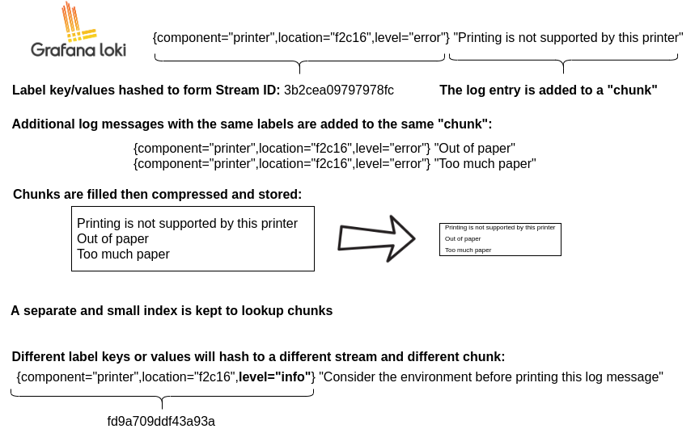

# Loki architecture

## Multi-tenancy

All data, both in memory and in long-term storage, may be partitioned by a
tenant ID, pulled from the `X-Scope-OrgID` HTTP header in the request when Grafana Loki
is running in multi-tenant mode. When Loki is **not** in multi-tenant mode, the
header is ignored and the tenant ID is set to "fake", which will appear in the
index and in stored chunks.

## Chunk Format

```
  -------------------------------------------------------------------
  |                               |                                 |
  |        MagicNumber(4b)        |           version(1b)           |
  |                               |                                 |
  -------------------------------------------------------------------
  |         block-1 bytes         |          checksum (4b)          |
  -------------------------------------------------------------------
  |         block-2 bytes         |          checksum (4b)          |
  -------------------------------------------------------------------
  |         block-n bytes         |          checksum (4b)          |
  -------------------------------------------------------------------
  |                        #blocks (uvarint)                        |
  -------------------------------------------------------------------
  | #entries(uvarint) | mint, maxt (varint) | offset, len (uvarint) |
  -------------------------------------------------------------------
  | #entries(uvarint) | mint, maxt (varint) | offset, len (uvarint) |
  -------------------------------------------------------------------
  | #entries(uvarint) | mint, maxt (varint) | offset, len (uvarint) |
  -------------------------------------------------------------------
  | #entries(uvarint) | mint, maxt (varint) | offset, len (uvarint) |
  -------------------------------------------------------------------
  |                      checksum(from #blocks)                     |
  -------------------------------------------------------------------
  |                    #blocks section byte offset                  |
  -------------------------------------------------------------------
```

`mint` and `maxt` describe the minimum and maximum Unix nanosecond timestamp,
respectively.

### Block Format

A block is comprised of a series of entries, each of which is an individual log
line.

Note that the bytes of a block are stored compressed using Gzip. The following
is their form when uncompressed:

```
  -------------------------------------------------------------------
  |    ts (varint)    |     len (uvarint)    |     log-1 bytes      |
  -------------------------------------------------------------------
  |    ts (varint)    |     len (uvarint)    |     log-2 bytes      |
  -------------------------------------------------------------------
  |    ts (varint)    |     len (uvarint)    |     log-3 bytes      |
  -------------------------------------------------------------------
  |    ts (varint)    |     len (uvarint)    |     log-n bytes      |
  -------------------------------------------------------------------
```

`ts` is the Unix nanosecond timestamp of the logs, while len is the length in
bytes of the log entry.

## Storage

### Single Store

Loki stores all data in a single object storage backend. This mode of operation became generally available with Loki 2.0 and is fast, cost-effective, and simple, not to mention where all current and future development lies. This mode uses an adapter called [`boltdb_shipper`]() to store the `index` in object storage (the same way we store `chunks`).

###  Deprecated: Multi-store

The **chunk store** is Loki's long-term data store, designed to support
interactive querying and sustained writing without the need for background
maintenance tasks. It consists of:

- An index for the chunks. This index can be backed by:
    - [Amazon DynamoDB](https://aws.amazon.com/dynamodb)
    - [Google Bigtable](https://cloud.google.com/bigtable)
    - [Apache Cassandra](https://cassandra.apache.org)
- A key-value (KV) store for the chunk data itself, which can be:
    - [Amazon DynamoDB](https://aws.amazon.com/dynamodb)
    - [Google Bigtable](https://cloud.google.com/bigtable)
    - [Apache Cassandra](https://cassandra.apache.org)
    - [Amazon S3](https://aws.amazon.com/s3)
    - [Google Cloud Storage](https://cloud.google.com/storage/)

> Unlike the other core components of Loki, the chunk store is not a separate
> service, job, or process, but rather a library embedded in the two services
> that need to access Loki data: the [ingester]() and [querier]().

The chunk store relies on a unified interface to the
"[NoSQL](https://en.wikipedia.org/wiki/NoSQL)" stores (DynamoDB, Bigtable, and
Cassandra) that can be used to back the chunk store index. This interface
assumes that the index is a collection of entries keyed by:

- A **hash key**. This is required for *all* reads and writes.
- A **range key**. This is required for writes and can be omitted for reads,
which can be queried by prefix or range.

The interface works somewhat differently across the supported databases:

- DynamoDB supports range and hash keys natively. Index entries are thus
  modelled directly as DynamoDB entries, with the hash key as the distribution
  key and the range as the DynamoDB range key.
- For Bigtable and Cassandra, index entries are modelled as individual column
  values. The hash key becomes the row key and the range key becomes the column
  key.

A set of schemas are used to map the matchers and label sets used on reads and
writes to the chunk store into appropriate operations on the index. Schemas have
been added as Loki has evolved, mainly in an attempt to better load balance
writes and improve query performance.

## Read Path

To summarize, the read path works as follows:

1. The querier receives an HTTP/1 request for data.
1. The querier passes the query to all ingesters for in-memory data.
1. The ingesters receive the read request and return data matching the query, if
   any.
1. The querier lazily loads data from the backing store and runs the query
   against it if no ingesters returned data.
1. The querier iterates over all received data and deduplicates, returning a
   final set of data over the HTTP/1 connection.

## Write Path



To summarize, the write path works as follows:

1. The distributor receives an HTTP/1 request to store data for streams.
1. Each stream is hashed using the hash ring.
1. The distributor sends each stream to the appropriate ingesters and their
   replicas (based on the configured replication factor).
1. Each ingester will create a chunk or append to an existing chunk for the
   stream's data. A chunk is unique per tenant and per labelset.
1. The distributor responds with a success code over the HTTP/1 connection.
