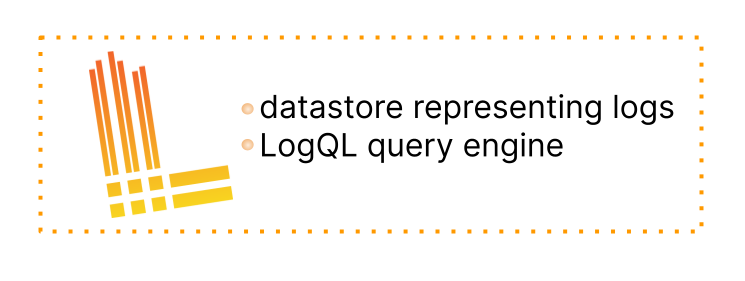
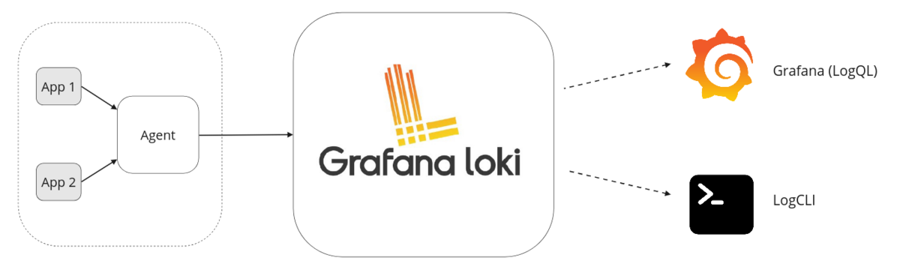

# Loki overview

Grafana Loki is a log aggregation tool,
and it is the core of a fully-featured logging stack.

Loki is a datastore optimized for efficiently holding log data.
The efficient indexing of log data
distinguishes Loki from other logging systems.
Unlike other logging systems, a Loki index is built from labels,
leaving the original log message unindexed.

An agent (also called a client) acquires logs,
turns the logs into streams,
and pushes the streams to Loki through an HTTP API.
The Promtail agent is designed for Loki installations,
but many other [Agents]() seamlessly integrate with Loki.

Loki indexes streams.
Each stream identifies a set of logs associated with a unique set of labels.
A quality set of labels is key to the creation of an index that is both compact
and allows for efficient query execution.

[LogQL]() is the query language for Loki.

## Loki features

-  **Efficient memory usage for indexing the logs**

    By indexing on a set of labels, the index can be significantly smaller
    than other log aggregation products.
    Less memory makes it less expensive to operate.

-  **Multi-tenancy**

    Loki allows multiple tenants to utilize a single Loki instance.
    The data of distinct tenants is completely isolated from other tenants.
    Multi-tenancy is configured by assigning a tenant ID in the agent.

-  **LogQL, Loki's query language**

    Users of the Prometheus query language, PromQL, will find LogQL familiar
    and flexible for generating queries against the logs.
    The language also facilitates the generation of metrics from log data,
    a powerful feature that goes well beyond log aggregation.

-  **Scalability**

    Loki is designed for scalability,
    as each of Loki's components can be run as microservices designed to run statelessly and natively within Kubernetes.
    Loki's read and write path are decoupled meaning that you can independently scale read or write leading to flexible large-scale installations that can quickly adapt to meet your workload at any given time.

-  **Flexibility**

    Many agents (clients) have plugin support.
    This allows a current observability structure
    to add Loki as their log aggregation tool without needing
    to switch existing portions of the observability stack.

-  **Grafana integration**

    Loki seamlessly integrates with Grafana,
    providing a complete observability stack.

