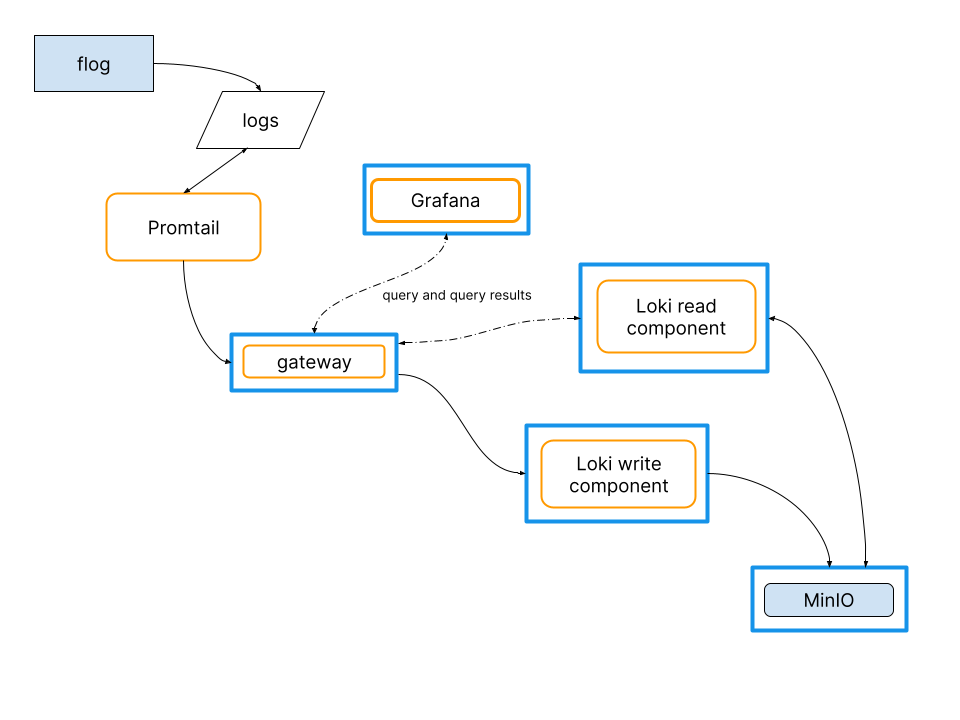

# Getting started with Grafana Loki

> **Note:** You can use [Grafana Cloud](https://grafana.com/products/cloud/features/#cloud-logs) to avoid installing, maintaining, and scaling your own instance of Grafana Loki. The free forever plan includes 50GB of free logs. [Create an account to get started](https://grafana.com/auth/sign-up/create-user?pg=docs-loki&plcmt=in-text).

This guide assists the reader to create and use a simple Loki cluster.
The cluster is intended for testing, development, and evaluation;
it will not meet most production requirements.

The test environment runs the [flog](https://github.com/mingrammer/flog) app that generates log lines.
Promtail is the environment's agent (or client) that captures the log lines and pushes them to the Loki cluster through a gateway.
Grafana provides a way to pose and visualize queries against the logs stored in Loki.
 


The test environment uses Docker compose to instantiate these services, each in its own container: 

- One [single scalable deployment](../fundamentals/architecture/deployment-modes/) mode **Loki** instance has:
    - One Loki read component
    - One Loki write component
- **Minio** is the storage back end.
- The **gateway** receives requests and redirects them to the appropriate container based on the request's URL.
- **Grafana** provides visualization of the log lines captured within Loki.

The flog app and Promtail are run on your local machine,
to make them easy to modify.

## Prerequisites

- [Docker](https://docs.docker.com/install)
- [Docker Compose](https://docs.docker.com/compose/install)
- The [flog](https://github.com/mingrammer/flog) app

## Obtain and configure the test environment

1. Create a directory for the test environment; make that new directory your current working directory:
    ```bash
    mkdir evaluate-loki
    cd evaluate-loki
    ```
1. Download `loki-config.yaml`, `promtail-local-config.yaml`, and `docker-compose.yaml`:

    ```bash
    wget https://raw.githubusercontent.com/grafana/loki/main/production/simple-scalable/loki-config.yaml -O loki-config.yaml
    wget https://raw.githubusercontent.com/grafana/loki/main/production/simple-scalable/promtail-local-config.yaml -O promtail-local-config.yaml
    wget https://raw.githubusercontent.com/grafana/loki/main/production/simple-scalable/docker-compose.yaml -O docker-compose.yaml
    ```

1. The `docker-compose.yaml` relies on the [Loki docker driver](https://grafana.com/docs/loki/latest/clients/docker-driver/), 
aliased to `loki-compose`, to send logs to the loki cluster. If this driver is not installed on your system, you can install it by running the following:

    ```bash
    docker plugin install grafana/loki-docker-driver:latest --alias loki-compose --grant-all-permissions
    ```

    If this driver is already installed, but under a different alias, you will have to change `docker-compose.yaml` to use the correct alias.

1. Modify the Promtail configuration file to scrape the output of the flog app. Edit the `promtail-local-config.yaml`. Change the `__path__` value `/path/to/flog.log` to be the path to your current working directory, which is the test environment's directory.

    Within Promtail configuration, the `scrape_configs` YAML block specifies the logs to scrape.

1. Download and install Promtail.
    1. On the [Loki](https://github.com/grafana/loki) home page, locate and click on the most recent release.  At the bottom of the releases's page are the Assets.  Find and download the Promtail ZIP file for your operating system and architecture.
    1. Uncompress the binary.  For example:
    ```bash
    unzip promtail-linux-amd64.zip
    ```

## Deploy the test environment

All shell commands are issued from the test environment's directory.

1. Deploy Grafana and the Loki cluster with `docker-compose`:
    ```bash
    docker-compose up
    ```
1. (Optional) Verify that the Loki cluster is up and running. The read component returns `ready` when you point a web browser at http://localhost:3101/ready.
The write component returns `ready` when you point a web browser at http://localhost:3102/ready.
1. Run the `flog` app to start generating log lines.
This example generates 100 log lines in JSON format, at intervals of 5 seconds:
    ```bash
    flog -f json -o flog.log -t log -n 100 -d 5s
    ```
1. Run Promtail to capture the log lines and push them to the Loki cluster. Your binary's name may be different than this example:
    ```bash
    ./promtail-linux-amd64 -config.file promtail-local-config.yaml
    ```

Navigate to http://localhost:3000 for the Grafana instance that has Loki configured as a datasource.

## Use Grafana and the test environment

This guide uses Grafana to query and observe the log lines captured in the Loki cluster.

Use Grafana to query and observe the log lines captured in the Loki cluster by navigating a browswer to http://localhost:3000.
The Grafana instance has Loki configured as a [datasource](https://grafana.com/docs/grafana/latest/datasources/loki/).

Click on the Grafana instance's [Explore](https://grafana.com/docs/grafana/latest/explore/) icon to bring up the log browser.

