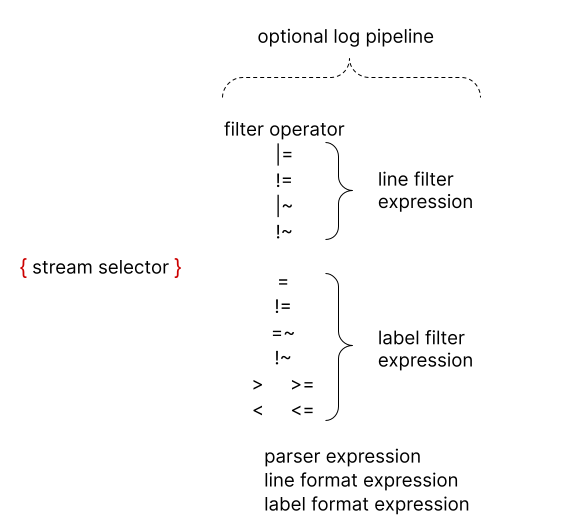

# LogQL: Log Query Language

LogQL is Loki's PromQL-inspired query language.
Queries act as if they are a distributed `grep` to aggregate log sources.
LogQL uses labels and operators for filtering.

There are two types of LogQL queries:

- *Log queries* return the contents of log lines.
- *Metric queries* extend log queries to calculate values
based on query results.

## Log Queries

All LogQL queries contain a **log stream selector**.



The log stream selector determines how many log streams (unique sources of log content, such as files) will be searched.
A more granular log stream selector then reduces the number of searched streams to a manageable volume.
This means that the labels passed to the log stream selector will affect the relative performance of the query's execution.

Optionally, the log stream selector can be followed by a **log pipeline**. A log pipeline is a set of stage expressions that are chained together and applied to the selected log streams. Each expression can filter out, parse, or mutate log lines and their respective labels.

The following example shows a full log query in action:

```logql
{container="query-frontend",namespace="loki-dev"} |= "metrics.go" | logfmt | duration > 10s and throughput_mb < 500
```

The query is composed of:

- a log stream selector `{container="query-frontend",namespace="loki-dev"}` which targets the `query-frontend` container  in the `loki-dev` namespace.
- a log pipeline `|= "metrics.go" | logfmt | duration > 10s and throughput_mb < 500` which will filter out log that contains the word `metrics.go`, then parses each log line to extract more labels and filter with them.

> To avoid escaping special characters you can use the `` ` ``(backtick) instead of `"` when quoting strings.
For example `` `\w+` `` is the same as `"\\w+"`.
This is specially useful when writing a regular expression which contains multiple backslashes that require escaping.

### Log Stream Selector

The stream selector determines which log streams to include in a query's results.
The stream selector is specified by one or more comma-separated key-value pairs. Each key is a log label and each value is that label's value.
Curly braces (`{` and `}`) delimit the stream selector. 

Consider this stream selector:

```logql
{app="mysql",name="mysql-backup"}
```

All log streams that have both a label of `app` whose value is `mysql`
and a label of `name` whose value is `mysql-backup` will be included in
the query results.
A stream may contain other pairs of labels and values,
but only the specified pairs within the stream selector are used to determine
which streams will be included within the query results.

The same rules that apply for [Prometheus Label Selectors](https://prometheus.io/docs/prometheus/latest/querying/basics/#instant-vector-selectors) apply for Loki log stream selectors.

The `=` operator after the label name is a **label matching operator**.
The following label matching operators are supported:

- `=`: exactly equal
- `!=`: not equal
- `=~`: regex matches
- `!~`: regex does not match

Regex log stream examples:

- `{name =~ "mysql.+"}`
- `{name !~ "mysql.+"}`
- `` {name !~ `mysql-\d+`} ``

**Note:** The `=~` regex operator is fully anchored, meaning regex must match against the *entire* string, including newlines. The regex `.` character does not match newlines by default. If you want the regex dot character to match newlines you can use the single-line flag, like so: `(?s)search_term.+` matches `search_term\n`.

### Log Pipeline

A log pipeline can be appended to a log stream selector to further process and filter log streams. It usually is composed of one or multiple expressions, each expressions is executed in sequence for each log line. If an expression filters out a log line, the pipeline will stop at this point and start processing the next line.

Some expressions can mutate the log content and respective labels.
For example,

```
| line_format "{{.status_code}}"`)
```

will be available for further filtering and processing following expressions or metric queries.

A log pipeline can be composed of:

- [Line Filter Expression](#line-filter-expression)
- [Parser Expression](#parser-expression)
- [Label Filter Expression](#label-filter-expression)
- [Line Format Expression](#line-format-expression)
- [Labels Format Expression](#labels-format-expression)
- [Unwrap Expression](#unwrapped-range-aggregations). An unwrapped expression is only used within metric queries.

#### Line Filter Expression

The line filter expression does a distributed `grep`
over the aggregated logs from the matching log streams.
It searches the contents of the log line,
discarding those lines that do not match the case sensitive expression.

Each line filter expression has a **filter operator**
followed by text or a regular expression.
These filter operators are supported:

- `|=`: Log line contains string
- `!=`: Log line does not contain string
- `|~`: Log line contains a match to the regular expression
- `!~`: Log line does not contain a match to the regular expression

Line filter expression examples:

- Keep log lines that have the substring "error":

    ```
    |= "error"
    ```

    A complete query using this example:

    ```
    {job="mysql"} |= "error"
    ```

- Discard log lines that have the substring "kafka.server:type=ReplicaManager":

    ```
    != "kafka.server:type=ReplicaManager"
    ```

    A complete query using this example:

    ```
    {instance=~"kafka-[23]",name="kafka"} != "kafka.server:type=ReplicaManager"
    ```

- Keep log lines that contain a substring that starts with `tsdb-ops` and ends with `io:2003`. A complete query with a regular expression:

    ```
    {name="kafka"} |~ "tsdb-ops.*io:2003"
    ```

- Keep log lines that contain a substring that starts with `error=`,
and is followed by 1 or more word characters. A complete query with a regular expression:

    ```
    {name="cassandra"} |~  `error=\w+` 
    ```

Filter operators can be chained.
Filters are applied sequentially.
Query results will have satisfied every filter.
This complete query example will give results that include the string `error`,
and do not include the string `timeout`.

```logql
{job="mysql"} |= "error" != "timeout"
```

When using `|~` and `!~`, Go (as in [Golang](https://golang.org/)) [RE2 syntax](https://github.com/google/re2/wiki/Syntax) regex may be used.
The matching is case-sensitive by default.
Switch to case-insensitive matching by prefixing the regular expression
with `(?i)`.

While line filter expressions could be placed anywhere within a log pipeline,
it is almost always better to have them at the beginning.
Placing them at the beginning improves the performance of the query,
as it only does further processing when a line matches.
For example,
 while the results will be the same,
the query specified with

```
{job="mysql"} |= "error" | json | line_format "{{.err}}"
```

will always run faster than

```
{job="mysql"} | json | line_format "{{.message}}" |= "error"
```

Line filter expressions are the fastest way to filter logs once the
log stream selectors have been applied.

Line filter expressions have support matching IP addresses. See [Matching IP addresses](ip/) for details.

#### Parser Expression

Parser expression can parse and extract labels from the log content. Those extracted labels can then be used for filtering using [label filter expressions](#label-filter-expression) or for [metric aggregations](#metric-queries).

Extracted label keys are automatically sanitized by all parsers, to follow Prometheus metric name convention.(They can only contain ASCII letters and digits, as well as underscores and colons. They cannot start with a digit.)

For instance, the pipeline `| json` will produce the following mapping:
```json
{ "a.b": {c: "d"}, e: "f" }
```
->
```
{a_b_c="d", e="f"}
```

In case of errors, for instance if the line is not in the expected format, the log line won't be filtered but instead will get a new `__error__` label added.

If an extracted label key name already exists in the original log stream, the extracted label key will be suffixed with the `_extracted` keyword to make the distinction between the two labels. You can forcefully override the original label using a [label formatter expression](#labels-format-expression). However if an extracted key appears twice, only the latest label value will be kept.

Loki supports  [JSON](#json), [logfmt](#logfmt), [pattern](#pattern), [regexp](#regexp) and [unpack](#unpack) parsers.

It's easier to use the predefined parsers `json` and `logfmt` when you can. If you can't, the `pattern` and `regexp` parsers can be used for log lines with an unusual structure. The `pattern` parser is easier and faster to write; it also outperforms the `regexp` parser.
Multiple parsers can be used by a single log pipeline. This is useful for parsing complex logs. There are examples in [Multiple parsers](#multiple-parsers).

##### JSON

The **json** parser operates in two modes:

1. **without** parameters:

   Adding `| json` to your pipeline will extract all json properties as labels if the log line is a valid json document.
   Nested properties are flattened into label keys using the `_` separator.

   Note: **Arrays are skipped**.

   For example the json parsers will extract from the following document:

   ```json
   {
       "protocol": "HTTP/2.0",
       "servers": ["129.0.1.1","10.2.1.3"],
       "request": {
           "time": "6.032",
           "method": "GET",
           "host": "foo.grafana.net",
           "size": "55",
           "headers": {
             "Accept": "*/*",
             "User-Agent": "curl/7.68.0"
           }
       },
       "response": {
           "status": 401,
           "size": "228",
           "latency_seconds": "6.031"
       }
   }
   ```

   The following list of labels:

   ```kv
   "protocol" => "HTTP/2.0"
   "request_time" => "6.032"
   "request_method" => "GET"
   "request_host" => "foo.grafana.net"
   "request_size" => "55"
   "response_status" => "401"
   "response_size" => "228"
   "response_size" => "228"
   ```

2. **with** parameters:

   Using `| json label="expression", another="expression"` in your pipeline will extract only the
   specified json fields to labels. You can specify one or more expressions in this way, the same
   as [`label_format`](#labels-format-expression); all expressions must be quoted.

   Currently, we only support field access (`my.field`, `my["field"]`) and array access (`list[0]`), and any combination
   of these in any level of nesting (`my.list[0]["field"]`).

   For example, `| json first_server="servers[0]", ua="request.headers[\"User-Agent\"]` will extract from the following document:

    ```json
    {
        "protocol": "HTTP/2.0",
        "servers": ["129.0.1.1","10.2.1.3"],
        "request": {
            "time": "6.032",
            "method": "GET",
            "host": "foo.grafana.net",
            "size": "55",
            "headers": {
              "Accept": "*/*",
              "User-Agent": "curl/7.68.0"
            }
        },
        "response": {
            "status": 401,
            "size": "228",
            "latency_seconds": "6.031"
        }
    }
    ```

   The following list of labels:

    ```kv
    "first_server" => "129.0.1.1"
    "ua" => "curl/7.68.0"
    ```

   If an array or an object returned by an expression, it will be assigned to the label in json format.

   For example, `| json server_list="servers", headers="request.headers` will extract:

   ```kv
   "server_list" => `["129.0.1.1","10.2.1.3"]`
   "headers" => `{"Accept": "*/*", "User-Agent": "curl/7.68.0"}`
   ```

##### logfmt

The **logfmt** parser can be added using the `| logfmt` and will extract all keys and values from the [logfmt](https://brandur.org/logfmt) formatted log line.

For example the following log line:

```logfmt
at=info method=GET path=/ host=grafana.net fwd="124.133.124.161" service=8ms status=200
```

will get those labels extracted:

```kv
"at" => "info"
"method" => "GET"
"path" => "/"
"host" => "grafana.net"
"fwd" => "124.133.124.161"
"service" => "8ms"
"status" => "200"
```

##### Pattern

<span style="background-color:#f3f973;">The pattern parser is a beta feature.</span>

The pattern parser allows the explicit extraction of fields from log lines by defining a pattern expression (`| pattern "<pattern-expression>"`). The expression matches the structure of a log line.

Consider this NGINX log line.

```log
0.191.12.2 - - [10/Jun/2021:09:14:29 +0000] "GET /api/plugins/versioncheck HTTP/1.1" 200 2 "-" "Go-http-client/2.0" "13.76.247.102, 34.120.177.193" "TLSv1.2" "US" ""
```

This log line can be parsed with the expression

`<ip> - - <_> "<method> <uri> <_>" <status> <size> <_> "<agent>" <_>`

to extract these fields:

```kv
"ip" => "0.191.12.2"
"method" => "GET"
"uri" => "/api/plugins/versioncheck"
"status" => "200"
"size" => "2"
"agent" => "Go-http-client/2.0"
```

A pattern expression is composed of captures and literals.

A capture is a field name delimited by the `<` and `>` characters. `<example>` defines the field name `example`.
An unnamed capture appears as `<_>`. The unnamed capture skips matched content.

Captures are matched from the line beginning or the previous set of literals, to the line end or the next set of literals.
If a capture is not matched, the pattern parser will stop.

Literals can be any sequence of UTF-8 characters, including whitespace characters.

By default, a pattern expression is anchored at the start of the log line. If the expression start with literals, then the log line must also start with the same set of literals. Use `<_>` at the beginning of the expression to anchor the expression at the start.

Consider the log line

```log
level=debug ts=2021-06-10T09:24:13.472094048Z caller=logging.go:66 traceID=0568b66ad2d9294c msg="POST /loki/api/v1/push (204) 16.652862ms"
```

To match `msg="`, use the expression:

```pattern
<_> msg="<method> <path> (<status>) <latency>"
```

A pattern expression is invalid if

- It does not contain any named capture.
- It contains two consecutive captures not separated by whitespace characters.

##### regexp

Unlike the logfmt and json, which extract implicitly all values and takes no parameters, the **regexp** parser takes a single parameter `| regexp "<re>"` which is the regular expression using the [Golang](https://golang.org/) [RE2 syntax](https://github.com/google/re2/wiki/Syntax).

The regular expression must contain a least one named sub-match (e.g `(?P<name>re)`), each sub-match will extract a different label.

For example the parser `| regexp "(?P<method>\\w+) (?P<path>[\\w|/]+) \\((?P<status>\\d+?)\\) (?P<duration>.*)"` will extract from the following line:

```log
POST /api/prom/api/v1/query_range (200) 1.5s
```

those labels:

```kv
"method" => "POST"
"path" => "/api/prom/api/v1/query_range"
"status" => "200"
"duration" => "1.5s"
```

##### unpack

The `unpack` parser parses a JSON log line, unpacking all embedded labels in the [`pack`](../clients/promtail/stages/pack/) stage.
**A special property `_entry` will also be used to replace the original log line**.

For example, using `| unpack` with the log line:

```json
{
  "container": "myapp",
  "pod": "pod-3223f",
  "_entry": "original log message"
}
```

extracts the `container` and `pod` labels; it sets `original log message` as the new log line.

You can combine the `unpack` and `json` parsers (or any other parsers) if the original embedded log line is of a specific format.

#### Label Filter Expression

Label filter expression allows filtering log line using their original and extracted labels. It can contain multiple predicates.

A predicate contains a **label identifier**, an **operation** and a **value** to compare the label with.

For example with `cluster="namespace"` the cluster is the label identifier, the operation is `=` and the value is "namespace". The label identifier is always on the right side of the operation.

We support multiple **value** types which are automatically inferred from the query input.

- **String** is double quoted or backticked such as `"200"` or \``us-central1`\`.
- **[Duration](https://golang.org/pkg/time/#ParseDuration)** is a sequence of decimal numbers, each with optional fraction and a unit suffix, such as "300ms", "1.5h" or "2h45m". Valid time units are "ns", "us" (or "µs"), "ms", "s", "m", "h".
- **Number** are floating-point number (64bits), such as`250`, `89.923`.
- **Bytes** is a sequence of decimal numbers, each with optional fraction and a unit suffix, such as "42MB", "1.5Kib" or "20b". Valid bytes units are "b", "kib", "kb", "mib", "mb", "gib",  "gb", "tib", "tb", "pib", "pb", "eib", "eb".

String type work exactly like Prometheus label matchers use in [log stream selector](#log-stream-selector). This means you can use the same operations (`=`,`!=`,`=~`,`!~`).

> The string type is the only one that can filter out a log line with a label `__error__`.

Using Duration, Number and Bytes will convert the label value prior to comparision and support the following comparators:

- `==` or `=` for equality.
- `!=` for inequality.
- `>` and `>=` for greater than and greater than or equal.
- `<` and `<=` for lesser than and lesser than or equal.

For instance, `logfmt | duration > 1m and bytes_consumed > 20MB`

If the conversion of the label value fails, the log line is not filtered and an `__error__` label is added. To filters those errors see the [pipeline errors](#pipeline-errors) section.

You can chain multiple predicates using `and` and `or` which respectively express the `and` and `or` binary operations. `and` can be equivalently expressed by a comma, a space or another pipe. Label filters can be place anywhere in a log pipeline.

This means that all the following expressions are equivalent:

```logql
| duration >= 20ms or size == 20kb and method!~"2.."
| duration >= 20ms or size == 20kb | method!~"2.."
| duration >= 20ms or size == 20kb , method!~"2.."
| duration >= 20ms or size == 20kb  method!~"2.."

```

By default the precedence of multiple predicates is right to left. You can wrap predicates with parenthesis to force a different precedence left to right.

For example the following are equivalent.

```logql
| duration >= 20ms or method="GET" and size <= 20KB
| ((duration >= 20ms or method="GET") and size <= 20KB)
```

It will evaluate first `duration >= 20ms or method="GET"`. To evaluate first `method="GET" and size <= 20KB`, make sure to use proper parenthesis as shown below.

```logql
| duration >= 20ms or (method="GET" and size <= 20KB)
```

> Label filter expressions are the only expression allowed after the [unwrap expression](#unwrapped-range-aggregations). This is mainly to allow filtering errors from the metric extraction (see [errors](#pipeline-errors)).

Label filter expressions have support matching IP addresses. See [Matching IP addresses](ip/) for details.

#### Line Format Expression

The line format expression can rewrite the log line content by using the [text/template](https://golang.org/pkg/text/template/) format.
It takes a single string parameter `| line_format "{{.label_name}}"`, which is the template format. All labels are injected variables into the template and are available to use with the `{{.label_name}}` notation.

For example the following expression:

```logql
{container="frontend"} | logfmt | line_format "{{.query}} {{.duration}}"
```

Will extract and rewrite the log line to only contains the query and the duration of a request.

You can use double quoted string for the template or backticks `` `{{.label_name}}` `` to avoid the need to escape special characters.

`line_format` also supports `math` functions. Example:

If we have the following labels `ip=1.1.1.1`, `status=200` and `duration=3000`(ms), we can divide the duration by `1000` to get the value in seconds.

```logql
{container="frontend"} | logfmt | line_format "{{.ip}} {{.status}} {{div .duration 1000}}"
```

The above query will give us the `line` as `1.1.1.1 200 3`

See [template functions](template_functions/) to learn about available functions in the template format.

#### Labels Format Expression

The `| label_format` expression can rename, modify or add labels. It takes as parameter a comma separated list of equality operations, enabling multiple operations at once.

When both side are label identifiers, for example `dst=src`, the operation will rename the `src` label into `dst`.

The left side can alternatively be a template string (double quoted or backtick), for example `dst="{{.status}} {{.query}}"`, in which case the `dst` label value is replaced by the result of the [text/template](https://golang.org/pkg/text/template/) evaluation. This is the same template engine as the `| line_format` expression, which means labels are available as variables and you can use the same list of [functions](functions/).

In both cases, if the destination label doesn't exist, then a new one is created.

The renaming form `dst=src` will _drop_ the `src` label after remapping it to the `dst` label. However, the _template_ form will preserve the referenced labels, such that  `dst="{{.src}}"` results in both `dst` and `src` having the same value.

> A single label name can only appear once per expression. This means `| label_format foo=bar,foo="new"` is not allowed but you can use two expressions for the desired effect: `| label_format foo=bar | label_format foo="new"`

### Log Queries Examples

#### Multiple filtering

Filtering should be done first using label matchers, then line filters (when possible) and finally using label filters. The following query demonstrate this.

```logql
{cluster="ops-tools1", namespace="loki-dev", job="loki-dev/query-frontend"} |= "metrics.go" !="out of order" | logfmt | duration > 30s or status_code!="200"
```

#### Multiple parsers

To extract the method and the path of the following logfmt log line:

```log
level=debug ts=2020-10-02T10:10:42.092268913Z caller=logging.go:66 traceID=a9d4d8a928d8db1 msg="POST /api/prom/api/v1/query_range (200) 1.5s"
```

You can use multiple parsers (logfmt and regexp) like this.

```logql
{job="cortex-ops/query-frontend"} | logfmt | line_format "{{.msg}}" | regexp "(?P<method>\\w+) (?P<path>[\\w|/]+) \\((?P<status>\\d+?)\\) (?P<duration>.*)"
```

This is possible because the `| line_format` reformats the log line to become `POST /api/prom/api/v1/query_range (200) 1.5s` which can then be parsed with the `| regexp ...` parser.

#### Formatting

The following query shows how you can reformat a log line to make it easier to read on screen.

```logql
{cluster="ops-tools1", name="querier", namespace="loki-dev"}
  |= "metrics.go" != "loki-canary"
  | logfmt
  | query != ""
  | label_format query="{{ Replace .query \"\\n\" \"\" -1 }}"
  | line_format "{{ .ts}}\t{{.duration}}\ttraceID = {{.traceID}}\t{{ printf \"%-100.100s\" .query }} "
```

Label formatting is used to sanitize the query while the line format reduce the amount of information and creates a tabular output.

For those given log line:

```log
level=info ts=2020-10-23T20:32:18.094668233Z caller=metrics.go:81 org_id=29 traceID=1980d41501b57b68 latency=fast query="{cluster=\"ops-tools1\", job=\"cortex-ops/query-frontend\"} |= \"query_range\"" query_type=filter range_type=range length=15m0s step=7s duration=650.22401ms status=200 throughput_mb=1.529717 total_bytes_mb=0.994659
level=info ts=2020-10-23T20:32:18.068866235Z caller=metrics.go:81 org_id=29 traceID=1980d41501b57b68 latency=fast query="{cluster=\"ops-tools1\", job=\"cortex-ops/query-frontend\"} |= \"query_range\"" query_type=filter range_type=range length=15m0s step=7s duration=624.008132ms status=200 throughput_mb=0.693449 total_bytes_mb=0.432718
```

The result would be:

```log
2020-10-23T20:32:18.094668233Z	650.22401ms	    traceID = 1980d41501b57b68	{cluster="ops-tools1", job="cortex-ops/query-frontend"} |= "query_range"
2020-10-23T20:32:18.068866235Z	624.008132ms	traceID = 1980d41501b57b68	{cluster="ops-tools1", job="cortex-ops/query-frontend"} |= "query_range"
```

## Metric Queries

LogQL supports applying a function to log query results.
This powerful feature creates metrics from logs.

Metric queries can be used to calculate things such as the rate of error messages, or the top N log sources with the most amount of logs over the last 3 hours.

Combined with log parsers, metrics queries can also be used to calculate metrics from a sample value within the log line, such as latency or request size.
All labels, including extracted ones, will be available for aggregations and generation of new series.

### Range Vector aggregation

LogQL shares the [range vector](https://prometheus.io/docs/prometheus/latest/querying/basics/#range-vector-selectors) concept of Prometheus.
In Loki, the selected range of samples is a range of selected log or label values.

The aggregation is applied over a time duration.
Loki defines [Time Durations](https://prometheus.io/docs/prometheus/latest/querying/basics/#time-durations) with the same syntax as Prometheus.

Loki supports two types of range vector aggregations: log range aggregations and unwrapped range aggregations.

#### Log Range Aggregations

A log range aggregation is a query followed by a duration.
A function is applied to aggregate the query over the duration.
The duration can be placed 
after the log stream selector or at end of the log pipeline.

The functions:

- `rate(log-range)`: calculates the number of entries per second
- `count_over_time(log-range)`: counts the entries for each log stream within the given range.
- `bytes_rate(log-range)`: calculates the number of bytes per second for each stream.
- `bytes_over_time(log-range)`: counts the amount of bytes used by each log stream for a given range.
- `absent_over_time(log-range)`: returns an empty vector if the range vector passed to it has any elements and a 1-element vector with the value 1 if the range vector passed to it has no elements. (`absent_over_time` is useful for alerting on when no time series and logs stream exist for label combination for a certain amount of time.)

Examples:

- Count all the log lines within the last five minutes for the MySQL job.

    ```logql
    count_over_time({job="mysql"}[5m])
    ```

- This aggregation includes filters and parsers.
    It returns the per-second rate of all non-timeout errors within the last minutes per host for the MySQL job and only includes errors whose duration is above ten seconds.

    ```logql
    sum by (host) (rate({job="mysql"} |= "error" != "timeout" | json | duration > 10s [1m]))
    ```

#### Unwrapped Range Aggregations

Unwrapped ranges uses extracted labels as sample values instead of log lines. However to select which label will be used within the aggregation, the log query must end with an unwrap expression and optionally a label filter expression to discard [errors](#pipeline-errors).

The unwrap expression is noted `| unwrap label_identifier` where the label identifier is the label name to use for extracting sample values.

Since label values are string, by default a conversion into a float (64bits) will be attempted, in case of failure the `__error__` label is added to the sample.
Optionally the label identifier can be wrapped by a conversion function `| unwrap <function>(label_identifier)`, which will attempt to convert the label value from a specific format.

We currently support the functions:
- `duration_seconds(label_identifier)` (or its short equivalent `duration`) which will convert the label value in seconds from the [go duration format](https://golang.org/pkg/time/#ParseDuration) (e.g `5m`, `24s30ms`).
- `bytes(label_identifier)` which will convert the label value to raw bytes applying the bytes unit  (e.g. `5 MiB`, `3k`, `1G`).

Supported function for operating over unwrapped ranges are:

- `rate(unwrapped-range)`: calculates per second rate of all values in the specified interval.
- `sum_over_time(unwrapped-range)`: the sum of all values in the specified interval.
- `avg_over_time(unwrapped-range)`: the average value of all points in the specified interval.
- `max_over_time(unwrapped-range)`: the maximum value of all points in the specified interval.
- `min_over_time(unwrapped-range)`: the minimum value of all points in the specified interval
- `first_over_time(unwrapped-range)`: the first value of all points in the specified interval
- `last_over_time(unwrapped-range)`: the last value of all points in the specified interval
- `stdvar_over_time(unwrapped-range)`: the population standard variance of the values in the specified interval.
- `stddev_over_time(unwrapped-range)`: the population standard deviation of the values in the specified interval.
- `quantile_over_time(scalar,unwrapped-range)`: the φ-quantile (0 ≤ φ ≤ 1) of the values in the specified interval.
- `absent_over_time(unwrapped-range)`: returns an empty vector if the range vector passed to it has any elements and a 1-element vector with the value 1 if the range vector passed to it has no elements. (`absent_over_time` is useful for alerting on when no time series and logs stream exist for label combination for a certain amount of time.)

Except for `sum_over_time`,`absent_over_time` and `rate`, unwrapped range aggregations support grouping.

```logql
<aggr-op>([parameter,] <unwrapped-range>) [without|by (<label list>)]
```

Which can be used to aggregate over distinct labels dimensions by including a `without` or `by` clause.

`without` removes the listed labels from the result vector, while all other labels are preserved the output. `by` does the opposite and drops labels that are not listed in the `by` clause, even if their label values are identical between all elements of the vector.

#### Unwrapped Examples

```logql
quantile_over_time(0.99,
  {cluster="ops-tools1",container="ingress-nginx"}
    | json
    | __error__ = ""
    | unwrap request_time [1m])) by (path)
```

This example calculates the p99 of the nginx-ingress latency by path.

```logql
sum by (org_id) (
  sum_over_time(
  {cluster="ops-tools1",container="loki-dev"}
      |= "metrics.go"
      | logfmt
      | unwrap bytes_processed [1m])
  )
```

This calculates the amount of bytes processed per organization id.

### Aggregation operators

Like [PromQL](https://prometheus.io/docs/prometheus/latest/querying/operators/#aggregation-operators), LogQL supports a subset of built-in aggregation operators that can be used to aggregate the element of a single vector, resulting in a new vector of fewer elements but with aggregated values:

- `sum`: Calculate sum over labels
- `min`: Select minimum over labels
- `max`: Select maximum over labels
- `avg`: Calculate the average over labels
- `stddev`: Calculate the population standard deviation over labels
- `stdvar`: Calculate the population standard variance over labels
- `count`: Count number of elements in the vector
- `bottomk`: Select smallest k elements by sample value
- `topk`: Select largest k elements by sample value

The aggregation operators can either be used to aggregate over all label values or a set of distinct label values by including a `without` or a `by` clause:

```logql
<aggr-op>([parameter,] <vector expression>) [without|by (<label list>)]
```

`parameter` is only required when using `topk` and `bottomk`.
`topk` and `bottomk` are different from other aggregators in that a subset of the input samples, including the original labels, are returned in the result vector.

`by` and `without` are only used to group the input vector.
The `without` clause removes the listed labels from the resulting vector, keeping all others.
The `by` clause does the opposite, dropping labels that are not listed in the clause, even if their label values are identical between all elements of the vector.

#### Vector Aggregations Examples

Get the top 10 applications by the highest log throughput:

```logql
topk(10,sum(rate({region="us-east1"}[5m])) by (name))
```

Get the count of logs for the last five minutes, grouping
by level:

```logql
sum(count_over_time({job="mysql"}[5m])) by (level)
```

Get the rate of HTTP GET of /home requests from NGINX logs by region:

```logql
avg(rate(({job="nginx"} |= "GET" | json | path="/home")[10s])) by (region)
```

### Functions

Loki supports several functions to operate on data. These are described in detail in the expression language [functions](functions/) page.

### Binary Operators

#### Arithmetic Binary Operators

The following binary arithmetic operators exist in Loki:

- `+` (addition)
- `-` (subtraction)
- `*` (multiplication)
- `/` (division)
- `%` (modulo)
- `^` (power/exponentiation)

Binary arithmetic operators are defined between two literals (scalars), a literal and a vector, and two vectors.

Between two literals, the behavior is obvious:
They evaluate to another literal that is the result of the operator applied to both scalar operands (`1 + 1 = 2`).

Between a vector and a literal, the operator is applied to the value of every data sample in the vector, e.g. if a time series vector is multiplied by 2, the result is another vector in which every sample value of the original vector is multiplied by 2.

Between two vectors, a binary arithmetic operator is applied to each entry in the left-hand side vector and its matching element in the right-hand vector.
The result is propagated into the result vector with the grouping labels becoming the output label set. Entries for which no matching entry in the right-hand vector can be found are not part of the result.

Pay special attention to [operator order](#operator-order) when chaining arithmetic operators.

##### Arithmetic Examples

Implement a health check with a simple query:

```logql
1 + 1
```

Double the rate of a a log stream's entries:

```logql
sum(rate({app="foo"})) * 2
```

Get proportion of warning logs to error logs for the `foo` app

```logql
sum(rate({app="foo", level="warn"}[1m])) / sum(rate({app="foo", level="error"}[1m]))
```

#### Logical/set binary operators

These logical/set binary operators are only defined between two vectors:

- `and` (intersection)
- `or` (union)
- `unless` (complement)

`vector1 and vector2` results in a vector consisting of the elements of vector1 for which there are elements in vector2 with exactly matching label sets.
Other elements are dropped.

`vector1 or vector2` results in a vector that contains all original elements (label sets + values) of vector1 and additionally all elements of vector2 which do not have matching label sets in vector1.

`vector1 unless vector2` results in a vector consisting of the elements of vector1 for which there are no elements in vector2 with exactly matching label sets.
All matching elements in both vectors are dropped.

##### Binary Operators Examples

This contrived query will return the intersection of these queries, effectively `rate({app="bar"})`:

```logql
rate({app=~"foo|bar"}[1m]) and rate({app="bar"}[1m])
```

#### Comparison operators

- `==` (equality)
- `!=` (inequality)
- `>` (greater than)
- `>=` (greater than or equal to)
- `<` (less than)
- `<=` (less than or equal to)

Comparison operators are defined between scalar/scalar, vector/scalar, and vector/vector value pairs.
By default they filter.
Their behavior can be modified by providing `bool` after the operator, which will return 0 or 1 for the value rather than filtering.

Between two scalars, these operators result in another scalar that is either 0 (false) or 1 (true), depending on the comparison result.
The `bool` modifier must **not** be provided.

`1 >= 1` is equivalent to `1`

Between a vector and a scalar, these operators are applied to the value of every data sample in the vector, and vector elements between which the comparison result is false get dropped from the result vector.
If the `bool` modifier is provided, vector elements that would be dropped instead have the value 0 and vector elements that would be kept have the value 1.

Filters the streams which logged at least 10 lines in the last minute:

```logql
count_over_time({foo="bar"}[1m]) > 10
```

Attach the value(s) `0`/`1` to streams that logged less/more than 10 lines:

```logql
count_over_time({foo="bar"}[1m]) > bool 10
```

Between two vectors, these operators behave as a filter by default, applied to matching entries.
Vector elements for which the expression is not true or which do not find a match on the other side of the expression get dropped from the result, while the others are propagated into a result vector.
If the `bool` modifier is provided, vector elements that would have been dropped instead have the value 0 and vector elements that would be kept have the value 1, with the grouping labels again becoming the output label set.

Return the streams matching `app=foo` without app labels that have higher counts within the last minute than their counterparts matching `app=bar` without app labels:

```logql
sum without(app) (count_over_time({app="foo"}[1m])) > sum without(app) (count_over_time({app="bar"}[1m]))
```

Same as above, but vectors have their values set to `1` if they pass the comparison or `0` if they fail/would otherwise have been filtered out:

```logql
sum without(app) (count_over_time({app="foo"}[1m])) > bool sum without(app) (count_over_time({app="bar"}[1m]))
```

#### Operator order

When chaining or combining operators, you have to consider operator precedence:
Generally, you can assume regular [mathematical convention](https://en.wikipedia.org/wiki/Order_of_operations) with operators on the same precedence level being left-associative.

More details can be found in the [Golang language documentation](https://golang.org/ref/spec#Operator_precedence).

`1 + 2 / 3` is equal to `1 + ( 2 / 3 )`.

`2 * 3 % 2` is evaluated as `(2 * 3) % 2`.

### Comments

LogQL queries can be commented using the `#` character:

```logql
{app="foo"} # anything that comes after will not be interpreted in your query
```

With multi-line LogQL queries, the query parser can exclude whole or partial lines using `#`:

```logql
{app="foo"}
    | json
    # this line will be ignored
    | bar="baz" # this checks if bar = "baz"
```

### Pipeline Errors

There are multiple reasons which cause pipeline processing errors, such as:

- A numeric label filter may fail to turn a label value into a number
- A metric conversion for a label may fail.
- A log line is not a valid json document.
- etc...

When those failures happen, Loki won't filter out those log lines. Instead they are passed into the next stage of the pipeline with a new system label named `__error__`. The only way to filter out errors is by using a label filter expressions. The `__error__` label can't be renamed via the language.

For example to remove json errors:

```logql
  {cluster="ops-tools1",container="ingress-nginx"}
    | json
    | __error__ != "JSONParserErr"
```

Alternatively you can remove all error using a catch all matcher such as `__error__ = ""` or even show only errors using `__error__ != ""`.

The filter should be placed after the stage that generated this error. This means if you need to remove errors from an unwrap expression it needs to be placed after the unwrap.

```logql
quantile_over_time(
	0.99,
	{container="ingress-nginx",service="hosted-grafana"}
	| json
	| unwrap response_latency_seconds
	| __error__=""[1m]
	) by (cluster)
```

>Metric queries cannot contains errors, in case errors are found during execution, Loki will return an error and appropriate status code.
