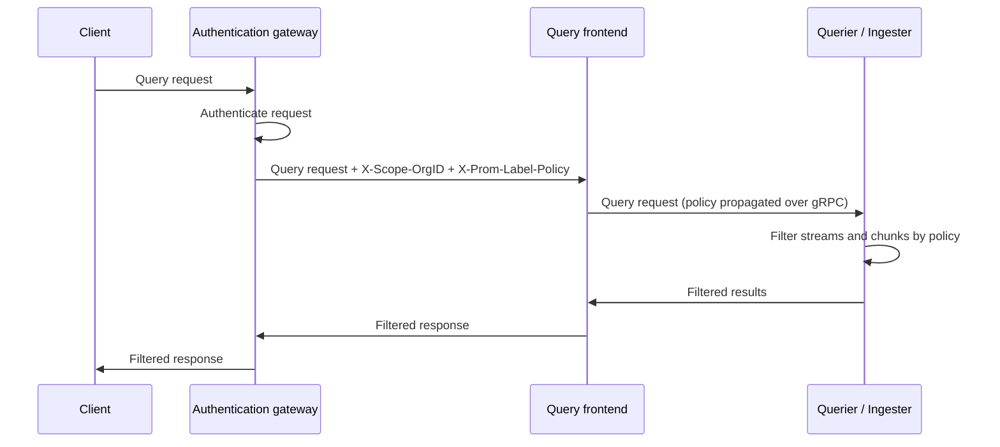

# Use label-based access control with Loki
<!-- TODO - Need to check release version. -->

This feature is experimental and available from v3.7.3. For the latest releases, refer to the [Release notes](https://grafana.com/docs/loki/<LOKI_VERSION>/release-notes/).


Label-based access control (LBAC) restricts the logs a tenant can query to those that match one or more [Prometheus label selectors](https://prometheus.io/docs/prometheus/latest/querying/basics/#time-series-selectors). You associate a set of selectors with a tenant, and queries from that tenant only return data from log streams that match at least one of the selectors. Because the selectors are combined with OR, this corresponds to [disjunctive normal form](https://en.wikipedia.org/wiki/Disjunctive_normal_form), which lets you express any required policy.

LBAC builds on Loki's multi-tenancy: policies are scoped per tenant, so you must run Loki in multi-tenant mode. For more information, refer to the [multi-tenancy](https://grafana.com/docs/loki/<LOKI_VERSION>/operations/multi-tenancy/) documentation.

## Why use LBAC

LBAC lets you share a single Loki tenant across multiple teams or users while still limiting what each of them can see. Common reasons to use LBAC include:

- **Restrict a tenant to a subset of its own data.** For example, one team should only see logs from its own Kubernetes namespace, even though the tenant contains logs from many namespaces.
- **Exclude sensitive log streams from some users.** For example, you can hide streams labeled `secret="true"` from most users, while still letting a smaller group of users query them.
- **Enforce access boundaries per tenant without creating a separate Loki tenant for every team.** Running one tenant per team adds operational overhead. LBAC lets you keep a single tenant and instead scope access with label policies.

## Security model

Loki does not include its own authentication layer. Both the tenant (`X-Scope-OrgID`) and the label policy (`X-Prom-Label-Policy`) are read from trusted HTTP headers on incoming requests.


Never expose the Loki API directly to clients. A client that can reach Loki can set the `X-Scope-OrgID` and `X-Prom-Label-Policy` headers itself and bypass label-based access control entirely. You must run an authentication gateway in front of Loki that authenticates the request, sets the tenant, and attaches the correct label policy.


The gateway is responsible for stripping any user supplied `X-Scope-OrgID` and `X-Prom-Label-Policy` and replacing them with values it derives from the authenticated identity. One open-source gateway that sets these headers is [db-auth-gateway](https://github.com/grafana/db-auth-gateway/). For general guidance on putting an authenticating reverse proxy in front of Loki, refer to the [authentication](https://grafana.com/docs/loki/<LOKI_VERSION>/operations/authentication/) documentation.

## How LBAC works

At a high level, your gateway attaches a label policy to each request, and Loki carries that policy through the read path so that every component filters data to match it.

1. Your authentication gateway authenticates the request and sets the `X-Prom-Label-Policy` HTTP header. Each value in the header has the form `<TENANT>:<URL-ENCODED SELECTOR>`, for example `tenant1:%7Benv%3D%22dev%22%7D` for the selector `{env="dev"}`.
2. An HTTP middleware inside Loki parses this header on every incoming request and stores the resulting policies in the request context.
3. As the request moves between Loki's internal components, for example from the query frontend to the queriers, ingesters, and index gateway, the policies travel with it as gRPC metadata. This means the same policy applies no matter which component ultimately reads the data.
4. Loki enforces the policy at several points in the read path:
   - It filters chunks and streams while running the query, for both the original query engine and the newer query engine.
   - It filters the results of label-values queries against the store and the ingesters.
   - In the query frontend, it filters the response of volume queries, and it rewrites aggregated-metrics queries so they only return permitted data.

The following diagram shows the request flow for a query from a client through the gateway and into Loki:



### LBAC and ingestion

Label-based access control is not enforced on write (push) requests. It only restricts what a tenant can read. A tenant that is allowed to write can push log lines with any labels, regardless of the label policy that applies to its queries.

### LBAC and alertmanager and ruler

Label policies are not enforced by the Alertmanager or ruler HTTP endpoints. This means that the requests they serve contain everything for a particular tenant without applying label-based access control. For example, listing all rule groups in the ruler returns all rule groups for the tenant, even if a label selector in the policy would exclude some of the labels on the rules. However it does apply when you query the metrics those components generate, such as `ALERTS`.

### LBAC and querying

LogQL queries use the following format:

```logql
{ log stream selector } | log pipeline
```

LBAC only applies to the log stream selector portion of a query, that is the part of the query that comes before the pipe (`|`). It does not apply to label filter expressions or other parts of the log pipeline.

For more information, refer to the [Log stream selector](https://grafana.com/docs/loki/<LOKI_VERSION>/query/log_queries/#log-stream-selector) and [Label filter expression](https://grafana.com/docs/loki/<LOKI_VERSION>/query/log_queries/#label-filter-expression) sections in the documentation about [Log queries](https://grafana.com/docs/loki/<LOKI_VERSION>/query/log_queries/).


## Enable label-based access control

LBAC requires multi-tenant mode, which is the default. Ensure authentication is enabled so that requests carry a tenant:

```yaml
auth_enabled: true
```

Then enable LBAC:

```yaml
lbac:
  enabled: true
```

This can also be set with the `-lbac.enabled` command-line flag. When enabled, Loki parses the `X-Prom-Label-Policy` header on incoming requests and enforces the policies it contains.

## Configuration reference

LBAC currently has a single configuration setting. There are no per-tenant settings in Loki's YAML configuration: policies for each tenant arrive dynamically in the `X-Prom-Label-Policy` header, set by your authentication gateway, not through Loki's configuration file.

```yaml
lbac:
  # Enables label based access control through the X-Prom-Label-Policy header.
  [enabled: <boolean> | default = false]
```

| Setting | CLI flag | Default | Description |
| --- | --- | --- | --- |
| `lbac.enabled` | `-lbac.enabled` | `false` | Enables label-based access control through the `X-Prom-Label-Policy` header. This setting is [experimental](https://grafana.com/docs/release-life-cycle/). |

## Setting up a label policy

A label policy is conveyed to Loki in the `X-Prom-Label-Policy` request header. This header is set by your authentication gateway, not by clients. Each header value has the form:

```http
<TENANT>:<URL-ENCODED SELECTOR>
```

The selector is a standard label matcher set such as `{env="dev"}`, URL-encoded so that it is safe to carry in a header. For example, the policy `{env="dev"}` for tenant `tenant1` is encoded as:

```http
X-Prom-Label-Policy: tenant1:%7Benv%3D%22dev%22%7D
```

To associate multiple selectors with a tenant, set multiple values. You can either repeat the header or separate the encoded policies with a comma (`,`). The selectors are combined with `OR`: a stream is returned if it matches any one of them.

## Exclude a label

One common use case for an LBAC policy is to exclude logs that have a specific label. For example, to exclude all log lines with the label `secret=true`, use a selector with `secret!="true"`:

```logql
{secret!="true"}
```

## Use multiple selectors

To allow access to both the production and development environments while excluding logs with the label `secret=true` in the production environment, use multiple selectors:

```logql
{secret!="true", env="prod"}
{env="dev"}
```

These selectors enforce the policy as follows:

* `{secret!="true", env="prod"}` matches and returns log lines from the production environment that do not have the `secret: true` label.
* `{env="dev"}` matches and returns log lines from the development environment, even if they have the `secret: true` label.

## Real-world examples

The following examples use labels that Loki assigns by default when logs are collected through OpenTelemetry, such as `service_name`, `k8s_namespace_name`, and `deployment_environment_name`. For the full list of default OpenTelemetry-derived labels, refer to [Default labels](https://grafana.com/docs/loki/<LOKI_VERSION>/get-started/labels/#default-labels-for-opentelemetry). Each example shows the LogQL selector and the resulting `X-Prom-Label-Policy` header value that your gateway would set, following the same format as [Setting up a label policy](#setting-up-a-label-policy).

### Restrict a team to one namespace

Scope a tenant so that it can only see logs from the `checkout` Kubernetes namespace. This is useful when a platform team gives a single application team access to a shared tenant, but the application team should only see its own namespace.

Selector:

```logql
{k8s_namespace_name="checkout"}
```

Header:

```http
X-Prom-Label-Policy: team-checkout:%7Bk8s_namespace_name%3D%22checkout%22%7D
```

### Restrict by environment

Give separate policies to a production support team and a staging support team that share the same tenant.

Production team selector:

```logql
{deployment_environment_name="production"}
```

Header:

```http
X-Prom-Label-Policy: team-prod:%7Bdeployment_environment_name%3D%22production%22%7D
```

Staging team selector:

```logql
{deployment_environment_name="staging"}
```

Header:

```http
X-Prom-Label-Policy: team-staging:%7Bdeployment_environment_name%3D%22staging%22%7D
```

### Restrict by service, with an exclusion

Combine a service restriction with an exclusion, similar to [Use multiple selectors](#use-multiple-selectors), but scoped to a specific service.

Allow access to the `payments-api` service, but exclude any of its streams labeled `secret="true"`, and separately allow access to every other service:

```logql
{service_name="payments-api", secret!="true"}
{service_name!="payments-api"}
```

Header:

```http
X-Prom-Label-Policy: team-payments:%7Bservice_name%3D%22payments-api%22%2C%20secret%21%3D%22true%22%7D,team-payments:%7Bservice_name%21%3D%22payments-api%22%7D
```

### Restrict by region for a distributed team

Scope a regional on-call team so that it only sees logs from its own region.

Selector:

```logql
{cloud_region="us-west-1"}
```

Header:

```http
X-Prom-Label-Policy: team-uswest:%7Bcloud_region%3D%22us-west-1%22%7D
```

### Combine selectors across multiple namespaces

Grant a tenant access to logs from two Kubernetes namespaces by giving it two separate selectors for the same tenant:

```logql
{k8s_namespace_name="frontend"}
{k8s_namespace_name="checkout"}
```

Because a tenant's selectors are combined with OR, a stream is returned if it matches either one: the `frontend` namespace or the `checkout` namespace.

Header:

```http
X-Prom-Label-Policy: team-multi:%7Bk8s_namespace_name%3D%22frontend%22%7D,team-multi:%7Bk8s_namespace_name%3D%22checkout%22%7D
```
