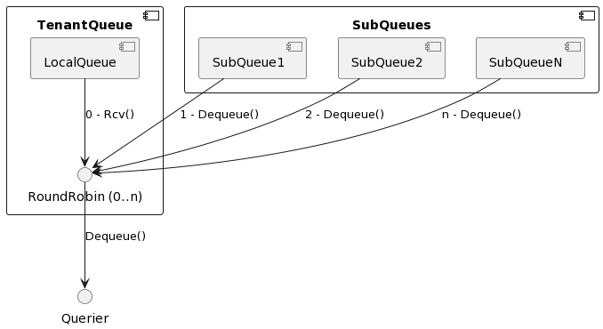

# Query fairness within tenants

Loki uses [shuffle sharding]()
to minimize impact across tenants in case of querier failures or misbehaving
neighboring tenants.

When there are potentially a lot of different actors using the same tenant to
query logs, such as users accessing Loki from Grafana or via LogCLI or other
applications using the HTTP API, it can lead to contention between queries of
different users, because they all share the same resources for a tenant.

In that case, as an operator, you would also want to ensure some sort of query
fairness across these actors within the tenants. An actor could be a Grafana user,
a CLI user, or an application accessing the API. To achieve that, Loki
introduces hierarchical scheduler queues in version 2.9 based on
[LID 0003: Query fairness across users within tenants]()
and they are enabled by default.

## What are hierarchical queues and how do they work

To understand hierarchical queues, we first need to know that in the scheduler
component each tenant has its own first in first out (FIFO) queue where
sub-queries are enqueued. Sub-queries are queries that result from splitting
and sharding of a query sent by a client using HTTP.

Tenant queues are the first level of the queue hierarchy. When a tenant
executes a query without any further controls, all of its sub-queries are
enqueued to the first level queue.

The second level of the queue hierarchy is that the tenant can have sub-queues. 

Similar to how shuffle sharding assigns queries at the tenant level, each time
the Loki Scheduler makes a round-robin pick at the second level of the query
hierarchy, it selects a query from the tenant’s local queue and subqueues.



The figure above shows that a tenant queue has a local queue, which is a leaf
node in the queue tree, and a set of sub-queues. Each sub-queue, again like the
tenant queue, consists of a local queue, and possible sub-queues, resulting in
a recursive tree structure.

So, how can we make use of these tree-like queue structures to achieve query fairness?

## How to control query fairness

As already mentioned, by default, sub-queries are only enqueued at the first
(tenant) level of the queue tree. The tenant is provided by the `X-Scope-OrgID`
header that is required when running Loki in multi-tenant mode.

You use the HTTP header `X-Loki-Actor-Path` to control to which sub-queue a
query (or more correctly its sub-queries) is enqueued.

The following example shows a `curl` command that invokes the HTTP endpoint for range queries
and passes both the `X-Scope-OrgID` and the `X-Loki-Actor-Path` headers.

```bash
curl -s http://localhost:3100/loki/api/v1/query_range?xxx \
    -H 'X-Scope-OrgID: grafana' \
    -H 'X-Loki-Actor-Path: joe'
```

The query that this request invokes ends up in the sub-queue `joe` of the
tenant queue `grafana`. Another user can use their own name in the actor path
header to enqueue their queries to their own sub-queue.

Since the scheduler chooses the next task for a tenant in a round-robin manner,
both actors (in our case human users) get their 50% share when the scheduler
dequeues a sub-query to send to the querier.

With N actors, each actor gets 1/Nth of their share. In our example with two
users, even when there are sub-queries in the local queue of the tenant, the
local queue gets 1/3 and each sub-queue gets 1/3 of their share.

As the explained implementation and the header name already suggest, it is
possible to enqueue queries several levels deep. To do so, you can construct a
path to the sub-queue using the `|` delimiter in the header value, as shown in
the following examples.

```bash
curl -s http://localhost:3100/loki/api/v1/query_range?xxx \
    -H 'X-Scope-OrgID: grafana' \
    -H 'X-Loki-Actor-Path: users|joe'

curl -s http://localhost:3100/loki/api/v1/query_range?xxx \
    -H 'X-Scope-OrgID: grafana' \
    -H 'X-Loki-Actor-Path: apps|logcli'
```

There is a limit to how deep a path and thus the queue tree can be. This is
controlled by the Loki `-query-scheduler.max-queue-hierarchy-levels` CLI argument
or its respective YAML configuration block:

```yaml
query_scheduler:
  max_queue_hierarchy_levels: 2  # defaults to 3
```

It is advised to keep the levels at a reasonable level (ideally 1 to 3 levels),
both for performance reasons as well as for the understanding of how query
fairness is ensured across all sub-queues.

## Enforcing headers

In the examples above the client that invoked the query directly against Loki also provided the
HTTP header that controls where in the queue tree the sub-queries are enqueued. However, as an operator,
you would usually want to avoid this scenario and control yourself where the header is set.

When using Grafana as the Loki user interface, you can, for example, create multiple data sources
with the same tenant, but with a different additional HTTP header
`X-Loki-Actor-Path` and restrict which Grafana user can use which data source.

Alternatively, if you have a proxy for authentication in front of Loki, you can
pass the (hashed) user from the authentication as downstream header to Loki.
