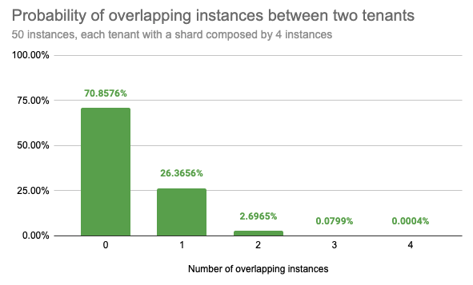

# Operating Shuffle Sharding in Loki

## What is it?
Shuffle sharding is a technique used to isolate different tenant’s workloads and to give each tenant a single-tenant experience even if they’re running in a shared cluster. This technique has been publicly shared and clearly explained by AWS in their [builders’ library](https://aws.amazon.com/builders-library/workload-isolation-using-shuffle-sharding/) and a reference implementation has been shown in the [Route53 Infima library](https://github.com/awslabs/route53-infima/blob/master/src/main/java/com/amazonaws/services/route53/infima/SimpleSignatureShuffleSharder.java).

The idea is to assign each tenant a shard composed by a subset of the Loki service instances(e.g: queriers), aiming to minimize the overlapping instances between two different tenants.

A misbehaving tenant will affect only its shard instances. Due to the low overlap of instances between different tenants, it’s statistically quite likely that any other tenant will run on different instances or only a subset of instances will match the affected ones.
Shuffle sharding requires no more resources than the default sharding strategy but instances may be less evenly balanced from time to time.

### Low overlapping instances probability
For example, given a Loki cluster running 50 queriers and assigning each tenant 4 out of 50 queriers, shuffling instances between each tenant, we get 230K possible combinations.

Randomly picking two different tenants we have the:

- 71% chance that they will not share any instance
- 26% chance that they will share only 1 instance
- 2.7% chance that they will share 2 instances
- 0.08% chance that they will share 3 instances
- Only a 0.0004% chance that their instances will fully overlap



## Why we need it on Loki?
We use shuffle sharding only on **Query** path in Loki.

In the default sharding strategy employed by Loki query path the workload uses the entire pool of instances running a given service (eg. queriers). For example, on the query path each tenant’s queries are sharded across all queriers, regardless how many different tenants are in the cell.

The default strategy allows to have a fair balance on the resources consumed by each instance (ie. CPU and memory) and to maximise these resources across the cluster.

However, in a multi-tenant cluster this approach also introduces some downsides:
- An outage of node(s) affects all tenants
- A misbehaving tenant (eg. causing out of memory) could affect all other tenants

The goal of shuffle sharding is to provide an alternative sharding strategy to reduce the blast radius of an outage and better isolate tenants.

By default all Loki queriers can execute received queries for any given tenant.

When shuffle sharding is enabled by setting `-frontend.max-queriers-per-tenant` to a value higher than 0 and lower than the number of available queriers, only specified number of queriers will execute queries for single tenant.

NOTE: this option is only available when using the query-frontend (with or without scheduler).

The maximum number of queriers can be overridden on a per-tenant basis in the limits overrides configuration (`max_queriers_per_tenant`).

### The impact of “query of death”
In the event a tenant is repeatedly sending a “query of death” which leads the querier to crash or getting killed because of out-of-memory, the crashed querier will get disconnected from the query-frontend and a new querier will be immediately assigned to the tenant’s shard. This practically invalidates the assumption that shuffle-sharding can be used to contain the blast radius in case of a query of death.

To mitigate it, Loki allows to configure a delay between when a querier disconnects because of a crash and when the crashed querier is actually removed from the tenant’s shard (and another healthy querier is added as replacement). A delay of 1 minute may be a reasonable trade-off:

- Query-Frontend: `-query-frontend.querier-forget-delay=1m`
- Query-Scheduler: `-query-scheduler.querier-forget-delay=1m`

## Key Configs.
1. `max_queriers_per_tenant` - per-tenant config (or `frontend.max-queriers-per-tenant` global config) which allocates **only** this many queriers to specific tenant for all their queries
2. `max_query_parallelism` - per-tenant config (or `querier.max-query-parallelism` global config) describes how many sub queries (after query splitting and query sharding) that can be scheduled to run at the same time **for each request** of any tenant.
3. `querier.concurrency` - Controls how many worker thread (goroutines) per single querier.

## Key Metrics

1. Overall Query-scheduler Queue Duration  - `cortex_query_scheduler_queue_duration_seconds_*`

1. Query-scheduler Queue Length per tenant - `cortex_query_scheduler_queue_length`

1. Query-scheduler Queue Duration per tenant - `max_over_time({cluster="$cluster",container="query-frontend", namespace="$namespace"} |= "metrics.go" |logfmt | unwrap duration(queue_time) | __error__="" [5m]) by (org_id)`


Too much spikes in any of those metrics may mean any of the following
1. Particular tenant is trying to use query resources more than he/she was allocated.
2. We may have to increase the value of `max_queriers_per_tenant` for that particular tenant.
3. Loki instances may be under provisioned

### Check how many queriers is being used by each tenants.
```
count by (org_id) (sum by (org_id, pod) (count_over_time({job="$namespace/querier", cluster="$cluster"} |= "metrics.go" | logfmt [$__interval])))
```
