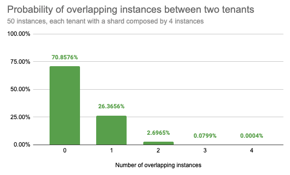

# Isolate tenant workflows using shuffle sharding

Shuffle sharding is a resource-management technique used to isolate tenant workloads from other tenant workloads, to give each tenant more of a single-tenant experience when running in a shared cluster.
This technique is explained by AWS in their article [Workload isolation using shuffle-sharding](https://aws.amazon.com/builders-library/workload-isolation-using-shuffle-sharding/).
A reference implementation has been shown in the [Route53 Infima library](https://github.com/awslabs/route53-infima/blob/master/src/main/java/com/amazonaws/services/route53/infima/SimpleSignatureShuffleSharder.java).

## The issues that shuffle sharding mitigates

Shuffle sharding can be configured for the query path.

The query path is sharded by default, and the default does not use shuffle sharding.
Each tenant’s query is sharded across all queriers, so the workload uses all querier instances.

In a multi-tenant cluster, sharding across all instances of a component may exhibit these issues:

- Any outage of a component instance affects all tenants
- A misbehaving tenant affects all other tenants

An individual query may create issues for all tenants.
A single tenant or a group of tenants may issue an expensive query:
one that causes a querier component to hit an out-of-memory error,
or one that causes a querier component to crash.
Once the error occurs,
the tenant or tenants issuing the error-causing query will be reassigned
to other running queriers(remember all tenants can use all available queriers),
This, in turn, may affect the queriers that have been reassigned.

## How shuffle sharding works

The idea of shuffle sharding is to assign each tenant to a shard composed by a subset of the Loki queriers, aiming to minimize the overlapping instances between distinct tenants.

A misbehaving tenant will affect only its shard's queriers. Due to the low overlap of queriers among tenants, only a small subset of tenants will be affected by the misbehaving tenant.
Shuffle sharding requires no more resources than the default sharding strategy.

Shuffle sharding does not fix all issues.
If a tenant repeatedly sends a problematic query, the crashed querier
will be disconnected from the query-frontend, and a new querier
will be immediately assigned to the tenant’s shard.
This invalidates the positive effects of shuffle sharding.
In this case,
configuring a delay between when a querier disconnects because of a crash,
and when the crashed querier is actually removed from the tenant’s shard
and another healthy querier is added as a replacement improves the situation.
A delay of 1 minute may be a reasonable value in
the query-frontend with configuration parameter
`-query-frontend.querier-forget-delay=1m`, and in the query-scheduler with configuration parameter
`-query-scheduler.querier-forget-delay=1m`.

### Low probability of overlapping instances

If an example Loki cluster runs 50 queriers and assigns each tenant 4 out of 50 queriers, shuffling instances between each tenant, there are 230K possible combinations.

Statistically, randomly picking two distinct tenants, there is:

- a 71% chance that they will not share any instance
- a 26% chance that they will share only 1 instance
- a 2.7% chance that they will share 2 instances
- a 0.08% chance that they will share 3 instances
- only a 0.0004% chance that their instances will fully overlap



## Configuration

Enable shuffle sharding by setting `-frontend.max-queriers-per-tenant` to a value higher than 0 and lower than the number of available queriers.
The value of the per-tenant configuration
`max_queriers_per_tenant` sets the quantity of allocated queriers.
This option is only available when using the query-frontend, with or without a scheduler.

The per-tenant configuration parameter
`max_query_parallelism` describes how many sub queries, after query splitting and query sharding, can be scheduled to run at the same time for each request of any tenant.

Configuration parameter
`querier.concurrency` controls the quantity of worker threads (goroutines) per single querier.

The maximum number of queriers can be overridden on a per-tenant basis in the limits overrides configuration by `max_queriers_per_tenant`.

## Shuffle sharding metrics

These metrics reveal information relevant to shuffle sharding:

-  the overall query-scheduler queue duration,  `loki_query_scheduler_queue_duration_seconds_*`

-  the query-scheduler queue length per tenant, `loki_query_scheduler_queue_length`

-  the query-scheduler queue duration per tenant can be found with this query:
    ```
    max_over_time({cluster="$cluster",container="query-frontend", namespace="$namespace"} |= "metrics.go" |logfmt | unwrap duration(queue_time) | __error__="" [5m]) by (org_id)
    ```

Too many spikes in any of these metrics may imply:

-  A particular tenant is trying to use more query resources than they were allocated.
-  That tenant may need an increase in the value of `max_queriers_per_tenant`.
-  Loki instances may be under provisioned.

A useful query checks how many queriers are being used by each tenant:

```
count by (org_id) (sum by (org_id, pod) (count_over_time({job="$namespace/querier", cluster="$cluster"} |= "metrics.go" | logfmt [$__interval])))
```
