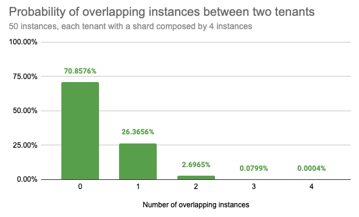

# Isolate tenant workflows using shuffle sharding

Shuffle sharding is a resource-management technique used to isolate tenant workloads from other tenant workloads, to give each tenant more of a single-tenant experience when running in a shared cluster.
This technique is explained by AWS in their article [Workload isolation using shuffle-sharding](https://aws.amazon.com/builders-library/workload-isolation-using-shuffle-sharding/).
A reference implementation has been shown in the [Route53 Infima library](https://github.com/awslabs/route53-infima/blob/master/src/main/java/com/amazonaws/services/route53/infima/SimpleSignatureShuffleSharder.java).

Several Loki components can use shuffle sharding, and each one has its own configuration.
You can enable shuffle sharding for one component without enabling it for the others.
This page explains the shared concept using the query path as an example, then documents the configuration for the query path, the ruler, and the index gateway.

## The issues that shuffle sharding mitigates

Shuffle sharding can be configured for the query path.

The query path is sharded by default, and the default does not use shuffle sharding.
Each tenant’s query is sharded across all queriers, so the workload uses all querier instances.

In a multi-tenant cluster, sharding across all instances of a component may exhibit these issues:

- Any outage of a component instance affects all tenants
- A misbehaving tenant affects all other tenants

An individual query may create issues for all tenants.
A single tenant or a group of tenants may issue an expensive query:
one that causes a querier component to hit an out-of-memory error,
or one that causes a querier component to crash.
Once the error occurs,
the tenant or tenants issuing the error-causing query will be reassigned
to other running queriers(remember all tenants can use all available queriers),
This, in turn, may affect the queriers that have been reassigned.

## How shuffle sharding works

The idea of shuffle sharding is to assign each tenant to a shard composed by a subset of the Loki queriers, aiming to minimize the overlapping instances between distinct tenants.

A misbehaving tenant will affect only its shard's queriers. Due to the low overlap of queriers among tenants, only a small subset of tenants will be affected by the misbehaving tenant.
Shuffle sharding requires no more resources than the default sharding strategy.

Shuffle sharding does not fix all issues.
If a tenant repeatedly sends a problematic query, the crashed querier
will be disconnected from the query-frontend, and a new querier
will be immediately assigned to the tenant’s shard.
This invalidates the positive effects of shuffle sharding.
In this case,
configuring a delay between when a querier disconnects because of a crash,
and when the crashed querier is actually removed from the tenant’s shard
and another healthy querier is added as a replacement improves the situation.
A delay of 1 minute may be a reasonable value in
the query-frontend with configuration parameter
`-query-frontend.querier-forget-delay=1m`, and in the query-scheduler with configuration parameter
`-query-scheduler.querier-forget-delay=1m`.

### Low probability of overlapping instances

If an example Loki cluster runs 50 queriers and assigns each tenant 4 out of 50 queriers, shuffling instances between each tenant, there are 230K possible combinations.

Statistically, randomly picking two distinct tenants, there is:

- a 71% chance that they will not share any instance
- a 26% chance that they will share only 1 instance
- a 2.7% chance that they will share 2 instances
- a 0.08% chance that they will share 3 instances
- only a 0.0004% chance that their instances will fully overlap



## Configuration for the query path

Enable shuffle sharding by setting `-frontend.max-queriers-per-tenant` to a value higher than 0 and lower than the number of available queriers.
The value of the per-tenant configuration
`max_queriers_per_tenant` sets the quantity of allocated queriers.
This option is only available when using the query-frontend, with or without a scheduler.

As an alternative to setting a fixed number of queriers, you can use `-frontend.max-query-capacity` (per-tenant configuration `max_query_capacity`) to give a tenant a fraction, from `0.0` to `1.0`, of the available query capacity.
For example, setting `max_query_capacity` to `0.5` allows a tenant to use half of the available queriers (or `read` components, in single scalable deployment mode).
If you set both `max_queriers_per_tenant` and `max_query_capacity` for a tenant, Loki uses whichever setting results in the smaller number of queriers.
If you set neither, all queriers handle requests for the tenant.

The per-tenant configuration parameter
`max_query_parallelism` describes how many sub queries, after query splitting and query sharding, can be scheduled to run at the same time for each request of any tenant.

Configuration parameter
`-querier.max-concurrent` (per-querier configuration `max_concurrent`) controls the maximum number of queries a single querier processes at the same time.
The querier divides this number across every query-frontend or query-scheduler it connects to.

The maximum number of queriers can be overridden on a per-tenant basis in the limits overrides configuration by `max_queriers_per_tenant`.

## Shuffle sharding metrics for the query path

These metrics reveal information relevant to shuffle sharding:

- the overall query-scheduler queue duration,  `loki_query_scheduler_queue_duration_seconds_*`

- the query-scheduler queue length per tenant, `loki_query_scheduler_queue_length`, labeled by `user`

- the query-scheduler queue duration per tenant can be found with this query:

    ```logql
    max_over_time({cluster="$cluster",container="query-frontend", namespace="$namespace"} |= "metrics.go" |logfmt | unwrap duration(queue_time) | __error__="" [5m]) by (org_id)
    ```

Too many spikes in any of these metrics may imply:

- A particular tenant is trying to use more query resources than they were allocated.
- That tenant may need an increase in the value of `max_queriers_per_tenant`.
- Loki instances may be under provisioned.

A useful query checks how many queriers are being used by each tenant:

```logql
count by (org_id) (sum by (org_id, pod) (count_over_time({job="$namespace/querier", cluster="$cluster"} |= "metrics.go" | logfmt [$__interval])))
```

## Shuffle sharding in the ruler

The ruler can also shuffle shard rule group evaluation across ruler instances, using the same underlying idea as the query path: each tenant is assigned a shard made up of a subset of the ruler instances, instead of using all of them.

To enable shuffle sharding for the ruler:

1. Set `-ruler.enable-sharding` (`enable_sharding`) to `true`. This turns on ring-based sharding of rule groups across ruler instances. By default this setting is `false`, and every ruler instance evaluates every rule.
1. Set `-ruler.sharding-strategy` (`sharding_strategy`) to `shuffle-sharding`. The default value, `default`, shards rule groups across all available ruler instances, without shuffle sharding.
1. Set the per-tenant configuration `ruler_tenant_shard_size` (`-ruler.tenant-shard-size`) to the number of ruler instances a tenant's rule groups should be sharded across. A value of `0` disables shuffle sharding for that tenant, so their rule groups are sharded across all ruler instances instead.

For example, this configuration enables shuffle sharding for the ruler and gives every tenant a shard of 3 ruler instances by default:

```yaml
ruler:
  enable_sharding: true
  sharding_strategy: shuffle-sharding

limits_config:
  ruler_tenant_shard_size: 3
```

## Shuffle sharding in the index gateway

The index gateway can also shuffle shard tenants across index gateway instances, so that each tenant's indexes are served by a subset of the available instances instead of all of them.

To enable shuffle sharding for the index gateway:

1. Set `-index-gateway.mode` (`mode`) to `ring`. In `ring` mode, each index gateway instance is responsible for a subset of tenants. In the default `simple` mode, every instance is responsible for all tenants, and ring-based shuffle sharding does not apply.
1. Set the per-tenant configuration `index_gateway_shard_size` (`-index-gateway.shard-size`) to the number of index gateway instances a tenant's indexes should be sharded across.

Unlike the query path, leaving the shard size at `0` doesn't mean "use all instances".
If the global `index_gateway_shard_size` is `0`, Loki replaces it at startup with the index gateway ring's replication factor, which is the deprecated `-replication-factor` flag (`index_gateway.ring.replication_factor` in YAML, default `3`).
This means an index gateway running in `ring` mode with otherwise default settings already shuffle shards each tenant's indexes across 3 instances.
Set `index_gateway_shard_size` explicitly rather than relying on the replication factor, which is deprecated.

For example, this configuration enables shuffle sharding for the index gateway and gives every tenant a shard of 5 instances by default:

```yaml
index_gateway:
  mode: ring

limits_config:
  index_gateway_shard_size: 5
```


`-index-gateway.max-capacity` (`index_gateway_max_capacity`) is a separate, experimental setting that limits each tenant to a fraction, from `0.0` to `1.0`, of the available index gateway instances.
It only applies in `simple` mode, where it selects the subset of instances for a tenant by hashing the tenant ID instead of using the ring.
It has no effect in `ring` mode, so it is not part of the configuration described in this section.

