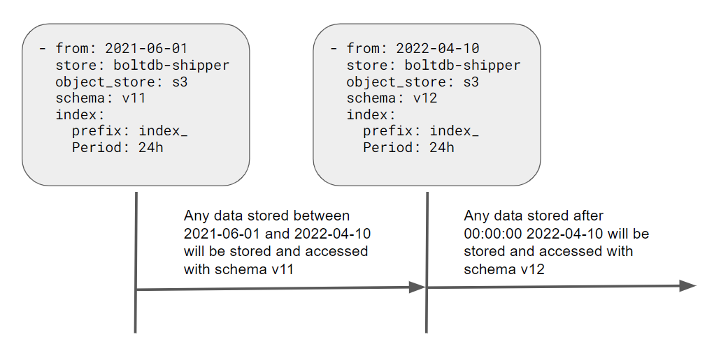

# Storage schema

To support iterations over the storage layer contents, Loki has a configurable storage schema. The schema is defined to apply over periods of time. A `from` value marks the starting point of that schema. The schema is active until another entry defines a new schema with a new `from` date.



Loki uses the defined schemas to determine which format to use when storing and querying the data.

Use of a schema allows Loki to iterate over the storage layer without requiring migration of existing data.

## New Loki installs

For a new Loki install with no previous data, here is an example schema configuration with recommended values

```yaml
schema_config:
  configs:
    - from: 2024-04-01
      object_store: s3
      store: tsdb
      schema: v13
      index:
        prefix: index_
        period: 24h
```

| Property     | Description                                                                                                                                            |
|--------------|--------------------------------------------------------------------------------------------------------------------------------------------------------|
| from         | for a new install, this must be a date in the past, use a recent date. Format is YYYY-MM-DD.                                                           |
| object_store | s3, azure, gcs, alibabacloud, bos, cos, swift, filesystem, or a named_store (see [StorageConfig](https://grafana.com/docs/loki/<LOKI_VERSION>/configure/#storage_config)). |
| store        | `tsdb` is the current and only recommended value for store. `boltdb-shipper` is deprecated; refer to [Deprecated `boltdb-shipper` store](#deprecated-boltdb-shipper-store) below.                    |
| schema       | `v13` is the most recent schema and recommended value.                                                                                                 |
| row_shards   | optional. Set at the same level as `store` and `schema`, not under `index`. Defaults to `16` for schema `v10` and newer. You do not usually need to change this value. |
| prefix:      | any value without spaces is acceptable.                                                                                                                |
| period:      | must be `24h`.                                                                                                                                         |


For a new install, the `from` date must be in the past so the schema is immediately active when Loki starts. If you set it to a future date, Loki will have no valid schema for the current time and will not be able to store incoming data.

This is different from adding a new schema entry to an existing install, where the `from` date must be in the future. See [Changing the schema](#changing-the-schema) below.



`tsdb` and `v13` are not only recommended, they are required in most cases. Structured metadata and native OpenTelemetry Protocol (OTLP) ingestion are enabled by default (`allow_structured_metadata: true` in the `limits_config` block), and both features require the active schema period to use the `tsdb` index type and schema `v13` or newer. If structured metadata is enabled and the active schema does not meet this requirement, Loki fails to start with one of these errors:

- `CONFIG ERROR: schema v13 is required to store Structured Metadata and use native OTLP ingestion...`
- ``CONFIG ERROR: `tsdb` index type is required to store Structured Metadata and use native OTLP ingestion...``

To resolve this, either:

- Add a new schema entry with a future `from` date that uses `store: tsdb` and `schema: v13` or newer. See [Changing the schema](#changing-the-schema) below.
- Or, set `allow_structured_metadata: false` in the `limits_config` block (or pass `-validation.allow-structured-metadata=false`) until you can complete the schema migration.

For background, refer to [Structured metadata](https://grafana.com/docs/loki/<LOKI_VERSION>/get-started/labels/structured-metadata/) and the [upgrade guide](https://grafana.com/docs/loki/<LOKI_VERSION>/setup/upgrade/#structured-metadata-open-telemetry-schemas-and-indexes).


## Deprecated `boltdb-shipper` store

`store: boltdb-shipper` is a deprecated index type. It is still accepted for existing Loki 3.x installs that have not yet migrated, but it must not be used for new installs, and it is being removed in Loki 4.0.

`boltdb-shipper` also does not support structured metadata or native OTLP ingestion, both of which require `tsdb`. If you are running `boltdb-shipper`, refer to [Single Store BoltDB (boltdb-shipper)](https://grafana.com/docs/loki/<LOKI_VERSION>/operations/storage/boltdb-shipper/) and plan to migrate to `tsdb` using the guidance in [Changing the schema](#changing-the-schema) below.

## Changing the schema


The guidance in this section applies when you are adding a new schema entry to an existing Loki install that already has data. Setting the `from` date to a future date gives Loki time to transition to the new schema and ensures that existing data continues to be read using the old schema. If the `from` date is not in the future, data written just before the cutover may become unreadable because Loki would try to query it using the wrong schema.

For a brand new install with no previous data, the `from` date should be in the past instead. See [New Loki installs](#new-loki-installs) above.


Here are items to consider when changing the schema; if schema changes are not done properly, a scenario can be created which prevents data from being read.

- Always set the `from` date in the new schema to a date in the future.

  The `from` date is interpreted by Loki to start at 00:00:00 UTC. Therefore, Loki must have a date in the future to be able to transition to the new schema when that date and time arrives.

  Be aware of your relation to UTC when using the current date. Make sure that UTC 00:00:00 has not already passed for your current date.
  
  As an example, assume that the current date is 2022-04-10, and you want to update to the v13 schema, so you restart Loki with 2022-04-11 as the `from` date for the new schema. If you forget to take into account that your timezone is UTC -5:00 and it’s currently 20:00 hours in your local timezone,  that is actually 2022-04-11T01:00:00 UTC. When Loki starts it will see the new schema and begin to write and store objects following that new schema. If you then try to query data that was written between 00:00:00 and 01:00:00 UTC, Loki will use the new schema and the data will be unreadable, because it was created with the previous schema.

- You cannot undo or roll back a schema change.

  Any data written with an active schema can only be read by that schema. If you wish to return to the previous schema; you can add another new entry with the previous schema settings.

## Schema configuration example

This example shows a schema change: data ingested before `2022-01-20` used schema `v12`, and data ingested on or after that date uses schema `v13`. Both periods use `tsdb` as the store and `gcs` as the object store; only the schema version changes.

```yaml
schema_config:
  configs:
    - from: "2020-07-31"
      index:
        period: 24h
        prefix: loki_ops_index_
      object_store: gcs
      schema: v12
      store: tsdb
    - from: "2022-01-20"
      index:
        period: 24h
        prefix: loki_ops_index_
      object_store: gcs
      schema: v13
      store: tsdb
```
