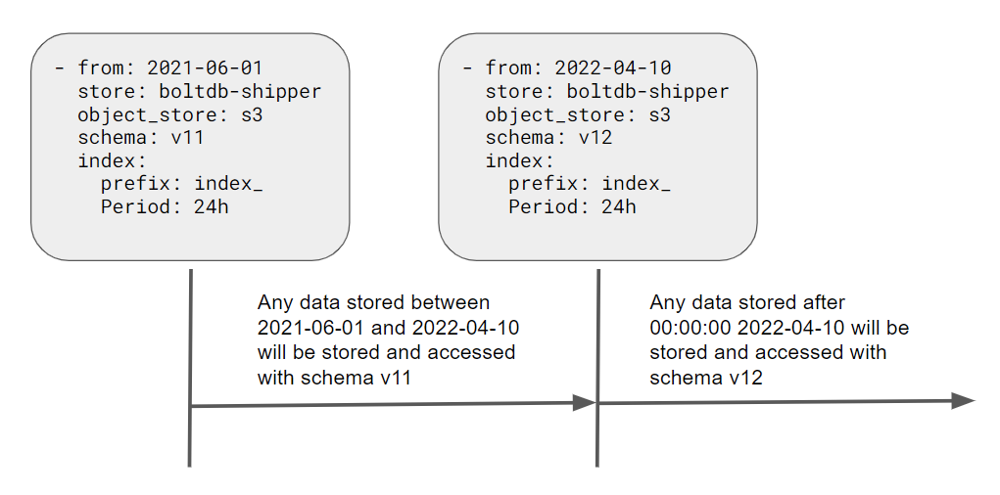

# Storage schema

To support iterations over the storage layer contents, Loki has a configurable storage schema. The schema is defined to apply over periods of time. A `from` value marks the starting point of that schema. The schema is active until another entry defines a new schema with a new `from` date.



Loki uses the defined schemas to determine which format to use when storing and querying the data.

Use of a schema allows Loki to iterate over the storage layer without requiring migration of existing data.

## Changing the schema

Here are items to consider when changing the schema; if schema changes are not done properly, a scenario can be created which prevents data from being read.
- Always set the `from` date in the new schema to a date in the future.

  The `from` date is interpreted by Loki to start at 00:00:00 UTC. Therefore, Loki must have a date in the future to be able to transition to the new schema when that date and time arrives.

  Be aware of your relation to UTC when using the current date. Make sure that UTC 00:00:00 has not already passed for your current date.
  
  As an example, assume that the current date is 2022-04-10, and you want to update to the v12 schema, so you restart Loki with 2022-04-11 as the `from` date for the new schema. If you forget to take into account that your timezone is UTC -5:00 and it’s currently 20:00 hours in your local timezone,  that is actually 2022-04-11T01:00:00 UTC. When Loki starts it will see the new schema and begin to write and store objects following that new schema. If you then try to query data that was written between 00:00:00 and 01:00:00 UTC, Loki will use the new schema and the data will be unreadable, because it was created with the previous schema.

- You cannot undo or roll back a schema change.

  Any data written with an active schema can only be read by that schema. If you wish to return to the previous schema; you can add another new entry with the previous schema settings.

## Schema configuration example

```
schema_config:
    configs:
        - from: "2020-07-31"
          index:
            period: 24h
            prefix: loki_ops_index_
          object_store: gcs
          schema: v11
          store: boltdb-shipper
        - from: "2022-01-20"
          index:
            period: 24h
            prefix: loki_ops_index_
          object_store: gcs
          schema: v12
          store: boltdb-shipper
```
