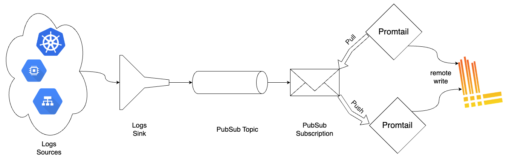

# Run the Promtail client on Google Cloud Platform

This document explains how one can setup Google Cloud Platform to forward its cloud resource logs from a particular GCP project into Google Pubsub topic so that is available for Promtail to consume.



This document assumes, that reader have `gcloud` installed and have the required permissions (as mentioned in [Roles and Permission](#roles-and-permission) section).

There are two flavours of how to configure this:
- Pull-based subscription: Promtail pulls log entries from a GCP PubSub topic
- Push-based subscription: GCP sends log entries to a web server that Promtail listens

Overall, the setup between GCP, Promtail and Loki will look like the following:



## Roles and Permission

The user should have following roles to complete the setup.
- "roles/pubsub.editor"
- "roles/logging.configWriter"

## Setup Pubsub Topic

Google Pubsub Topic will act as the queue to persist log messages which then can be read from Promtail.

```bash
$ gcloud pubsub topics create $TOPIC_ID
```

For example:
```bash
$ gcloud pubsub topics create cloud-logs
```

## Setup Log Router

We create a log sink to forward cloud logs into pubsub topic that we just created.

```bash
$ gcloud logging sinks create $SINK_NAME $SINK_LOCATION $OPTIONAL_FLAGS
```

For example: 
```bash
$ gcloud logging sinks create cloud-logs pubsub.googleapis.com/projects/my-project/topics/cloud-logs \
--log-filter='resource.type=("gcs_bucket")' \
--description="Cloud logs"
```

The above command also adds `log-filter` option which represents what type of logs should get into the destination `pubsub` topic.
For more information on adding `log-filter` refer this [document](https://cloud.google.com/logging/docs/export/configure_export_v2#creating_sink)

We cover more advanced `log-filter` [below](#Advanced-Log-filter)

## Grant log sink the pubsub publisher role

Find the writer identity service account of the log sink just created:

```bash
gcloud logging sinks describe \
 --format='value(writerIdentity)' $SINK_NAME
```

For example:
```bash
gcloud logging sinks describe \
 --format='value(writerIdentity)' cloud-logs
```

Create an IAM policy binding to allow log sink to publish messages to the topic:
```bash
gcloud pubsub topics add-iam-policy-binding $TOPIC_ID \
--member=$WRITER_IDENTITY --role=roles/pubsub.publisher
```

For example:
```bash
gcloud pubsub topics add-iam-policy-binding cloud-logs \
--member=serviceAccount:pxxxxxxxxx-xxxxxx@gcp-sa-logging.iam.gserviceaccount.com --role=roles/pubsub.publisher
```

## Create Pubsub subscription for Grafana Loki

### Pull

We create subscription for the pubsub topic we create above and Promtail uses this subscription to consume the log messages.

```bash
$ gcloud pubsub subscriptions create cloud-logs --topic=$TOPIC_ID \
--ack-deadline=$ACK_DEADLINE \
--message-retention-duration=$RETENTION_DURATION \
```

e.g:
```bash
$ gcloud pubsub subscriptions create cloud-logs --topic=projects/my-project/topics/cloud-logs \
--ack-deadline=10 \
--message-retention-duration=7d
```

For more fine grained options, refer to the `gcloud pubsub subscriptions --help`

### Push

Since GCP PubSub push subscriptions is a rather new service, In some cases, it is necessary to grant Google permission. First, check the date the GCP project was created on:

```bash
> gcloud projects describe $GCP_PROJECT_ID

createTime: 'some date'
...
projectId: $GCP_PROJECT_ID
projectNumber: '$GCP_PROJECT_NUMBER'
```

If the `createTime` is earlier than **April 8, 2021**, skip the following step. Otherwise, you [need to grant the](https://cloud.google.com/pubsub/docs/push#configure_for_push_authentication) the `iam.serviceAccountTokenCreator` role to a Google-managed service account:
```bash
PUBSUB_SERVICE_ACCOUNT="service-${GCP_PROJECT_NUMBER}@gcp-sa-pubsub.iam.gserviceaccount.com"
gcloud projects add-iam-policy-binding ${GCP_PROJECT_ID} \
 --member="serviceAccount:${PUBSUB_SERVICE_ACCOUNT}"\
 --role='roles/iam.serviceAccountTokenCreator'
```

have configured Promtail with the [GCP Logs Push target](#push), hosted in an internet-facing and HTTPS enabled deployment, we can continue with creating
the push subscription.

```bash
gcloud pubsub subscriptions create cloud-logs \
--topic=$TOPIC_ID \
--push-endpoint=$HTTPS_PUSH_ENDPOINT_URI
```

## Setup using Terraform

You also have the option of creating the required resources for GCP Log collection with terraform. First, the following snippet will add the resources needed for both `pull` and `push` flavours.

How to use Terraform is outside the scope of this guide. You can find [this tutorial](https://developer.hashicorp.com/terraform/tutorials/gcp-get-started/google-cloud-platform-build) on how to work with Terraform and GCP useful.

```terraform
// Provider module
provider "google" {
  project = "$GCP_PROJECT_ID"
}

// Topic
resource "google_pubsub_topic" "main" {
  name = "cloud-logs"
}

// Log sink
variable "inclusion_filter" {
  type        = string
  description = "Optional GCP Logs query which can filter logs being routed to the pub/sub topic and promtail"
}

resource "google_logging_project_sink" "main" {
  name                   = "cloud-logs"
  destination            = "pubsub.googleapis.com/${google_pubsub_topic.main.id}"
  filter                 = var.inclusion_filter
  unique_writer_identity = true
}

resource "google_pubsub_topic_iam_binding" "log-writer" {
  topic = google_pubsub_topic.main.name
  role  = "roles/pubsub.publisher"
  members = [
    google_logging_project_sink.main.writer_identity,
  ]
}
```

Then, another snippet needs to be added depending on whether the `pull` or `push` flavour is chosen.

### Pull

The following snippet configures a subscription to the pub/sub topic which Promtail will subscribe to.

```terraform
// Subscription
resource "google_pubsub_subscription" "main" {
  name  = "cloud-logs"
  topic = google_pubsub_topic.main.name
}
```

Then, to create the new resources run the snippet below after filling in the required variables.

```bash
terraform apply \
    -var="inclusion_filter=<GCP Logs query of what logs to include>"
```

### Push

The following snippet configures a push subscription to the pub/sub topic which will forward logs to Promtail.

```terraform
// Subscription
variable "push_endpoint_url" {
  type        = string
  description = "Public URL where Promtail is hosted."
}

resource "google_pubsub_subscription" "main" {
  name  = "cloud-logs"
  topic = google_pubsub_topic.main.name
  push_config {
    push_endpoint = var.push_endpoint_url
    attributes = {
      x-goog-version = "v1"
    }
  }
}
```

To create the new resources, run the snippet below after filling in the required variables.

```bash
terraform apply \
    -var="push_endpoint_url=<Promtail public URL>" \
    -var="inclusion_filter=<GCP Logs query of what logs to include>"
```

## ServiceAccount for Promtail

We need a service account with the following permissions:
- pubsub.subscriber

This enables Promtail to read log entries from the pubsub subscription created before.

You can find an example for Promtail scrape config for `gcplog` [here](../../scraping/#gcp-log-scraping)

If you are scraping logs from multiple GCP projects, then this serviceaccount should have above permissions in all the projects you are tyring to scrape.

## Operations

Sometimes, you may wish to clear the pending pubsub queue containing logs.

These messages stays in Pubsub Subscription until they're acknowledged. The following command removes log messages without needing to be consumed via Promtail or any other pubsub consumer.

```bash
gcloud pubsub subscriptions seek <subscription-path> --time=<yyyy-mm-ddThh:mm:ss>
```

To delete all the old messages until now, set `--time` to current time.

```bash
gcloud pubsub subscriptions seek projects/my-project/subscriptions/cloud-logs --time=$(date +%Y-%m-%dT%H:%M:%S)
```

## Advanced log filter

So far we've covered admitting GCS bucket logs into Grafana Loki, but often one may need to add multiple cloud resource logs and may also need to exclude unnecessary logs. The following is a more complex example.

We use the `log-filter` option to include logs and the `exclusion` option to exclude specific logs.

### Use Case
Include the following cloud resource logs:
- GCS bucket
- Kubernetes
- IAM
- HTTP Load balancer

We also exclude specific HTTP load balancer logs based on payload and status code.

```
$ gcloud logging sinks create cloud-logs pubsub.googleapis.com/projects/my-project/topics/cloud-logs \
--log-filter='resource.type=("gcs_bucket OR k8s_cluster OR service_account OR iam_role OR api OR audited_resource OR http_load_balancer")' \
--description="Cloud logs" \
--exclusion='name=http_load_balancer,filter=<<EOF
resource.type="http_load_balancer"
(
	(
		jsonPayload.statusDetails=("byte_range_caching" OR "websocket_closed")
	)
		OR
	(
		http_request.status=(101 OR 206)
	)
)
EOF
```
