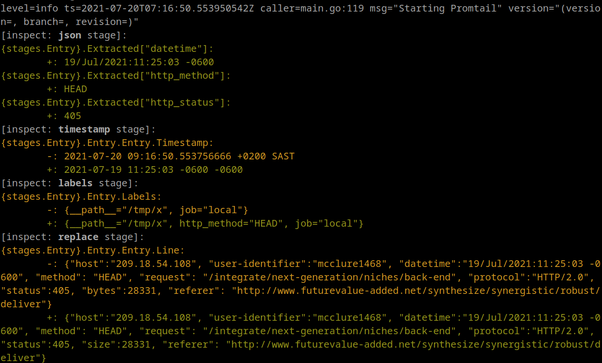

# Troubleshooting Promtail

This document describes known failure modes of Promtail on edge cases and the adopted trade-offs.



## Dry running

Promtail can be configured to print log stream entries instead of sending them to Loki.
This can be used in combination with [piping data](#pipe-data-to-promtail) to debug or troubleshoot Promtail log parsing.

In dry run mode, Promtail still support reading from a [positions](../configuration/#positions) file however no update will be made to the targeted file, this is to ensure you can easily retry the same set of lines.

To start Promtail in dry run mode use the flag `--dry-run` as shown in the example below:

```bash
cat my.log | promtail --stdin --dry-run --client.url http://127.0.0.1:3100/loki/api/v1/push
```

## Inspecting a config file

Promtail can validate and syntatically check your `config` file for a valid configuration.
This can be used to check for errors and inconsistency in your config file and help prevent deploying invalid configurations.

In check syntax mode, promtail will just validate the config file and then exit:

```bash
promtail -config.file=myConfigFile.yaml -check-syntax
```

## Inspecting pipeline stages

Promtail can output all changes to log entries as each pipeline stage is executed.
Each log entry contains four fields:
- line
- timestamp
- labels
- extracted fields

Enable the inspection output using the `--inspect` command-line option. The `--inspect` option can be used in combination with `--stdin` and `--dry-run`.

```bash
cat my.log | promtail --stdin --dry-run --inspect --client.url http://127.0.0.1:3100/loki/api/v1/push
```



The output uses color to highlight changes. Additions are in green, modifications in yellow, and removals in red.

If no changes are applied during a stage, that is usually an indication of a misconfiguration or undesired behavior.

The `--inspect` flag should not be used in production, as the calculation of changes between pipeline stages negatively
impacts Promtail's performance.

## Pipe data to Promtail

Promtail supports piping data for sending logs to Loki (via the flag `--stdin`). This is a very useful way to troubleshooting your configuration.
Once you have Promtail installed you can for instance use the following command to send logs to a local Loki instance:

```bash
cat my.log | promtail --stdin  --client.url http://127.0.0.1:3100/loki/api/v1/push
```

You can also add additional labels from command line using:

```bash
cat my.log | promtail --stdin  --client.url http://127.0.0.1:3100/loki/api/v1/push --client.external-labels=k1=v1,k2=v2
```

This will add labels `k1` and `k2` with respective values `v1` and `v2`.

In pipe mode Promtail also support file configuration using `--config.file`, however do note that positions config is not used and
only **the first scrape config is used**.

[`static_configs:`](../configuration/) can be used to provide static labels, although the targets property is ignored.

If you don't provide any [`scrape_config:`](../configuration/#scrape_configs) a default one is used which will automatically adds the following default labels: `{job="stdin",hostname="<detected_hostname>"}`.

For example you could use this config below to parse and add the label `level` on all your piped logs:

```yaml
clients:
  - url: http://localhost:3100/loki/api/v1/push

scrape_configs:
- job_name: system
  pipeline_stages:
  - regex:
      expression: '(level|lvl|severity)=(?P<level>\\w+)'
  - labels:
      level:
  static_configs:
  - labels:
      job: my-stdin-logs
```

```
cat my.log | promtail --config.file promtail.yaml
```


## A tailed file is truncated while Promtail is not running

Given the following order of events:

1. Promtail is tailing `/app.log`
1. Promtail current position for `/app.log` is `100` (byte offset)
1. Promtail is stopped
1. `/app.log` is truncated and new logs are appended to it
1. Promtail is restarted

When Promtail is restarted, it reads the previous position (`100`) from the
positions file. Two scenarios are then possible:

- `/app.log` size is less than the position before truncating
- `/app.log` size is greater than or equal to the position before truncating

If the `/app.log` file size is less than the previous position, then the file is
detected as truncated and logs will be tailed starting from position `0`.
Otherwise, if the `/app.log` file size is greater than or equal to the previous
position, Promtail can't detect it was truncated while not running and will
continue tailing the file from position `100`.

Generally speaking, Promtail uses only the path to the file as key in the
positions file. Whenever Promtail is started, for each file path referenced in
the positions file, Promtail will read the file from the beginning if the file
size is less than the offset stored in the position file, otherwise it will
continue from the offset, regardless the file has been truncated or rolled
multiple times while Promtail was not running.

## Loki is unavailable

For each tailing file, Promtail reads a line, process it through the
configured `pipeline_stages` and push the log entry to Loki. Log entries are
batched together before getting pushed to Loki, based on the max batch duration
`client.batch-wait` and size `client.batch-size-bytes`, whichever comes first.

In case of any error while sending a log entries batch, Promtail adopts a
"retry then discard" strategy:

- Promtail retries to send log entry to the ingester up to `max_retries` times
- If all retries fail, Promtail discards the batch of log entries (_which will
  be lost_) and proceeds with the next one

You can configure the `max_retries` and the delay between two retries via the
`backoff_config` in the Promtail config file:

```yaml
clients:
  - url: INGESTER-URL
    backoff_config:
      min_period: 100ms
      max_period: 10s
      max_retries: 10
```

The following table shows an example of the total delay applied by the backoff algorithm
with `min_period: 100ms` and `max_period: 10s`:

| Retry | Min delay | Max delay | Total min delay | Total max delay |
|-------|-----------|-----------|-----------------|-----------------|
| 1     | 100ms     | 200ms     | 100ms           | 200ms           |
| 2     | 200ms     | 400ms     | 300ms           | 600ms           |
| 3     | 400ms     | 800ms     | 700ms           | 1.4s            |
| 4     | 800ms     | 1.6s      | 1.5s            | 3s              |
| 5     | 1.6s      | 3.2s      | 3.1s            | 6.2s            |
| 6     | 3.2s      | 6.4s      | 6.3s            | 12.6s           |
| 7     | 6.4s      | 10s       | 12.7s           | 22.6s           |
| 8     | 6.4s      | 10s       | 19.1s           | 32.6s           |
| 9     | 6.4s      | 10s       | 25.5s           | 42.6s           |
| 10    | 6.4s      | 10s       | 31.9s           | 52.6s           |
| 11    | 6.4s      | 10s       | 38.3s           | 62.6s           |
| 12    | 6.4s      | 10s       | 44.7s           | 72.6s           |
| 13    | 6.4s      | 10s       | 51.1s           | 82.6s           |
| 14    | 6.4s      | 10s       | 57.5s           | 92.6s           |
| 15    | 6.4s      | 10s       | 63.9s           | 102.6s          |
| 16    | 6.4s      | 10s       | 70.3s           | 112.6s          |
| 17    | 6.4s      | 10s       | 76.7s           | 122.6s          |
| 18    | 6.4s      | 10s       | 83.1s           | 132.6s          |
| 19    | 6.4s      | 10s       | 89.5s           | 142.6s          |
| 20    | 6.4s      | 10s       | 95.9s           | 152.6s          |


## Log entries pushed after a Promtail crash / panic / abruptly termination

When Promtail shuts down gracefully, it saves the last read offsets in the
positions file, so that on a subsequent restart it will continue tailing logs
without duplicates neither losses.

In the event of a crash or abruptly termination, Promtail can't save the last
read offsets in the positions file. When restarted, Promtail will read the
positions file saved at the last sync period and will continue tailing the files
from there. This means that if new log entries have been read and pushed to the
ingester between the last sync period and the crash, these log entries will be
sent again to the ingester on Promtail restart.

If Loki is not configured to [accept out-of-order writes](https://grafana.com/docs/loki/<LOKI_VERSION>/configure/#accept-out-of-order-writes), Loki will reject all log lines received in
what it perceives is out of
order. If Promtail happens to
crash, it may re-send log lines that were sent prior to the crash. The default
behavior of Promtail is to assign a timestamp to logs at the time it read the
entry from the tailed file. This would result in duplicate log lines being sent
to Loki; to avoid this issue, if your tailed file has a timestamp embedded in
the log lines, a `timestamp` stage should be added to your pipeline.
