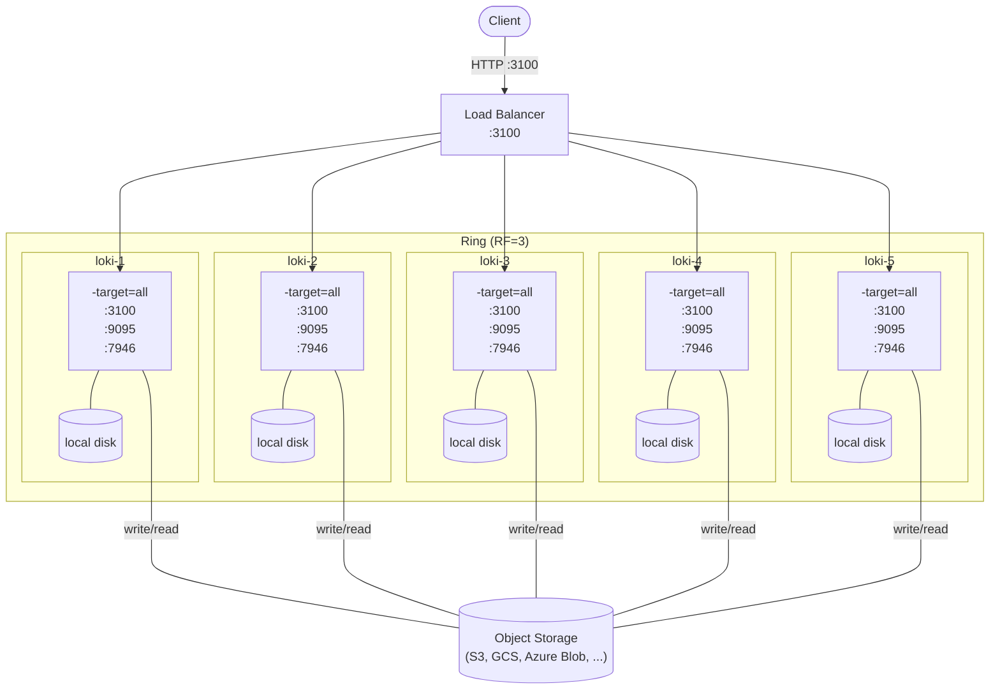

# High Available Single Binary

High available single binary is a replacement for the Simple Scalable Deployment (SSD).
SSD has been deprecated and will be removed with the release of Loki 4.0.

This example demonstrates how to run a number of single binary Loki instances (`-target=all`) behind a reverse proxy (NGINX) for high availability and durability. The demo uses Docker compose, but the mechanics can be applied to any other deployment model, such as Helm or Tanka.

This folder contains a `docker-compose.yaml` and a `config` directory with configuration files for Loki and NGIX.

```console
$ tree
.
├── config
│   ├── loki.yaml
│   └── nginx.conf
└── docker-compose.yaml
```

## Usage

To use the latest features of Loki, you need to build the Docker image from main locally.

```bash
make loki-image
```

Then replace the `image` in `docker-compose.yaml`.

```bash
docker compose up
```

## Architecture


