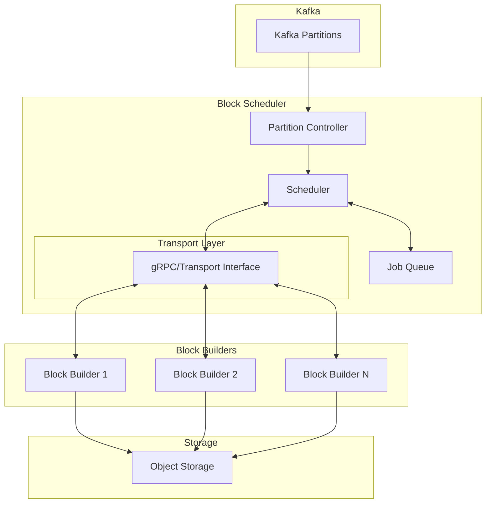
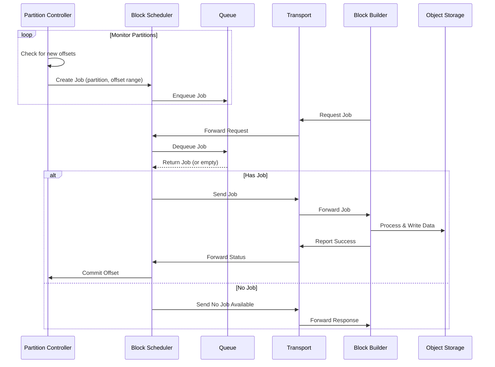

# Block Builder Architecture

## Overview

The Block Builder and Block Scheduler are separate components designed to build storage formats from ingested Kafka data. The Block Scheduler coordinates job distribution to multiple Block Builder instances, implementing a pull-based architecture that decouples read and write operations, allowing for independent scaling and simpler operational management. This document describes the architecture and interaction between components.

## Component Diagram

## Job Processing Sequence

## Core Components

### Job and Offsets
- `Job`: Represents a unit of work for processing Kafka data
  - Contains a partition ID and an offset range
  - Immutable data structure that can be safely passed between components
- `Offsets`: Defines a half-open range [min,max) of Kafka offsets to process
  - Used to track progress and ensure exactly-once processing

### Block Scheduler
- Central component responsible for:
  - Managing the job queue
  - Coordinating Block Builder assignments
  - Tracking job progress
- Implements a pull-based model where Block Builders request jobs
- Decoupled from specific transport mechanisms through the Transport interface

### Block Builder
- Processes jobs assigned by the Block Scheduler
- Responsible for:
  - Building storage formats from Kafka data
  - Reporting job status back to Block Scheduler
- Stateless design allows for easy scaling
- Transport-agnostic through the Transport interface

### Transport Layer
- Abstract interface for communication between Block Scheduler and Block Builders
- Default gRPC implementation provided
- Can be replaced with different implementations for testing or different protocols
- Enables decoupling of business logic from I/O operations

### Queue
- Manages pending jobs
- Provides operations for:
  - Enqueueing new jobs
  - Dequeuing jobs for processing
  - Tracking job status

### Partition Controller
- Interfaces with Kafka partitions
- Manages:
  - Offset tracking
  - Data processing
  - Commit operations
- Ensures exactly-once processing of data

## Design Principles

### 1. Decoupled I/O
- Business logic is separated from I/O operations
- Transport interface allows for different communication mechanisms
- Enables easier testing through mock implementations

### 2. Pull-Based Architecture
- Block Builders pull jobs from the Block Scheduler
- Natural backpressure handling
- Improved resource utilization
- Similar to Loki's query-frontend design

### 3. Stateless Block Builders
- Block Builders are designed to be stateless
- Easier to scale and manage
- No disk requirements
- Safe to delete without orphaned data

### 4. Interface-Driven Design
- Core components defined by interfaces
- Default implementations provided
- Easy to extend or mock for testing
- Uses unimplemented variants for interface compliance

### 5. Idempotent Operations
- Jobs can be retried safely
- No data duplication on retries
- Robust error handling

### Independent Scaling
- Block Scheduler and Block Builders can be scaled independently
- Resource allocation based on actual demand
- Improved cost efficiency
