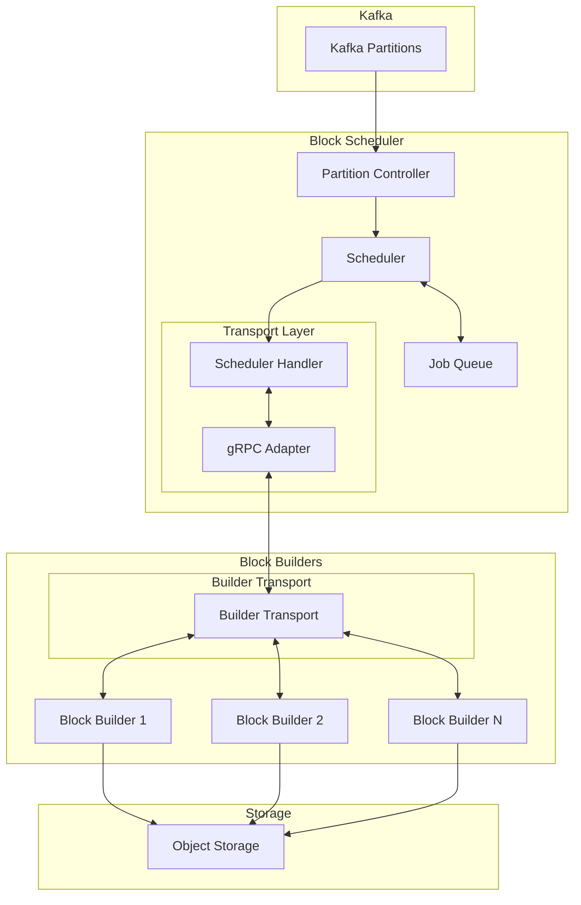
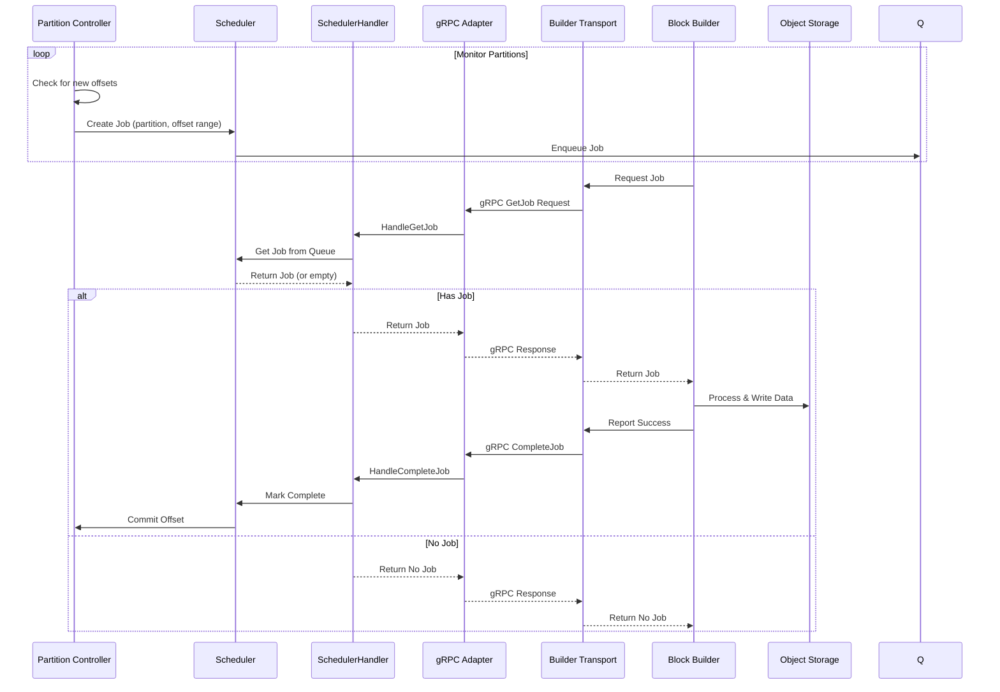

# Block Builder Architecture

## Overview

The Block Builder and Block Scheduler are separate components designed to build storage formats from ingested Kafka data. The Block Scheduler coordinates job distribution to multiple Block Builder instances, implementing a pull-based architecture that decouples read and write operations, allowing for independent scaling and simpler operational management. This document describes the architecture and interaction between components.

## Package Structure

The Block Builder system is organized into three main packages:

### pkg/blockbuilder/types
- Contains shared type definitions and interfaces
- Defines core data structures like `Job` and `JobStatus`
- Provides interface definitions for:
  - `BuilderTransport`: Interface for builder-to-scheduler communication
  - `SchedulerHandler`: Interface for scheduler business logic

The transport layer is split into client and server components:
- Client side uses `BuilderTransport` to abstract gRPC details
- Server side uses `SchedulerHandler` for pure business logic
- A gRPC adapter connects the two sides

### pkg/blockbuilder/scheduler
- Implements the job queue and scheduling logic
- Manages job distribution to block builders
- Tracks job progress and ensures exactly-once processing
- Implements `SchedulerHandler` interface for business logic
- Uses gRPC adapter to expose services to builders

### pkg/blockbuilder/builder
- Implements the block builder functionality
- Uses `BuilderTransport` to communicate with scheduler
- Processes assigned jobs and builds storage formats
- Handles data processing and object storage interactions

## Component Diagram

## Job Processing Sequence

## Interface Design

The system uses a layered interface approach:

1. **Builder Side**:
   - Simple API for job processing
   - `BuilderTransport`: Handles communication details
   - Builders work with domain types, unaware of gRPC

2. **Transport Layer**:
   - gRPC service definitions in proto files
   - Adapter pattern to convert between proto and domain types
   - Clear separation between transport and business logic

3. **Scheduler Side**:
   - `SchedulerHandler`: Pure business logic interface
   - No knowledge of transport details
   - Clean separation of concerns

This design allows for:
- Easy testing of each layer independently
- Flexibility to change transport mechanism
- Clear separation between business logic and communication
- Type-safe conversions between proto and domain types

###  Decoupled I/O
- Business logic is separated from I/O operations
- Transport interface allows for different communication mechanisms
- Enables easier testing through mock implementations

### Stateless Design
- Block Builders are stateless workers
- All state is managed by the Scheduler
- Allows for easy scaling and failover

### Pull-Based Architecture
- Block Builders pull jobs when ready
- Natural load balancing
- Prevents overloading of workers