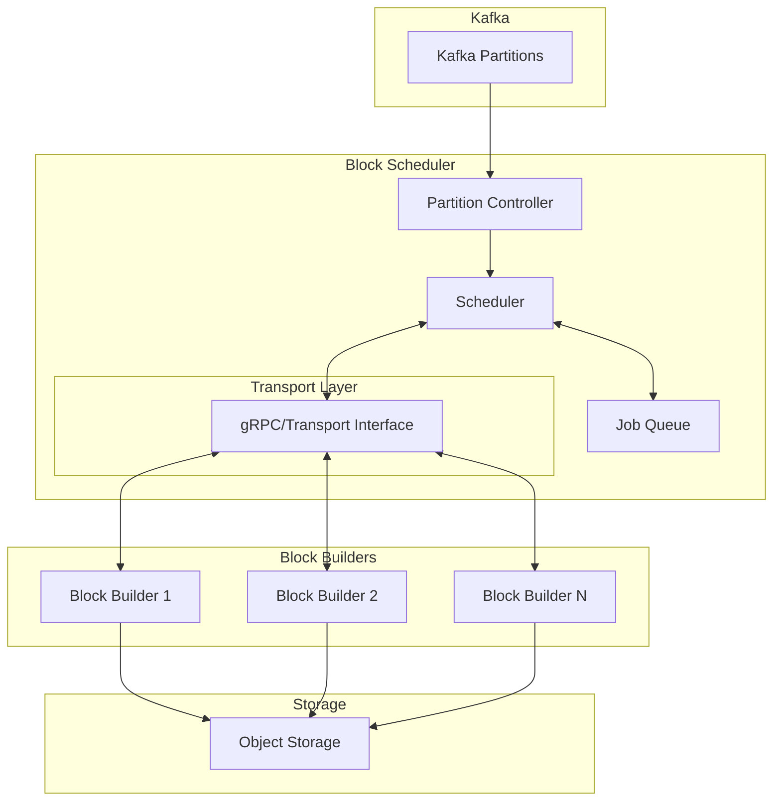
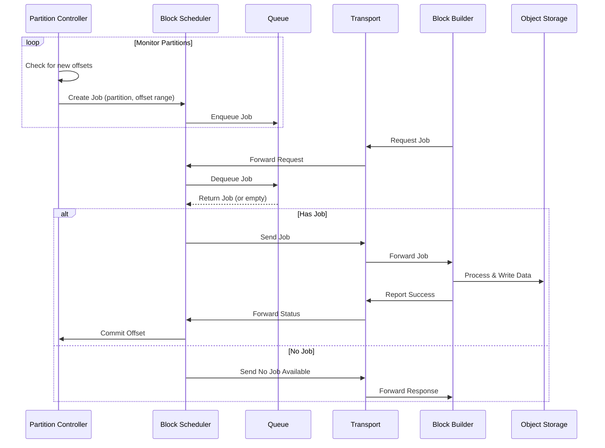

# Block Builder Architecture

## Overview

The Block Builder and Block Scheduler are separate components designed to build storage formats from ingested Kafka data. The Block Scheduler coordinates job distribution to multiple Block Builder instances, implementing a pull-based architecture that decouples read and write operations, allowing for independent scaling and simpler operational management. This document describes the architecture and interaction between components.

## Package Structure

The Block Builder system is organized into three main packages:

### pkg/blockbuilder/types
- Contains shared type definitions and interfaces
- Defines core data structures like `Job` and `Offsets`
- Provides interface definitions for:
  - `Scheduler`: Interface for job scheduling and worker management
  - `Transport`: Interface for communication between components

### pkg/blockbuilder/scheduler
- Implements the job queue and scheduling logic
- Manages job distribution to block builders
- Tracks job progress and ensures exactly-once processing
- Handles job state management and offset tracking

### pkg/blockbuilder/builder
- Implements the block builder worker functionality
- Processes assigned jobs and builds storage formats
- Manages transport layer communication
- Handles data processing and object storage interactions

## Component Diagram

## Job Processing Sequence

## Core Components

### Job and Offsets
- `Job`: Represents a unit of work for processing Kafka data
  - Contains a partition ID and an offset range
  - Immutable data structure that can be safely passed between components
- `Offsets`: Defines a half-open range [min,max) of Kafka offsets to process
  - Used to track progress and ensure exactly-once processing

### Block Scheduler
- Central component responsible for:
  - Managing the job queue
  - Coordinating Block Builder assignments
  - Tracking job progress
- Implements a pull-based model where Block Builders request jobs
- Decoupled from specific transport mechanisms through the Transport interface

### Block Builder
- Processes jobs assigned by the Block Scheduler
- Responsible for:
  - Building storage formats from Kafka data
  - Writing completed blocks to object storage
  - Reporting job status back to scheduler

### Transport Layer
- Provides communication between Block Builders and Scheduler
- Abstracts transport mechanism (currently in-memory & gRPC)
- Defines message types for:
  - Job requests
  - Job completion notifications
  - Job synchronization

## Design Principles

###  Decoupled I/O
- Business logic is separated from I/O operations
- Transport interface allows for different communication mechanisms
- Enables easier testing through mock implementations

### Stateless Design
- Block Builders are stateless workers
- All state is managed by the Scheduler
- Allows for easy scaling and failover

### Pull-Based Architecture
- Block Builders pull jobs when ready
- Natural load balancing
- Prevents overloading of workers

### Interface-Driven Development
- Core components defined by interfaces
- Allows for multiple implementations
- Facilitates testing and modularity
