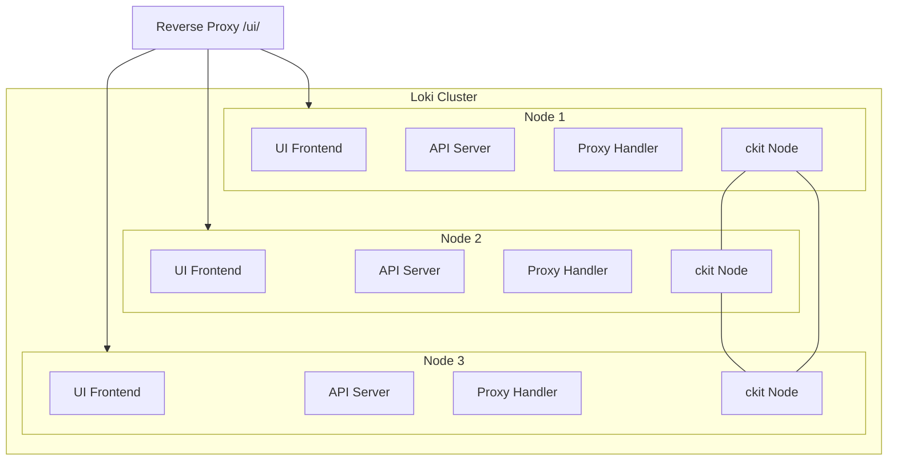
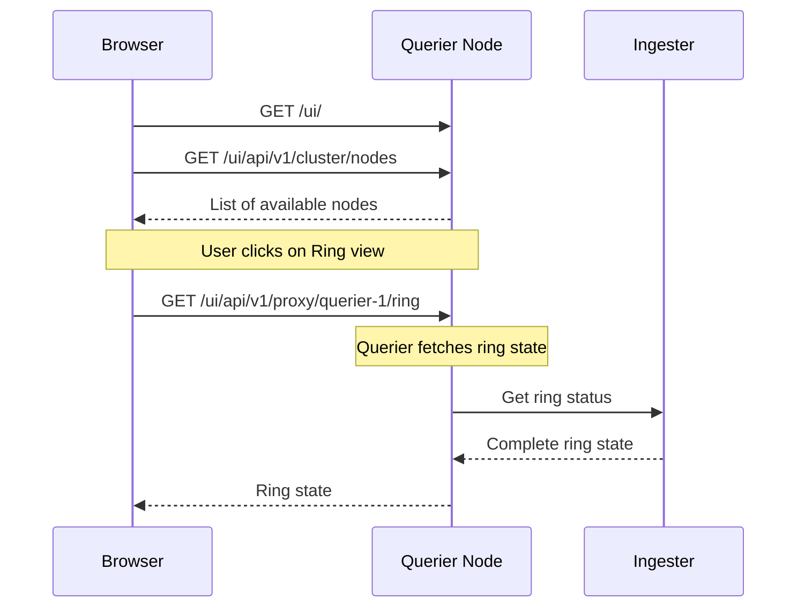

# Loki UI Architecture in Distributed Mode

## Overview

Loki's UI system is designed to work seamlessly in a distributed environment where multiple Loki nodes can serve the UI and proxy requests to other nodes in the cluster. The system uses [ckit](https://github.com/grafana/ckit) for cluster membership and discovery, allowing any node to serve as an entry point for the UI while maintaining the ability to interact with all nodes in the cluster.

## Key Components

### 1. Node Discovery and Clustering

- Uses `ckit` for cluster membership and discovery
- Each node advertises itself and maintains a list of peers
- Nodes can join and leave the cluster dynamically
- Periodic rejoin mechanism to handle split-brain scenarios

### 2. UI Service Components

- **Static UI Files**: Embedded React frontend served from each node
- **API Layer**: REST endpoints for cluster state and proxying
- **Proxy System**: Allows forwarding requests to specific nodes
- **Service Discovery**: Tracks available nodes and their services

## Architecture Diagram



## API Endpoints

All endpoints are prefixed with `/ui/`

### Cluster Management

- `GET /ui/api/v1/cluster/nodes`
  - Returns the state of all nodes in the cluster
  - Response includes node status, services, and build information

- `GET /ui/api/v1/cluster/nodes/self/details`
  - Returns detailed information about the current node
  - Includes configuration, analytics, and system information

### Proxy System

- `GET /ui/api/v1/proxy/{nodename}/*`
  - Proxies requests to specific nodes in the cluster
  - Maintains original request path after the node name

### Analytics

- `GET /ui/api/v1/analytics`
  - Returns analytics data for the node

### Static UI

- `GET /ui/*`
  - Serves the React frontend application
  - Falls back to index.html for client-side routing

## Request Flow Examples

### Example 1: Viewing Cluster Status

1. User accesses `http://loki-cluster/ui/`
2. Frontend loads and makes request to `/ui/api/v1/cluster/nodes`
3. Node handling the request:
   - Queries all peers using ckit
   - Collects status from each node
   - Returns consolidated cluster state

```sequence
Browser->Node 1: GET /ui/api/v1/cluster/nodes
Node 1->Node 2: Fetch status
Node 1->Node 3: Fetch status
Node 2-->Node 1: Status response
Node 3-->Node 1: Status response
Node 1-->Browser: Combined cluster state
```

### Example 2: Accessing Node-Specific Service

1. User requests service data from specific node
2. Frontend makes request to `/ui/api/v1/proxy/{nodename}/services`
3. Request is proxied to target node
4. Response returns directly to client

```sequence
Browser->Node 1: GET /ui/api/v1/proxy/node2/services
Node 1->Node 2: Proxy request
Node 2-->Node 1: Service data
Node 1-->Browser: Proxied response
```

## Configuration

The UI service can be configured with the following key parameters:

```yaml
ui:
  node_name: <string>           # Name for this node in the cluster
  advertise_addr: <string>      # IP address to advertise
  interface_names: <[]string>   # Network interfaces to use
  rejoin_interval: <duration>   # How often to rejoin cluster
  cluster_name: <string>        # Cluster identifier
  discovery:
    join_peers: <[]string>      # Initial peers to join
```

## Security Considerations

1. The UI endpoints should be protected behind authentication
2. The `/ui/` prefix allows easy reverse proxy configuration
3. Node-to-node communication should be restricted to internal network

## High Availability

- Any node can serve the UI
- Nodes automatically discover each other
- Periodic rejoin handles split-brain scenarios
- Load balancer can distribute traffic across nodes

## Best Practices

1. Configure a reverse proxy in front of the Loki cluster
2. Use consistent node names across the cluster
3. Configure appropriate rejoin intervals based on cluster size
4. Monitor cluster state for node health
5. Use internal network for node-to-node communication

## Concrete Example: Ring UI via Querier

### Ring UI Overview

The Ring UI is a critical component for understanding the state of Loki's distributed hash ring. Here's how it works when accessed through a querier node. Since each ingester maintains the complete ring state, querying a single ingester is sufficient to view the entire ring:

### Component Interaction



### Request Flow Details

1. **Initial UI Load**

   ```http
   GET /ui/
   GET /ui/api/v1/cluster/nodes
   ```

   - Frontend loads and discovers available nodes
   - UI shows querier node in the node list

2. **Ring State Request**

   ```http
   GET /ui/api/v1/proxy/querier-1/ring
   ```

   - Frontend requests ring state through the proxy endpoint
   - Request is forwarded to the querier's ring endpoint
   - Querier gets complete ring state from a single ingester

3. **Ring Data Structure**

   ```json
   {
     "tokens": [
       {
         "token": "123456",
         "ingester": "ingester-1",
         "state": "ACTIVE",
         "timestamp": "2024-02-04T12:00:00Z"
       },
       // ... more tokens
     ],
     "ingesters": {
       "ingester-1": {
         "state": "ACTIVE",
         "tokens": ["123456", "789012"],
         "address": "ingester-1:3100",
         "last_heartbeat": "2024-02-04T12:00:00Z"
       }
       // ... more ingesters
     }
   }
   ```

### Security Notes

1. Ring access should be restricted to authorized users
2. Internal ring communication uses HTTP/2
3. Ring state contains sensitive cluster information
