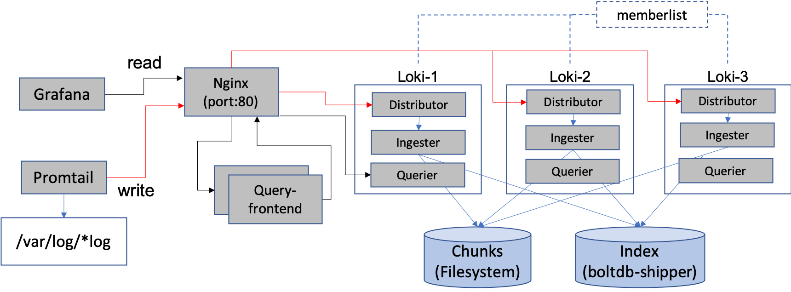

# Loki cluster using docker-compose

To deploy a cluster of loki nodes on a local machine (as shown below), you could use the `docker-compose-ha-member.yaml` file.



Some features of the deployment:

- Backend: 3 Loki servers enabled with distributor, ingester, querier module
- Together they form a cluster ring based on memberlist mechanism (if using consul/etcd, modules can be separate for further separate read/write workloads)
- Index data are stored and replicated through botldb-shipper
- Replication_factor=2: the receiving distributor sends log data to 2 ingesters based on consistent hashing
- Chunk storage is a shared directory mounted from the same host directory (to simulate S3 or gcs)
- Query are performed through the two query frontend servers
- An nginx gateway to route the write and read workloads from clients (Grafana, promtail)

1. Ensure you have the most up-to-date Docker container images:

   ```bash
   docker-compose pull
   ```

1. Run the stack on your local Docker:

   ```bash
   docker-compose -f ./docker-compose-ha-memberlist.yaml up
   ```

1. When adding data source in the grafana dashboard, using `http://loki-gateway:3100` for the URL field.

1. To clean up

   ```bash
   docker-compose -f ./docker-compose-ha-memberlist.yaml down
   ```

   Remove the chunk data under `./chunks/`.
