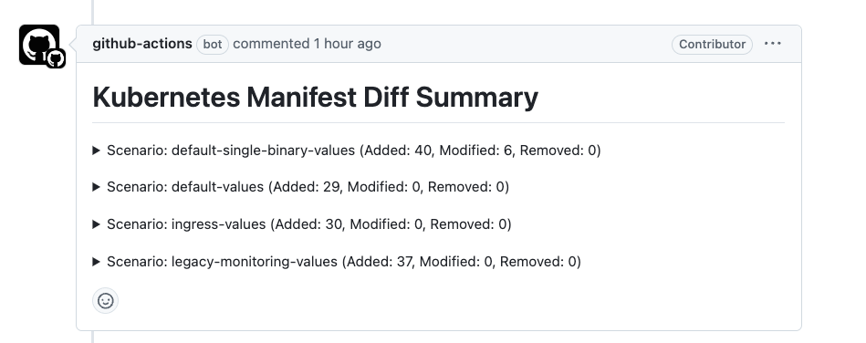
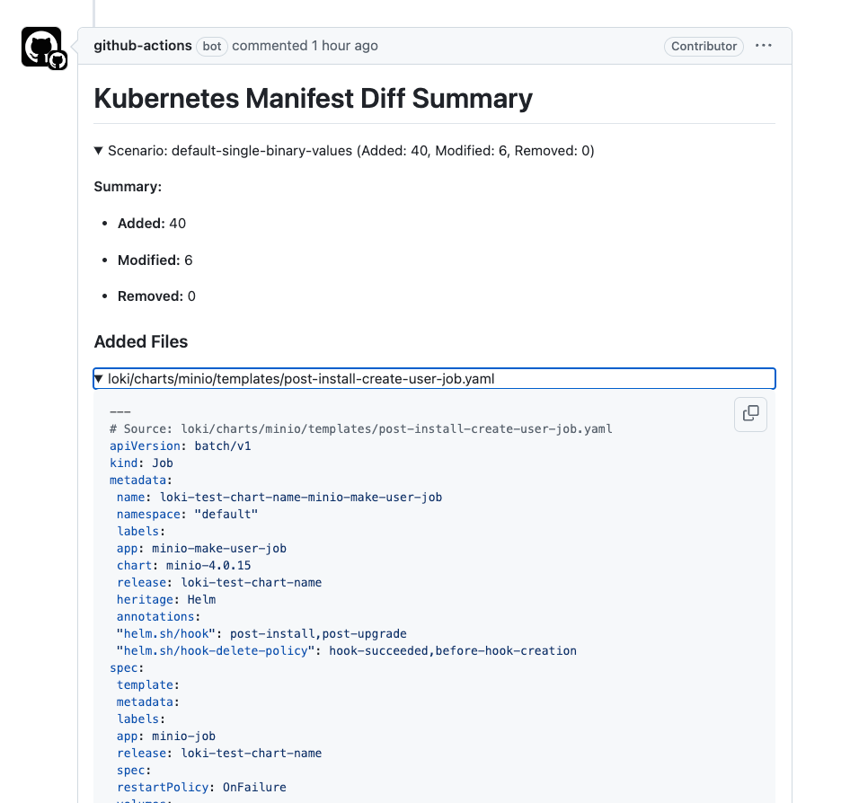
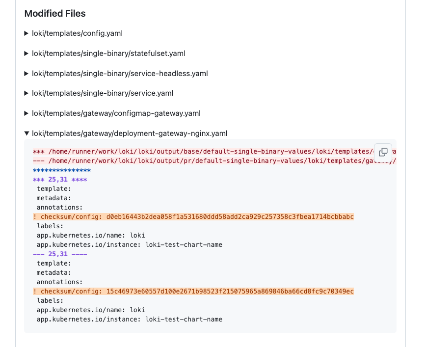
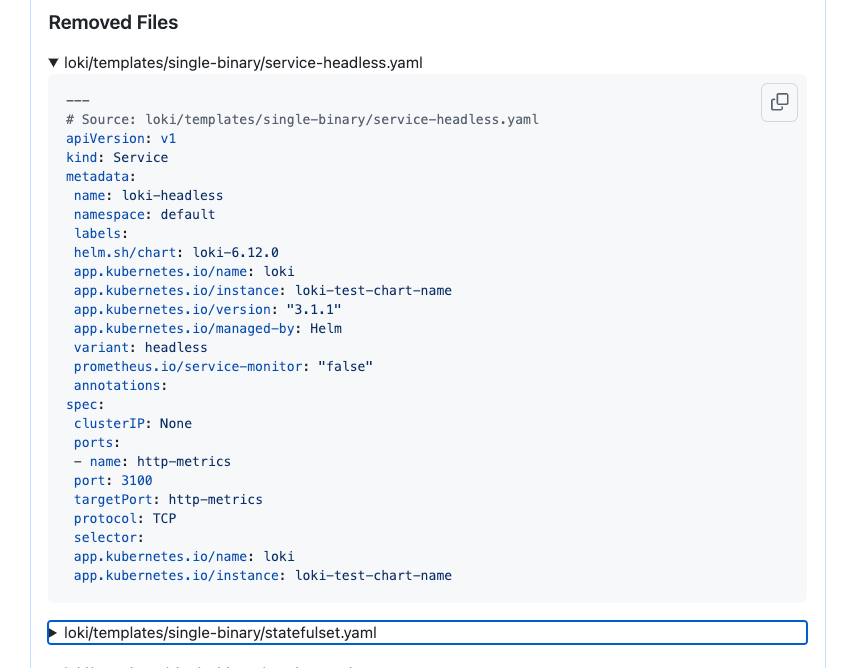

These scenarios are used by Github Workflow: [Publish Rendered Helm Chart Diff](../../../../.github/workflows/helm-loki-ci.yml). 

Each scenario is used as the values file for the Loki Helm chart to render Kubernetes manifests in `base` and `PR's` branch to compare the content and report the diff on Pull Request as a comment([example](https://github.com/grafana/loki/pull/14127#issuecomment-2348360828)). It gives the ability to the reviewer to understand how the changes in the chart modify resulting manifests.

The workflow reports three types of changes for each scenario:

1. Added files - the manifests that are added in the current PR and that did not exist in `base` branch.

2. Modified files - the manifests that exist in both branches but the changes in PRs branch modify them.

3. Removed files - the manifests that exist in `base` branch but do not exist in PRs branch.

