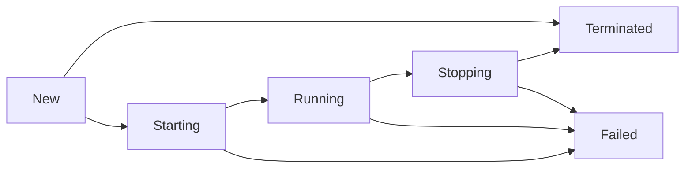

# Services

This is a Go implementation of the [services model](https://github.com/google/guava/wiki/ServiceExplained) from the [Google Guava](https://github.com/google/guava) library.

It provides a `Service` interface (with implementation in the `BasicService` type) and a `Manager` for managing a group of services at once.

The main benefits of this model are:

- Services have well-defined explicit states. Services don't start any work until they are started and only enter the `Running` state if they have successfully done all initialization in the `Starting` state.
- States are observable by clients. A client can see the state and also wait for `Running` or `Terminated` states.
- If more observability is needed, clients can register state listeners.
- Service startup and shutdown are done asynchronously. This allows for nice parallelization of startup or shutdown of multiple services.
- Services that depend on each other can simply wait for other services to be in the correct state before using them.

## Service interface

As a user of the service, here is what you need to know.

Each service starts in the `New` state.
In this state, the service is only instantiated and ready to be started.

Start a service by calling its `StartAsync` method. This makes the service transition to the `Starting` state, and eventually to the `Running` state, if starting is successful.
Starting is done asynchronously, so that a client can do other work while the service is starting, for example, starting more services.

A service spends most of its time in the `Running` state, in which it provides its services to the clients. What exactly it does depends on the service itself. Typical examples include responding to HTTP requests, running periodic background tasks, etc.

Clients can stop the service by calling `StopAsync`, which tells the service to stop. The service transitions to the `Stopping` state to perform necessary cleanup, and then to the `Terminated` state.
If a service fails in its `Starting`, `Running`, or `Stopping` state, it ends up in the `Failed` state instead of `Terminated`.

Once a service is in a `Terminated` or `Failed` state, it cannot be restarted; these states are terminal.

Full state diagram:




The API, states, and semantics are implemented to correspond to the [Service class](https://guava.dev/releases/snapshot/api/docs/com/google/common/util/concurrent/Service.html) in the Guava library.

## Manager

Multiple services can be managed via a `Manager` (corresponds to the [ServiceManager](https://guava.dev/releases/snapshot/api/docs/com/google/common/util/concurrent/ServiceManager.html) in Guava library).
A `Manager` is initialized with a list of `New` services.
It can start the services and wait until all services are running (= "Healthy" state).
A `Manager` can also be stopped, which also stops all of its services.
When all services are in their `Terminated` or `Failed` states, the `Manager` is said to be "stopped."

## Implementing a custom service

As a developer who wants to implement your own service, there are several possibilities.

### Using `NewService`

The easiest possible way to create a service is using the `NewService` function with three functions as arguments called `StartingFn`, `RunningFn` and `StoppingFn`.
The returned service is in the `New` state.
When it transitions to the `Starting` state (by calling `StartAsync`), `StartingFn` is called.
When `StartingFn` finishes with no error, the service transitions to the `Running` state and `RunningFn` is called.
When `RunningFn` finishes, services transition to the `Stopping` state, and `StoppingFn` is called.
After `StoppingFn` is done, the service ends in `Terminated` state (if none of the functions returned an error), or the `Failed` state, if there were errors.

Any of the functions can be `nil`, in which case the service simply moves to the next state.

### Using `NewIdleService`

This "idle" service needs to run custom code during `Starting` or `Stopping` states, but not in the `Running` state.
The service remains in the `Running` state until explicitly stopped using `StopAsync`.

Example usage is a service that registers some HTTP or gRPC handlers.

### Using `NewTimerService`

This service runs a supplied function once every tick interval, defined by a `time.Duration` argument. If this function returns an error, the service fails.
Otherwise, the service continues calling the supplied function until stopped using `StopAsync`.

### Using `BasicService` struct

All previous options use the `BasicService` type internally, and it is `BasicService` that implements the semantics of the `Service` interface.
This struct can also be embedded into a custom struct, and then initialized with starting/running/stopping functions via `InitBasicService`:

```go
type exampleService struct {
	*BasicService

	log []string
	ch  chan string
}

func newExampleServ() *exampleService {
	s := &exampleService{
		ch: make(chan string),
	}
    s.BasicService = NewBasicService(nil, s.collect, nil) // `StartingFn`, `RunningFn`, `StoppingFn`
	return s
}

// This is used as the `RunningFn` function. When the service is stopped,
// the context is canceled, so we can react to it.
func (s *exampleService) collect(ctx context.Context) error {
	for {
		select {
		case <-ctx.Done():
			return nil
		case msg := <-s.ch:
			s.log = append(s.log, msg)
		}
	}
}

// External method called by clients of the service.
func (s *exampleService) Send(msg string) bool {
	ctx := s.ServiceContext() // provided by `BasicService`, not part of the `Service` interface.
	if ctx == nil {
		// `Service` is not yet started.
		return false
	}
	select {
	case s.ch <- msg:
		return true
	case <-ctx.Done():
		// `Service` is not running anymore.
		return false
	}
}
```

Now `exampleService` is a service that can be started, observed for state changes, or stopped. As long as the service is in the `Running` state, clients can call its `Send` method:

```go
s := newExampleServ()
s.StartAsync(context.Background())
s.AwaitRunning(context.Background())
// Now collect() is running.
s.Send("A")
s.Send("B")
s.Send("C")
s.StopAsync()
s.AwaitTerminated(context.Background())
// Now the service is finished, and we can access s.log.
```

After a service is stopped, i.e. in the `Terminated` or `Failed` state, all collected messages can be read from the `log` field. However in this case the `RunningFn` function doesn't return an error, so only the `Terminated` state is possible.
Notice that no further synchronization is necessary in this case; when the service is stopped and a client has observed that via `AwaitTerminated`, any access to `log` is safe.

(This example is adapted from the unit tests in `basic_service_test.go`)

This may seem like a lot of extra code, and for such a simple usage it probably is.
The real benefit comes when one starts combining multiple services into a `Manager`, observes them as a group, or lets services depend on each other via `Await` methods.
